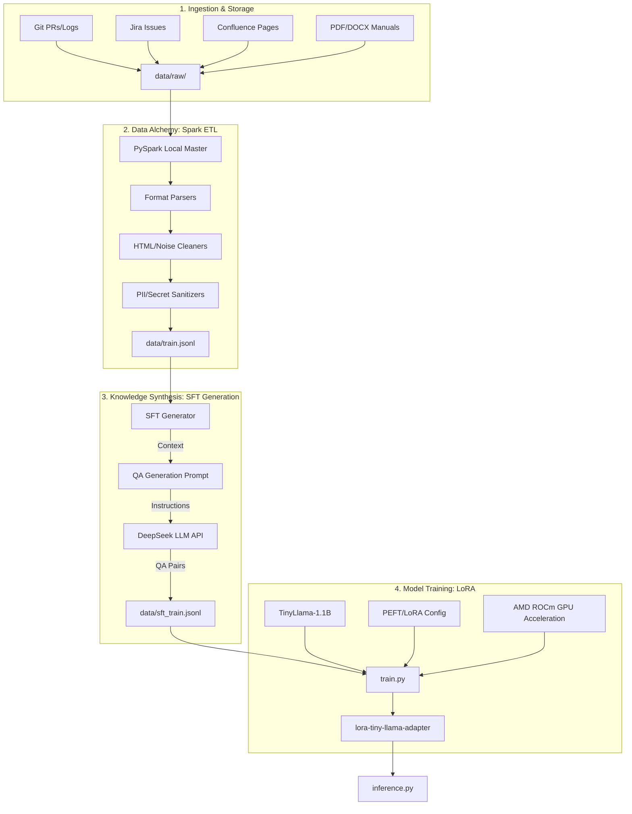

# LoRA Fine-tuning Architecture: Data Alchemy to Model

This document describes the technical architecture of the LoRA fine-tuning pipeline, covering data ingestion, distributed cleaning, synthetic data generation, and model training on AMD ROCm (Windows).

## 1. Overall Pipeline

The pipeline follows a tiered architecture, transforming raw heterogeneous enterprise data into a specialized LoRA adapter.

---

## 2. Component Details

### 2.1 Data Alchemy (Spark ETL)
The Spark-based ETL module (`spark_etl/`) is designed for high-throughput cleaning of "dirty" enterprise data.
- **Local Master Strategy**: Uses `local[*]` to utilize all CPU cores on Windows without needing a cluster.
- **UDF-based Processing**: Custom User Defined Functions (UDFs) handle HTML removal (BeautifulSoup), whitespace normalization, and sensitive information masking (Regex).
- **Binary Handling**: Uses `sparkContext.binaryFiles` to parallelize the extraction of text from non-structured `.pdf` and `.docx` files.

### 2.2 SFT Generation (Self-Instruct)
This layer transforms raw facts into interactive training pairs.
- **Synthetic Data**: Uses DeepSeek's `deepseek-chat` model to generate 1-3 high-quality instruction-response pairs per knowledge chunk.
- **Multithreading**: Implements `ThreadPoolExecutor` to overcome API latency, allowing parallel synthesis of the corpus.
- **SFT vs. CPT**:
    - `train.jsonl` (CPT): For Continuing Pre-training (learning language style/facts).
    - `sft_train.jsonl` (SFT): For alignment and instruction following.

### 2.3 LoRA Training on AMD ROCm
Optimized for AMD hardware performance and compatibility on Windows.
- **PEFT Integration**: Targets all linear layers (`q_proj`, `k_proj`, `v_proj`, `o_proj`, etc.) with Rank 16 for maximum expressive power.
- **ROCm Monkeypatching**: Includes specific workarounds for `torch.distributed` and `DTensor` issues encountered on ROCm Windows builds.
- **Memory Efficiency**: Uses 16-bit precision and gradient accumulation to fit the training process within consumer-grade VRAM (8GB+).

---

## 3. Data Flow Specification

| Step | Input | Output | Purpose |
| :--- | :--- | :--- | :--- |
| **Clean** | Heterogeneous JSON/Binary | `train.jsonl` | Noise removal & Sanitization |
| **Synthesize** | `train.jsonl` (Raw Text) | `sft_train.jsonl` (QA) | Knowledge to Instruction conversion |
| **Train** | `sft_train.jsonl` + Base Model | `adapter_model.bin` | Parameter-efficient fine-tuning |
| **Infer** | User Prompt + Adapter | Model Response | Specialized knowledge retrieval |

