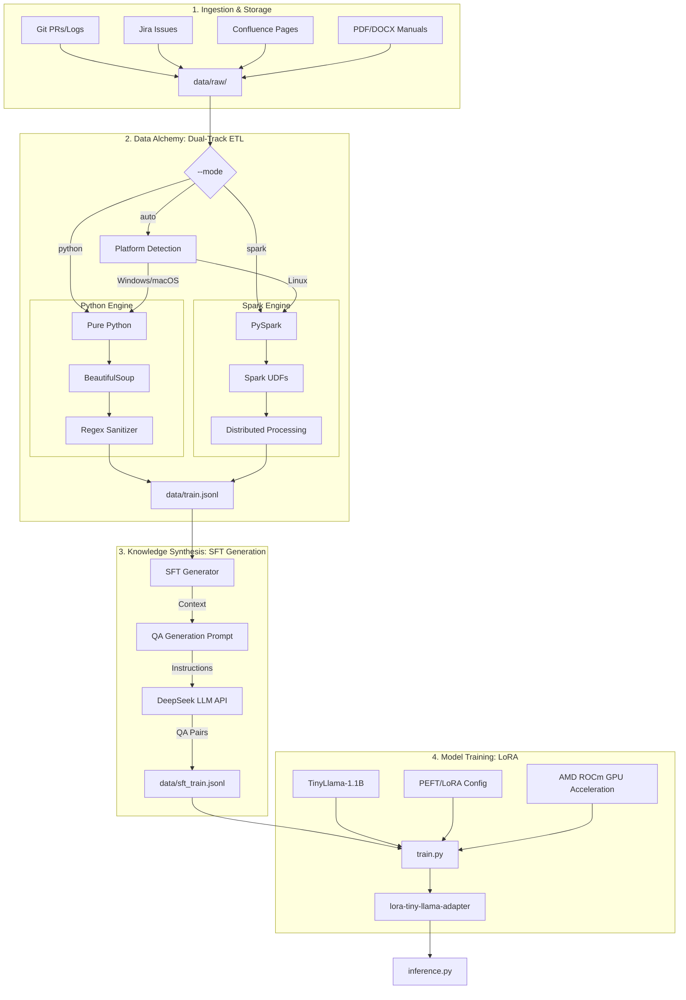

# LoRA Fine-tuning Architecture: Data Alchemy to Model

This document describes the technical architecture of the LoRA fine-tuning pipeline, covering data ingestion, distributed cleaning, synthetic data generation, and model training on AMD ROCm (Windows).

## 1. Overall Pipeline

The pipeline follows a tiered architecture, transforming raw heterogeneous enterprise data into a specialized LoRA adapter.



---

## 2. Dual-Track Architecture

The Data Alchemy layer supports **two processing engines** to accommodate different environments and data scales:

### 2.1 Python Engine (Development/Demo)

| Aspect | Description |
|--------|-------------|
| **Best For** | Windows, macOS, local development, quick demos |
| **Data Scale** | < 1GB (thousands to tens of thousands of records) |
| **Dependencies** | Zero external deps (no Spark, no Hadoop, no Java) |
| **Performance** | Single-threaded, memory-bound |
| **Usage** | `--mode python` or auto-detected on Windows/macOS |

**Advantages:**
- No Java/Spark installation required
- Works out-of-the-box on any OS
- Fast startup, no JVM overhead
- Perfect for prototyping and debugging

### 2.2 Spark Engine (Production)

| Aspect | Description |
|--------|-------------|
| **Best For** | Linux servers, EMR, Databricks, cloud environments |
| **Data Scale** | 1GB - 100GB+ (multi-node cluster for very large data) |
| **Dependencies** | Java 17+, PySpark 3.5+ |
| **Performance** | Multi-core parallel, distributed when clustered |
| **Usage** | `--mode spark` or auto-detected on Linux |

**Advantages:**
- Horizontal scalability (add more nodes)
- Built-in fault tolerance
- Optimized for large-scale batch processing
- Industry-standard for production data pipelines

### 2.3 Mode Selection Logic

```
┌─────────────────────────────────────────────────────────┐
│                    --mode argument                       │
├─────────────────────────────────────────────────────────┤
│  python  │  Force Python engine (any platform)          │
│  spark   │  Force Spark engine (requires Java)          │
│  auto    │  Auto-detect based on platform (default)     │
└─────────────────────────────────────────────────────────┘

Auto-detection rules:
  ┌──────────────┬─────────────────────────────────────────┐
  │ Platform     │ Selected Engine                         │
  ├──────────────┼─────────────────────────────────────────┤
  │ Windows      │ Python (Hadoop has native lib issues)   │
  │ macOS        │ Python (simplicity preferred)           │
  │ Linux + Java │ Spark (production-ready)                │
  │ Linux - Java │ Python (fallback)                       │
  └──────────────┴─────────────────────────────────────────┘
```

---

## 3. Component Details

### 3.1 Data Alchemy (ETL Layer)

The ETL module (`spark_etl/`) is designed for high-throughput cleaning of "dirty" enterprise data.

**File Structure:**
```
spark_etl/
├── main.py              # Entry point with --mode switch
├── config.py            # Centralized configuration
├── engines/
│   ├── python_engine.py # Pure Python implementation
│   └── spark_engine.py  # PySpark implementation
├── cleaners/
│   ├── base.py          # Common UDFs (HTML, whitespace)
│   ├── git_pr.py        # Git PR processor
│   ├── jira.py          # Jira processor
│   ├── confluence.py    # Confluence processor
│   └── document.py      # PDF/DOCX processor
├── sanitizers.py        # PII/Secret masking
├── sft_generator.py     # LLM-based QA generation
└── prompts.py           # Prompt templates
```

### 3.2 SFT Generation (Self-Instruct)

This layer transforms raw facts into interactive training pairs.
- **Synthetic Data**: Uses DeepSeek's `deepseek-chat` model to generate 1-3 high-quality instruction-response pairs per knowledge chunk.
- **Multithreading**: Implements `ThreadPoolExecutor` to overcome API latency, allowing parallel synthesis of the corpus.
- **SFT vs. CPT**:
    - `train.jsonl` (CPT): For Continuing Pre-training (learning language style/facts).
    - `sft_train.jsonl` (SFT): For alignment and instruction following.

### 3.3 LoRA Training on AMD ROCm

Optimized for AMD hardware performance and compatibility on Windows.
- **PEFT Integration**: Targets all linear layers (`q_proj`, `k_proj`, `v_proj`, `o_proj`, etc.) with Rank 16 for maximum expressive power.
- **ROCm Monkeypatching**: Includes specific workarounds for `torch.distributed` and `DTensor` issues encountered on ROCm Windows builds.
- **Memory Efficiency**: Uses 16-bit precision and gradient accumulation to fit the training process within consumer-grade VRAM (8GB+).

---

## 4. Data Flow Specification

| Step | Input | Output | Purpose |
| :--- | :--- | :--- | :--- |
| **Clean** | Heterogeneous JSON/Binary | `train.jsonl` | Noise removal & Sanitization |
| **Synthesize** | `train.jsonl` (Raw Text) | `sft_train.jsonl` (QA) | Knowledge to Instruction conversion |
| **Train** | `sft_train.jsonl` + Base Model | `adapter_model.bin` | Parameter-efficient fine-tuning |
| **Infer** | User Prompt + Adapter | Model Response | Specialized knowledge retrieval |

---

## 5. Scaling Recommendations

| Data Volume | Recommended Setup |
|-------------|-------------------|
| < 100MB | Python Engine, single machine |
| 100MB - 1GB | Python Engine (fast enough), or Spark for consistency |
| 1GB - 10GB | Spark Engine, single machine with `local[*]` |
| 10GB - 100GB | Spark cluster (3-10 nodes), or cloud EMR |
| 100GB+ | Spark on EMR/Databricks with S3/HDFS storage |

**Migration Path:**
1. Start with Python Engine for development
2. Switch to `--mode spark` when data grows
3. Change `SPARK_MASTER` from `local[*]` to cluster URL
4. Replace local file paths with S3/HDFS paths
