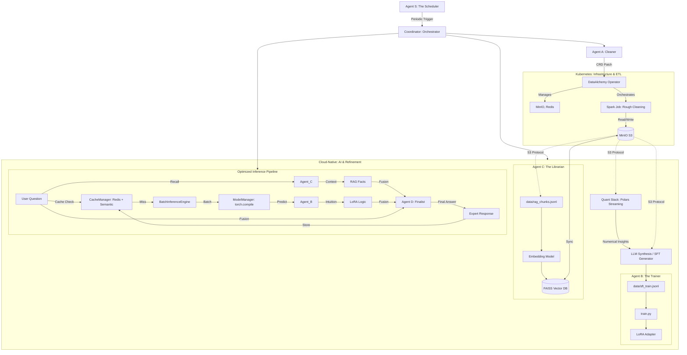

# LoRA + RAG Multi-Agent Architecture: Enterprise Knowledge Hub

This document describes the evolved technical architecture of the pipeline, which integrates Data Alchemy, Multi-Agent Coordination, RAG (Retrieval-Augmented Generation), and LoRA Fine-tuning.

## 1. Overall Pipeline (Agentic Workflow)

The system is organized into specialized Agents and a cloud-native hybrid data pipeline managed by a **Kubernetes Operator**.



---

## 2. Multi-Agent Roles

### 2.1 Agent A: The Cleaner (Data Alchemy)
- **Responsibility**: Heterogeneous data extraction and distributed cleaning.
- **Operator Integration**: Agent A triggers cleaning by patching the `DataAlchemyStack` custom resource with an annotation. The **Operator** then spawns a Spark Job in Kubernetes with correct S3 credentials and resource limits.
- **Output**: Spark writes results directly to S3 (`cleaned_corpus.jsonl`, `rag_chunks.jsonl`, and `metrics.parquet`).

### 2.2 Numerical Quant Agents (The Scientists)
- **Scout Agent**: Performs "zero-copy" metadata scanning. It infers schemas and statistics without loading full datasets into memory.
- **QuantAgent**: The core engine for feature expansion. It uses Polars' Lazy API to perform $O(N^2)$ polynomial interactions on million-row tables using streaming sinks to disk.
- **Curator Agent**: Handles the "Dimension Curse". It computes correlation matrices in chunks and filters redundant features to keep the feature set performant for downstream models.
- **Validator Agent**: Ensures that the data entering the "Quant" meets the expected schema and hasn't drifted significantly from reference distributions.

### 2.3 Agent B: The Trainer (Domain Specialist)
- **Responsibility**: Managing the LoRA life cycle.
- **Role in Inference**: Provides "Model Intuition". It understands domain-specific terminology and the "style" of the internal data.
### 2.3 Agent C: The Librarian (Knowledge Manager)
- **Responsibility**: Distributed vector storage and high-precision hybrid retrieval.
- **Technology**: **FAISS** + **BM25** + **Cross-Encoder** + **SQLite** + **MinIO/S3** + **Quant Enhancement**.
- **Optimization**:
    - **Hybrid Search**: Combines semantic (FAISS) and keyword-based (BM25) retrieval to ensure both thematic relevance and exact keyword matching.
    - **Deep Reranking**: Uses a **Cross-Encoder** (`bge-reranker-base`) to perform fine-grained scoring on top-20 candidates, significantly improving Top-1 accuracy.
    - **Quant-Enhanced Scoring**: Integrates numerical insights from Quant Stack to boost documents with data-driven evidence, using weighted fusion: `Final_Score = 0.7 * Rerank_Score + 0.3 * Quant_Insight_Score`.
    - **Memory Efficiency (Memory-Index + Disk-Storage)**: 
        - **In-Memory**: Light-weight FAISS vectors and BM25 statistics (IDs only).
        - **On-Disk (SQLite)**: Full document text and metadata, fetched only for the final Top-K candidates.
    - **Distributed Persistence**: Index and metadata are stored in S3/MinIO for cross-instance sharing.
    - **Dynamic Reloading**: Background thread periodically syncs with S3 to update the local index without downtime.

### 2.4 Agent D: The Finalist (Fusion Expert)
- **Responsibility**: Evidence synthesis and final answering.
- **Strategy**: Hybrid Parallel Fusion. It combines facts from Agent C and reasoning suggestions from Agent B via DeepSeek.

### 2.5 Agent S: The Scheduler (Chronos)
- **Responsibility**: Automated periodic execution (Wash -> Refine -> Train).

---

## 3. Data Flow Specification

| Stage | Platform | Engine | Input | Output | Purpose |
| :--- | :--- | :--- | :--- | :--- | :--- |
| **Rough Cleaning** | K8s | Spark (Operator) | `s3://raw/*` | `s3://processed/*` | Distributed cleaning & numerical metric extraction |
| **RAG Chunking** | K8s | Spark | `s3://processed/*` | `rag_chunks.jsonl` | **Sentence-aware sliding window** chunking |
| **Feature Quant** | Linux/Host | Polars (Streaming) | `metrics.parquet` | `quant/final_features.parquet` | High-dimensional feature engineering & insight extraction |
| **Refinement** | Linux/Host | LLM (ETL) | Text + **Quant Insights** | `data/sft_train.jsonl` | Generating high-quality QA training pairs with data-driven reasoning |
| **Indexing** | Linux/Host | Agent C | `s3://processed/*` | FAISS Index (S3 Sync) | Build hybrid (Vector+BM25) knowledge base |
| **Training** | Linux/Host | Agent B | `data/sft_train.jsonl` | LoRA Adapter | Fine-tune model on domain patterns |
| **Chat** | Linux/Host | Coordinator | User Query | Final Answer | Combine RAG facts and LoRA intuition |

---

## 4. Dual-Stack Cleaning Engine (Cloud-Native)

To ensure both high performance for large datasets and zero-dependency ease of use for small datasets, the system implements a "Dual-Stack" cleaning architecture, now orchestrated by Kubernetes.

### 4.1 Architecture Overview

```mermaid
flowchart LR
    Input[Raw Data] --> AgentA[Agent A: Orchestrator]
    
    AgentA -->|mode='spark'| Operator[DataAlchemy Operator]
    Operator -->|Spawn| SparkJob[Spark Job: K8s]
    AgentA -->|mode='python'| PythonPath[Python Stack: Linux/Host]
    
    subgraph SparkStack [Spark Stack (Managed by Operator)]
        SparkJob --> S_Cleaners[Specialized Cleaners]
        S_Cleaners --> S_Output[S3: cleaned_corpus.jsonl]
    end
    
    subgraph PythonStack [Python Stack (Local)]
        PyEngine[PythonEngine]
        PyEngine --> P_Cleaners[Local Cleaners]
        P_Cleaners --> P_Output[Local: cleaned_corpus.jsonl]
    end
```

### 4.2 Engine Comparison

| Feature | Spark Engine (K8s) | Python Engine (Local) |
| :--- | :--- | :--- |
| **Environment** | Kubernetes (Operator Managed) | Linux/Host (Native) |
| **Data Scale** | > 10GB (Distributed) | < 1GB (Single Machine) |
| **Infrastructure** | Managed MinIO & Redis | Local Filesystem |
| **Persistence** | HostPath (/data) | Local `data/` folder |

---

## 5. Cloud-Native Hybrid Architecture

To solve dependency conflicts between ROCm (AI) and Java (Spark/K8s), the project uses a hybrid architecture:

1.  **Infrastructure Plane (Kubernetes)**:
    -   Managed by the **DataAlchemy Operator**.
    -   Hosts **MinIO** (S3) and **Redis** (Cache).
    -   Executes **Spark Jobs** for massive data processing.
    -   Exposes services to the host via `LoadBalancer` on `localhost`.

2.  **Compute Plane (Linux/Host)**:
    -   Runs GPU-intensive tasks: **LoRA Training** and **Joint Inference**.
    -   Hosts the **WebUI** and **Multi-Agent Coordinator**.
    -   Connects to K8s Infrastructure via standard S3/Redis protocols.

3.  **Persistence Layer (Shared HostPath)**:
    -   Critical data (MinIO buckets, Redis AOF) is stored on the host's filesystem (`data/minio_data`, `data/redis_data`).

---

## 6. Inference Optimization & RAG Quality

### 6.1 Query Rewriting & Refinement
- **LLM-Based Rewriting**: Before retrieval, the user's query is transformed by an LLM into search-optimized keywords and phrases, improving the recall of relevant document chunks.

### 6.2 ModelManager (ROCm Acceleration)
- **`torch.compile`**: Uses Inductor to generate optimized kernels for AMD GPUs.
- **Mixed Precision**: Uses `torch.float16` to increase throughput.
- **Unified Embedding**: Shares a single `BAAI/bge-small-zh-v1.5` instance across CacheManager and Agent C to minimize VRAM overhead.

### 6.3 CacheManager (Redis + Semantic)
- **Semantic Search**: If a new query is >92% similar to a cached one, the cached result is returned.
- **Redis Persistence**: Uses **Redis AOF (Append Only File)** with `hostPath` persistence to ensure chat history survives Pod restarts.

### 6.4 Hot-Reloading & Dynamic Adaptation
- **Adapter Versioning**: Agent B tracks the `LastModified` timestamp of LoRA adapters in S3.
- **In-Memory Swapping**: When a newer adapter is detected, the `ModelManager` uses PEFT's `unload/load` mechanism to swap weights in-place without reloading the base model, maintaining high availability.
- **Trigger Mechanism**: 
    - **Automatic**: Background check during inference.
    - **Manual**: Via `POST /api/models/reload` endpoint.

---

## 7. Self-Evolution Trigger (Kubernetes Native)

The system supports multiple ways to trigger the "Alchemy" cycle:

1.  **Operator Annotation**: Patching the `DataAlchemyStack` with `dataalchemy.io/request-full-cycle` triggers the Operator to spawn a new Job.
2.  **WebUI Bridge**: The WebUI provides an API to perform this patch, allowing external systems to trigger evolution via simple HTTP requests.
3.  **Scheduler (Agent S)**: Performs periodic triggers based on a configurable interval.

---

## 8. Monitoring & Observability

The system uses **Prometheus** for real-time performance tracking, with a simplified WebUI that focuses on the core AI experience.

### 7.1 Key Metrics
- **`inference_latency_seconds`**: Histogram of processing time.
- **`inference_cache_hits_total`**: Counter for exact vs. semantic hits.
- **`gpu_memory_usage_bytes`**: Gauge for VRAM consumption.
