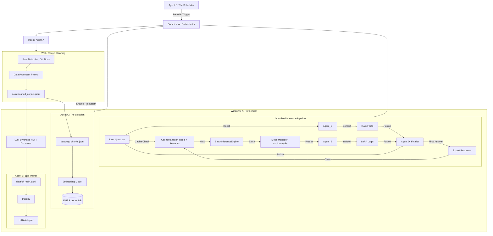
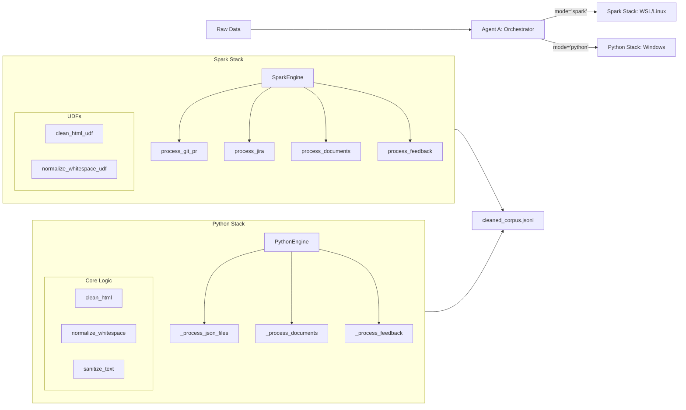

# LoRA + RAG Multi-Agent Architecture: Enterprise Knowledge Hub

This document describes the evolved technical architecture of the pipeline, which integrates Data Alchemy, Multi-Agent Coordination, RAG (Retrieval-Augmented Generation), and LoRA Fine-tuning.

## 1. Overall Pipeline (Agentic Workflow)

The system is organized into specialized Agents and a cross-environment data pipeline.

## 2. Multi-Agent Roles

### 2.1 Agent A: The Cleaner (Data Alchemy)
- **Responsibility**: Heterogeneous data extraction and cleaning.
- **Cross-Environment Orchestration**: Agent A in the main project acts as a bridge. It triggers the **Spark Standalone Project** in WSL for large-scale rough cleaning.
- **Output**: Produces `cleaned_corpus.jsonl` (Roughly cleaned, desensitized) and `rag_chunks.jsonl` (Semantic chunks for RAG).

### 2.2 Agent B: The Trainer (Domain Specialist)
- **Responsibility**: Managing the LoRA life cycle.
- **Role in Inference**: Provides "Model Intuition". It understands domain-specific terminology and the "style" of the internal data.

### 2.3 Agent C: The Librarian (RAG Manager)
- **Responsibility**: Vector storage and high-speed retrieval.
- **Technology**: **FAISS** + **Sentence-Transformers**.

### 2.4 Agent D: The Finalist (Fusion Expert)
- **Responsibility**: Evidence synthesis and final answering.
- **Strategy**: Hybrid Parallel Fusion. It combines facts from Agent C and reasoning suggestions from Agent B via DeepSeek.

### 2.5 Agent S: The Scheduler (Chronos)
- **Responsibility**: Automated periodic execution (Wash -> Refine -> Train).

---

## 3. Data Flow Specification
# LoRA + RAG Multi-Agent Architecture: Enterprise Knowledge Hub

This document describes the evolved technical architecture of the pipeline, which integrates Data Alchemy, Multi-Agent Coordination, RAG (Retrieval-Augmented Generation), and LoRA Fine-tuning.

## 1. Overall Pipeline (Agentic Workflow)

The system is organized into specialized Agents and a cross-environment data pipeline.

---

## 2. Multi-Agent Roles

### 2.1 Agent A: The Cleaner (Data Alchemy)
- **Responsibility**: Heterogeneous data extraction and cleaning.
- **Cross-Environment Orchestration**: Agent A in the main project acts as a bridge. It triggers the **Data Processor Project** in WSL for large-scale rough cleaning.
- **Output**: Produces `cleaned_corpus.jsonl` (Roughly cleaned, desensitized) and `rag_chunks.jsonl` (Semantic chunks for RAG).

### 2.2 Agent B: The Trainer (Domain Specialist)
- **Responsibility**: Managing the LoRA life cycle.
- **Role in Inference**: Provides "Model Intuition". It understands domain-specific terminology and the "style" of the internal data.

### 2.3 Agent C: The Librarian (RAG Manager)
- **Responsibility**: Vector storage and high-speed retrieval.
- **Technology**: **FAISS** + **Sentence-Transformers**.

### 2.4 Agent D: The Finalist (Fusion Expert)
- **Responsibility**: Evidence synthesis and final answering.
- **Strategy**: Hybrid Parallel Fusion. It combines facts from Agent C and reasoning suggestions from Agent B via DeepSeek.

### 2.5 Agent S: The Scheduler (Chronos)
- **Responsibility**: Automated periodic execution (Wash -> Refine -> Train).

---

## 3. Data Flow Specification

| Stage | Platform | Engine | Input | Output | Purpose |
| :--- | :--- | :--- | :--- | :--- | :--- |
| **Rough Cleaning** | WSL | Spark | `data/raw/*` | `cleaned_corpus.jsonl` | Massive data cleaning & desensitization |
| **Refinement** | Windows | LLM (ETL) | `cleaned_corpus.jsonl` | `sft_train.jsonl` | Generating high-quality QA training pairs |
| **Indexing** | Windows | Agent C | `rag_chunks.jsonl` | FAISS Index | Build the searchable knowledge base |
| **Training** | Windows | Agent B | `sft_train.jsonl` | LoRA Adapter | Fine-tune model on domain patterns |
| **Chat** | Windows | Coordinator | User Query | Final Answer | Combine RAG facts and LoRA intuition |

---

## 4. Dual-Stack Cleaning Engine (Phase 1)

To ensure both high performance for large datasets and zero-dependency ease of use for small datasets, the system implements a "Dual-Stack" cleaning architecture.

### 4.1 Architecture Overview

### 4.2 Engine Comparison

| Feature | Spark Engine (`main.py`) | Python Engine (`python_engine.py`) |
| :--- | :--- | :--- |
| **Environment** | WSL / Linux (Big Data Stack) | Windows / macOS (Pure Python) |
| **Data Scale** | > 10GB (Distributed) | < 1GB (Single Machine) |
| **Core Technology** | PySpark DataFrames & UDFs | Standard Python Lists & Dicts |
| **Cleaning Pipeline** | `clean_html` -> `normalize_whitespace` | `clean_html` -> `normalize_whitespace` -> `sanitize_text` |
| **Chunking Strategy** | Spark-native windowing (planned) | Sliding window (`_chunk_text`) |

### 4.3 Key Functions & Logic

#### Shared Cleaners (`data_processor/cleaners/base.py`)
- `clean_html(text)`: Uses `BeautifulSoup` with `html.parser` to strip tags and extract clean text.
- `normalize_whitespace(text)`: Uses `re.sub(r'\s+', ' ', text)` to collapse multiple spaces and newlines.

#### Sanitization (`data_processor/sanitizers.py`)
- `sanitize_text(text)`: Iterates through `PATTERNS` defined in `config.py` (e.g., IP addresses, internal URLs) and replaces them with `TOKENS` (e.g., `[IP_ADDR]`).

#### Spark Engine Specifics
- **UDF Registration**: Cleaners are wrapped in `pyspark.sql.functions.udf` for parallel execution across the Spark cluster.
- **DataFrame Union**: Different sources are processed into identical schemas and combined using `df.union()`.

#### Python Engine Specifics
- **Lazy Loading**: Parsers like `pypdf` and `python-docx` are loaded only when needed to minimize startup time.
- **Memory Efficient**: Uses generators and line-by-line JSON processing to handle files larger than RAM.

---

## 5. Cross-Environment Architecture

To solve dependency conflicts between ROCm (AI) and Spark (Java/Big Data), the project is split:

1.  **Main Project (Windows/ROCm)**: Contains AI Agents (B, C, D), Coordinator, and LLM Refinement logic.
2.  **Data Processor (WSL/Linux)**: A lightweight project in `data_processor/` that only depends on PySpark.
3.  **Infrastructure (Kubernetes)**: MinIO for S3 storage and Redis for inference caching.

**Communication**: Orchestrated via `subprocess` calls using `wsl` command and data exchange via S3 (MinIO) or Redis.

---

## 6. Inference Optimization & Caching

To meet enterprise requirements for high concurrency and low latency, the system implements a multi-tier optimization strategy.

### 6.1 ModelManager (ROCm Acceleration)
- **`torch.compile`**: Uses the Inductor backend to generate optimized Triton/C++ kernels for AMD GPUs.
- **Mixed Precision**: Automatically uses `torch.float16` for inference to reduce VRAM usage and increase throughput.
- **Lazy Loading**: Models are loaded into GPU memory only upon the first request.

### 6.2 BatchInferenceEngine (Throughput)
- **Dynamic Batching**: Accumulates incoming requests into batches (default max 8) within a short window (default 50ms).
- **Async Processing**: Uses `asyncio` to handle multiple concurrent users without blocking the main event loop.

### 6.3 CacheManager (Intelligence)
- **Exact Match**: MD5 hashing of prompt + parameters for instant retrieval.
- **Semantic Search**: Uses `all-MiniLM-L6-v2` to compute query embeddings. If a new query is >92% similar to a cached one, the cached result is returned.
- **Redis Persistence**: All cache entries and the semantic index are persisted to Redis, ensuring survival across restarts.
