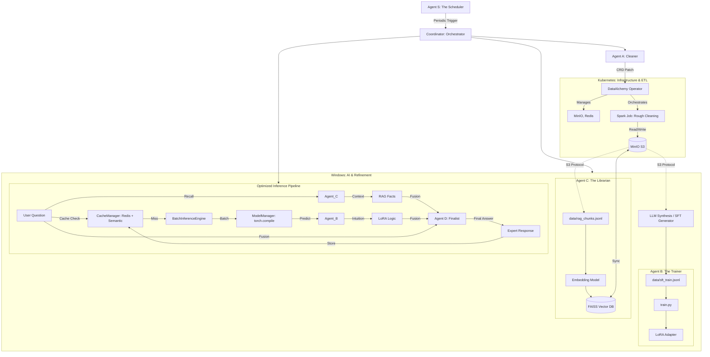

# LoRA + RAG Multi-Agent Architecture: Enterprise Knowledge Hub

This document describes the evolved technical architecture of the pipeline, which integrates Data Alchemy, Multi-Agent Coordination, RAG (Retrieval-Augmented Generation), and LoRA Fine-tuning.

## 1. Overall Pipeline (Agentic Workflow)

The system is organized into specialized Agents and a cross-environment data pipeline.


## 2. Multi-Agent Roles

### 2.1 Agent A: The Cleaner (Data Alchemy)
- **Responsibility**: Heterogeneous data extraction and cleaning.
- **Cross-Environment Orchestration**: Agent A in the main project acts as a bridge. It triggers the **Spark Standalone Project** in WSL for large-scale rough cleaning.
- **Output**: Produces `cleaned_corpus.jsonl` (Roughly cleaned, desensitized) and `rag_chunks.jsonl` (Semantic chunks for RAG).

### 2.2 Agent B: The Trainer (Domain Specialist)
- **Responsibility**: Managing the LoRA life cycle.
- **Role in Inference**: Provides "Model Intuition". It understands domain-specific terminology and the "style" of the internal data.

### 2.3 Agent C: The Librarian (RAG Manager)
- **Responsibility**: Vector storage and high-speed retrieval.
- **Technology**: **FAISS** + **Sentence-Transformers**.

### 2.4 Agent D: The Finalist (Fusion Expert)
- **Responsibility**: Evidence synthesis and final answering.
- **Strategy**: Hybrid Parallel Fusion. It combines facts from Agent C and reasoning suggestions from Agent B via DeepSeek.

### 2.5 Agent S: The Scheduler (Chronos)
- **Responsibility**: Automated periodic execution (Wash -> Refine -> Train).

---

## 3. Data Flow Specification
# LoRA + RAG Multi-Agent Architecture: Enterprise Knowledge Hub

This document describes the evolved technical architecture of the pipeline, which integrates Data Alchemy, Multi-Agent Coordination, RAG (Retrieval-Augmented Generation), and LoRA Fine-tuning.

## 1. Overall Pipeline (Agentic Workflow)

The system is organized into specialized Agents and a cloud-native hybrid data pipeline managed by a **Kubernetes Operator**.



---

## 2. Multi-Agent Roles

### 2.1 Agent A: The Cleaner (Data Alchemy)
- **Responsibility**: Heterogeneous data extraction and distributed cleaning.
- **Operator Integration**: Agent A triggers cleaning by patching the `DataAlchemyStack` custom resource with an annotation. The **Operator** then spawns a Spark Job in Kubernetes with correct S3 credentials and resource limits.
- **Output**: Spark writes results directly to S3 (`cleaned_corpus.jsonl` and `rag_chunks.jsonl`).

### 2.2 Agent B: The Trainer (Domain Specialist)
- **Responsibility**: Managing the LoRA life cycle.
- **Role in Inference**: Provides "Model Intuition". It understands domain-specific terminology and the "style" of the internal data.
### 2.3 Agent C: The Librarian (Knowledge Manager)
- **Responsibility**: Distributed vector storage and high-speed retrieval.
- **Technology**: **FAISS** + **SQLite** + **MinIO/S3**.
- **Optimization**:
    - **Distributed Persistence**: Index and metadata are stored in S3/MinIO for cross-instance sharing.
    - **Memory Efficiency**: Metadata is stored in SQLite instead of memory-heavy pickle files.
    - **Dynamic Reloading**: Background thread periodically syncs with S3 to update the local index without downtime.

### 2.4 Agent D: The Finalist (Fusion Expert)
- **Responsibility**: Evidence synthesis and final answering.
- **Strategy**: Hybrid Parallel Fusion. It combines facts from Agent C and reasoning suggestions from Agent B via DeepSeek.

### 2.5 Agent S: The Scheduler (Chronos)
- **Responsibility**: Automated periodic execution (Wash -> Refine -> Train).

---

## 3. Data Flow Specification

| Stage | Platform | Engine | Input | Output | Purpose |
| :--- | :--- | :--- | :--- | :--- | :--- |
| **Rough Cleaning** | K8s | Spark (Operator) | `s3://raw/*` | `s3://processed/*` | Distributed cleaning & desensitization |
| **Refinement** | Windows | LLM (ETL) | `s3://processed/*` | `data/sft_train.jsonl` | Generating high-quality QA training pairs |
| **Indexing** | Windows | Agent C | `s3://processed/*` | FAISS Index (S3 Sync) | Build and backup knowledge base |
| **Training** | Windows | Agent B | `data/sft_train.jsonl` | LoRA Adapter | Fine-tune model on domain patterns |
| **Chat** | Windows | Coordinator | User Query | Final Answer | Combine RAG facts and LoRA intuition |

---

## 4. Dual-Stack Cleaning Engine (Cloud-Native)

To ensure both high performance for large datasets and zero-dependency ease of use for small datasets, the system implements a "Dual-Stack" cleaning architecture, now orchestrated by Kubernetes.

### 4.1 Architecture Overview

```mermaid
flowchart LR
    Input[Raw Data] --> AgentA[Agent A: Orchestrator]
    
    AgentA -->|mode='spark'| Operator[DataAlchemy Operator]
    Operator -->|Spawn| SparkJob[Spark Job: K8s]
    AgentA -->|mode='python'| PythonPath[Python Stack: Windows]
    
    subgraph SparkStack [Spark Stack (Managed by Operator)]
        SparkJob --> S_Cleaners[Specialized Cleaners]
        S_Cleaners --> S_Output[S3: cleaned_corpus.jsonl]
    end
    
    subgraph PythonStack [Python Stack (Local)]
        PyEngine[PythonEngine]
        PyEngine --> P_Cleaners[Local Cleaners]
        P_Cleaners --> P_Output[Local: cleaned_corpus.jsonl]
    end
```

### 4.2 Engine Comparison

| Feature | Spark Engine (K8s) | Python Engine (Local) |
| :--- | :--- | :--- |
| **Environment** | Kubernetes (Operator Managed) | Windows Host (Native) |
| **Data Scale** | > 10GB (Distributed) | < 1GB (Single Machine) |
| **Infrastructure** | Managed MinIO & Redis | Local Filesystem |
| **Persistence** | HostPath (C:\Users\...\data) | Local `data/` folder |

---

## 5. Cloud-Native Hybrid Architecture

To solve dependency conflicts between ROCm (AI) and Java (Spark/K8s), the project uses a hybrid architecture:

1.  **Infrastructure Plane (Kubernetes)**:
    -   Managed by the **DataAlchemy Operator**.
    -   Hosts **MinIO** (S3) and **Redis** (Cache).
    -   Executes **Spark Jobs** for massive data processing.
    -   Exposes services to the host via `LoadBalancer` on `localhost`.

2.  **Compute Plane (Windows Host)**:
    -   Runs GPU-intensive tasks: **LoRA Training** and **Joint Inference**.
    -   Hosts the **WebUI** and **Multi-Agent Coordinator**.
    -   Connects to K8s Infrastructure via standard S3/Redis protocols.

3.  **Persistence Layer (Shared HostPath)**:
    -   Critical data (MinIO buckets, Redis AOF) is stored on the Windows host's filesystem (`data/minio_data`, `data/redis_data`).

---

## 6. Inference Optimization & Caching

### 6.1 ModelManager (ROCm Acceleration)
- **`torch.compile`**: Uses Inductor to generate optimized kernels for AMD GPUs.
- **Mixed Precision**: Uses `torch.float16` to increase throughput.

### 6.2 CacheManager (Redis + Semantic)
- **Semantic Search**: If a new query is >92% similar to a cached one, the cached result is returned.
- **Redis Persistence**: Uses **Redis AOF (Append Only File)** with `hostPath` persistence to ensure chat history survives Pod restarts.

---

## 7. Monitoring & Observability

The system uses **Prometheus** for real-time performance tracking, with a simplified WebUI that focuses on the core AI experience.

### 7.1 Key Metrics
- **`inference_latency_seconds`**: Histogram of processing time.
- **`inference_cache_hits_total`**: Counter for exact vs. semantic hits.
- **`gpu_memory_usage_bytes`**: Gauge for VRAM consumption.
