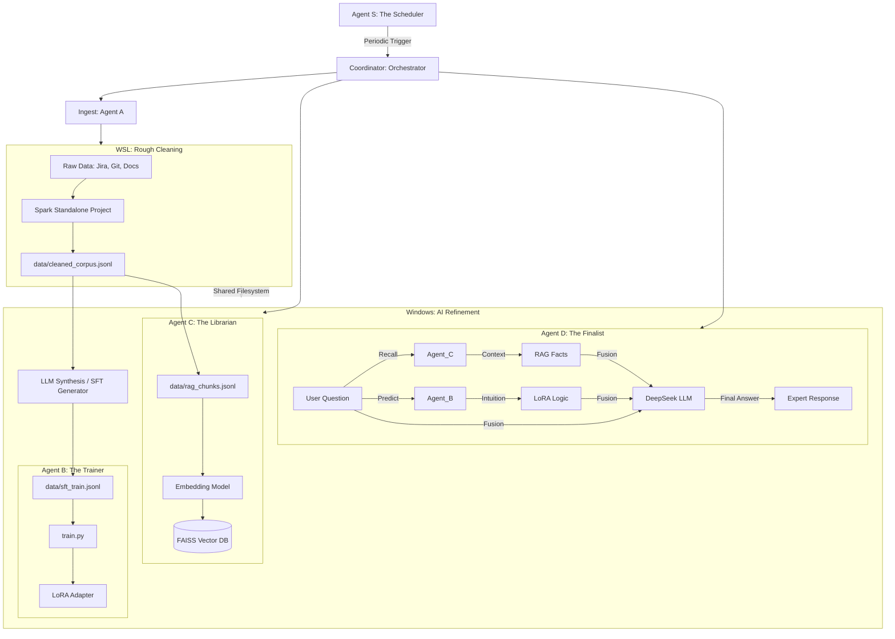

# LoRA + RAG Multi-Agent Architecture: Enterprise Knowledge Hub

This document describes the evolved technical architecture of the pipeline, which integrates Data Alchemy, Multi-Agent Coordination, RAG (Retrieval-Augmented Generation), and LoRA Fine-tuning.

## 1. Overall Pipeline (Agentic Workflow)

The system is organized into specialized Agents and a cross-environment data pipeline.

---

## 2. Multi-Agent Roles

### 2.1 Agent A: The Cleaner (Data Alchemy)
- **Responsibility**: Heterogeneous data extraction and cleaning.
- **Cross-Environment Orchestration**: Agent A in the main project acts as a bridge. It triggers the **Spark Standalone Project** in WSL for large-scale rough cleaning.
- **Output**: Produces `cleaned_corpus.jsonl` (Roughly cleaned, desensitized) and `rag_chunks.jsonl` (Semantic chunks for RAG).

### 2.2 Agent B: The Trainer (Domain Specialist)
- **Responsibility**: Managing the LoRA life cycle.
- **Role in Inference**: Provides "Model Intuition". It understands domain-specific terminology and the "style" of the internal data.

### 2.3 Agent C: The Librarian (RAG Manager)
- **Responsibility**: Vector storage and high-speed retrieval.
- **Technology**: **FAISS** + **Sentence-Transformers**.

### 2.4 Agent D: The Finalist (Fusion Expert)
- **Responsibility**: Evidence synthesis and final answering.
- **Strategy**: Hybrid Parallel Fusion. It combines facts from Agent C and reasoning suggestions from Agent B via DeepSeek.

### 2.5 Agent S: The Scheduler (Chronos)
- **Responsibility**: Automated periodic execution (Wash -> Refine -> Train).

---

## 3. Data Flow Specification

| Stage | Platform | Engine | Input | Output | Purpose |
| :--- | :--- | :--- | :--- | :--- | :--- |
| **Rough Cleaning** | WSL | Spark | `data/raw/*` | `cleaned_corpus.jsonl` | Massive data cleaning & desensitization |
| **Refinement** | Windows | LLM (ETL) | `cleaned_corpus.jsonl` | `sft_train.jsonl` | Generating high-quality QA training pairs |
| **Indexing** | Windows | Agent C | `rag_chunks.jsonl` | FAISS Index | Build the searchable knowledge base |
| **Training** | Windows | Agent B | `sft_train.jsonl` | LoRA Adapter | Fine-tune model on domain patterns |
| **Chat** | Windows | Coordinator | User Query | Final Answer | Combine RAG facts and LoRA intuition |

---

## 4. Cross-Environment Architecture

To solve dependency conflicts between ROCm (AI) and Spark (Java/Big Data), the project is split:

1.  **Main Project (Windows/ROCm)**: Contains AI Agents (B, C, D), Coordinator, and LLM Refinement logic.
2.  **Spark ETL Standalone (WSL/Linux)**: A lightweight project in `spark_etl_standalone/` that only depends on PySpark.

**Communication**: Orchestrated via `subprocess` calls using `wsl` command and data exchange via the shared Windows filesystem (`/mnt/c/...`).
