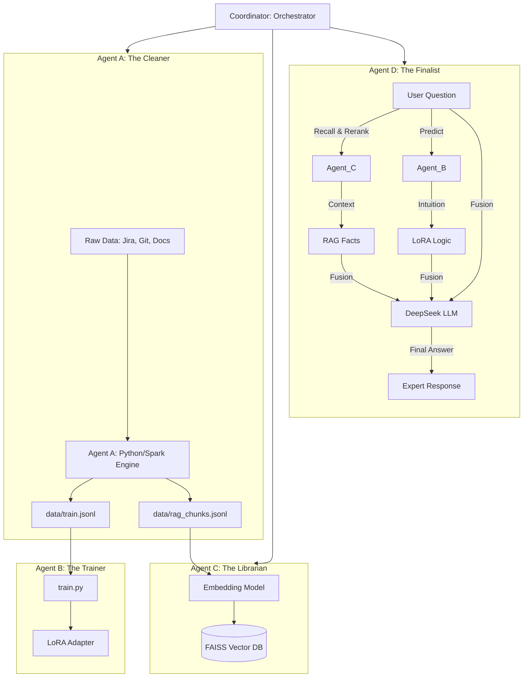

# LoRA + RAG Multi-Agent Architecture: Enterprise Knowledge Hub

This document describes the evolved technical architecture of the pipeline, which integrates Data Alchemy, Multi-Agent Coordination, RAG (Retrieval-Augmented Generation), and LoRA Fine-tuning.

## 1. Overall Pipeline (Agentic Workflow)

The system is now organized into four specialized Agents that collaborate to transform raw data into expert responses.

---

## 2. Multi-Agent Roles

### 2.1 Agent A: The Cleaner (Data Alchemy)
- **Responsibility**: Heterogeneous data extraction and cleaning.
- **Dual-Track Engine**: Supports both Python (local) and Spark (distributed).
- **Key Feature**: **Semantic Chunking**. It produces `rag_chunks.jsonl` with overlapping sliding windows for high-precision retrieval.

### 2.2 Agent B: The Trainer (Domain Specialist)
- **Responsibility**: Managing the LoRA life cycle.
- **Role in Inference**: Provides "Model Intuition". It understands domain-specific terminology and the "style" of the internal data even without specific context.

### 2.3 Agent C: The Librarian (RAG Manager)
- **Responsibility**: Vector storage and high-speed retrieval.
- **Technology**: **FAISS** (IndexFlatIP) + **Sentence-Transformers**.
- **Search Strategy**: Uses semantic search to retrieve the most relevant documentation fragments.

### 2.4 Agent D: The Finalist (Fusion Expert)
- **Responsibility**: Evidence synthesis and final answering.
- **Strategy**: **Hybrid Parallel Fusion**. It takes raw facts from Agent C and reasoning suggestions from Agent B, then uses DeepSeek to resolve conflicts and generate the final reliable answer.

---

## 3. Data Flow Specification

| Mode | Agent Path | Input | Output | Purpose |
| :--- | :--- | :--- | :--- | :--- |
| **Ingest** | A -> C | Raw Data | FAISS Index | Build the searchable knowledge base |
| **Train** | B | `train.jsonl` | LoRA Adapter | Teach the model domain patterns |
| **Chat** | C + B -> D | User Query | Final Answer | Combine facts and intuition for the user |

---

## 4. Component Details

### 4.1 RAG Layer (`src/rag/`)
- **Vector Store**: FAISS index for O(1) semantic search.
- **Embedding**: Local models for low-latency vectorization.
- **Persistence**: Metadata and vectors are saved locally to `data/`.

### 4.2 Coordination Layer (`src/agents/`)
- **Coordinator**: The main entry point that manages the state and sequence of agent operations.
- **Fused Prompting**: Agent D uses a specialized prompt that combines User Query, RAG Evidence, and LoRA Intuition.

---

## 5. Deployment & Scaling

- **Development**: Use `python` mode for Agent A and local FAISS.
- **Production**: Switch Agent A to `spark` mode for large-scale data, and migrate FAISS to a distributed vector DB like Milvus/Chroma if needed.
