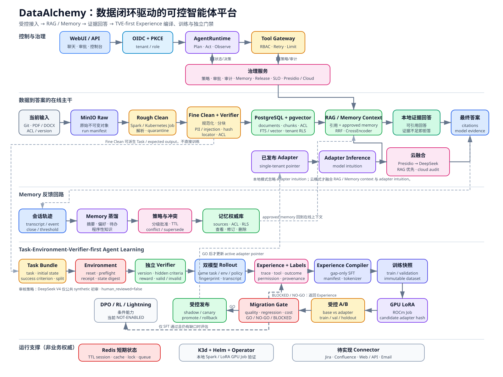
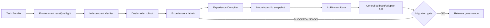
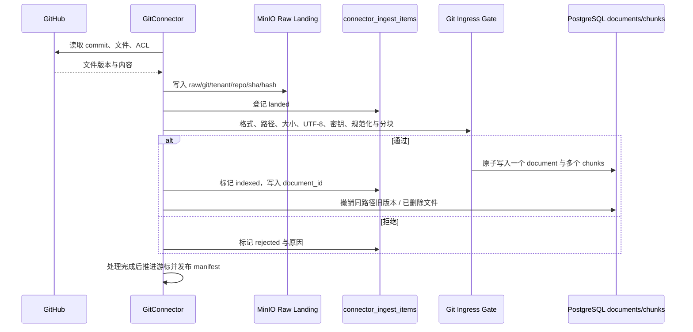

# DataAlchemy 当前软件架构

> 当前分支：`feat/harness-tve`；Agent Learning 功能证据基线：`7d312ce`（2026-08-25）。
> DataAlchemy 是**内部发布候选**，
> 不是已通过真实客户验收的正式生产版。阶段交付与未关闭门禁以
> [发布状态](./RELEASE_STATUS.md) 为准。

## 1. 架构原则与边界

- **单一运行时**：`Plan → Act → Observe → Replan` 是唯一任务编排路径；不以多 Agent
  图或第二套调度器作为线上权威。
- **PostgreSQL 是事务与知识权威**：任务、事件、审批、文档、chunk、pgvector、FTS、
  ACL、记忆、审计和发布记录全部受 tenant RLS 约束。
- **MinIO 不是检索索引**：保存 Git/PDF/DOCX 原始不可变对象、运行 manifest、备份和其他
  产物；检索永远从 PostgreSQL 读取。
- **Redis 不是长期状态**：只保存 tenant scope + TTL 的会话、缓存、锁和队列。
- **Spark/K3d 是受控执行能力**：PDF/DOCX 试点的 rough clean 使用真实 Kubernetes Job；
  Spark 也用于大规模历史回灌和批量粗清洗。Git 增量同步不必每次启动 Spark；K3d 仍只用于
  本地 Kubernetes/Helm 验证。
- **训练默认关闭**：只有已审核、具有来源与 tenant 许可的反馈可成为训练候选；未通过
  固定评测与审批的 LoRA 不发布。
- **Task-Environment-Verifier 优先**：可重放 Task Bundle、可重置 Environment 和独立 Verifier
  是模型无关资产；Experience、compiled dataset 和 adapter 依次由其派生。
- **证据先于生成**：在线回答必须保留 RAG 引用；无可用云模型时直接基于证据回答，
  证据不足则拒答。云融合是显式可选路径，外发前必须通过 Presidio 脱敏并写入审计。

## 2. 当前软件架构图

这是一张统一流程图：中间主干从外部数据一直到最终答案；回答后的会话进入 Memory
蒸馏回路。LoRA 同时接收 Fine Clean 派生的 SFT 候选和问答轨迹/反馈，但两者都必须
经过训练样本门禁，而不能自动训练；发布结果再回到 adapter inference。
控制与治理位于主干上方；Redis、K3d 和未实现 Connector 只作为运行支撑，
不是文档、记忆或发布状态的业务权威。
控制面的主路径是 `WebUI/API → OIDC → AgentRuntime → Tool Gateway`。治理服务
不执行工具：它与 Runtime/Gateway 双向交换策略、审批、状态与审计证据；
Tool Gateway 是唯一受控工具出口，并由它访问 Retriever 等在线能力。

## 3. 在线请求与任务执行

1. WebUI/API 通过 OIDC（生产）或受控本地身份（开发）得到服务端验证的用户、角色和
   tenant；生产环境拒绝默认管理员与本地密码登录。
2. `AgentRuntime` 在 PostgreSQL 创建任务、计划和事件。所有工具调用只能从统一
   `Tool Gateway` 出口执行，先经过 schema、RBAC、幂等、限流、重试预算和敏感字段脱敏检查。
   治理服务提供可持久的策略与审批决策，并接收 Runtime/Gateway 产生的审计证据；
   它不是第二个工具调度器。
3. `rag_chat` 用同一 tenant identity 查询 PostgreSQL：pgvector 与 FTS 分别召回，RRF 合并，
   再由 CrossEncoder 精排。RLS 与 ACL 在数据库中限制可见文档。
4. 本地模式不调用云模型：根据召回证据生成可引用回答，或在证据不足时拒答。
   云模式可将 RAG context 和 adapter intuition 交给 DeepSeek 融合；任何外发文本先经
   Presidio 脱敏，门禁不可用则拒绝云调用。adapter 不能越过 RAG 引用或独立作为事实来源。
5. WebUI 反馈先保存不可变 source，再按 `run_id` 幂等写入 PostgreSQL
   `trajectory_annotations`；只有 reviewer 明确审批且授予训练许可后才能进入 H5 snapshot。
6. 运行时可暂停、恢复或失败；任务、工具结果和审计记录均可关联查询。Redis 丢失不会改变
   任务、记忆或检索权威状态。
7. 版本发布必须包含评测结果、guardrail 和回滚目标；候选依次经历 shadow、canary、
   promote，异常自动回滚。

Memory 与 LoRA 是两条不同的反馈闭环：

- **Memory 蒸馏**：会话关闭或达到轮数阈值后，从 transcript/event 提炼摘要、偏好、
  待办和程序性知识。经分级批准、TTL、冲突与 supersede 策略后写入 PostgreSQL
  Memory，再作为后续问答上下文；这一路径不会训练模型。
- **LoRA 学习**：Fine Clean 的规范化 chunk 必须先转换为带监督标签和来源信息的 SFT
  候选；问答轨迹、用户反馈或修订也必须形成 annotation。只有来源、split、许可与审核
  完整且 `training_allowed=true` 的 Experience 才能由版本化 compiler 生成不可变训练快照，
  经 GPU LoRA、固定 base/adapter A/B、safety verifier 和发布治理后更新 adapter pointer。
  LLM judge 可审核明确授权的公共 synthetic fixture，但必须保留 `human_reviewed=false`，不能
  替代生产数据人工校准。
  本地回答忽略 adapter intuition；只有云增强路径会将它与 RAG/Memory context 融合。

### 3.1 Agent Learning 资产与执行链

```mermaid
flowchart LR
    T[Task Bundle] --> E[Environment reset/preflight]
    E --> V[Independent Verifier]
    V --> R[Dual-model rollout]
    R --> X[Experience + labels]
    X --> C[Experience Compiler]
    C --> S[Model-specific snapshot]
    S --> L[LoRA candidate]
    L --> A[Controlled base/adapter A/B]
    A --> G{Migration gate}
    G -->|GO| P[Release governance]
    G -->|BLOCKED / NO-GO| X
```

权威边界保持不变：PostgreSQL 保存 tenant、状态、许可和关系投影；MinIO 保存内容寻址的
Task Bundle、receipt、transcript、Experience、compiled dataset、manifest 与决策报告；Kubernetes Job
只是训练执行器。旧模型 trajectory 会完整保留，但 compiler 只选择目标模型仍存在的能力缺口，且不会把
失败重试原封不动编译成期望行为。

当前公共 MultiDoc2Dial 工程闭环已经执行两组 TinyLlama/Qwen2.5 base/adapter A/B。两个 adapter 均停在
`candidate`：TinyLlama 总体改善但 validation/holdout 回退；Qwen2.5 总体无改善且 holdout 回退；两组
迁移门禁还缺少不可变训练成本证据。因此 EL-3 为 `BLOCKED`，DPO/RL 与 Agent Lightning 未启用。
完整证据见 [Agent Learning 设计](./harness/EXPERIENCE_FIRST_AGENT_LEARNING_DESIGN.md) 和
[实施计划](./harness/EXPERIENCE_FIRST_AGENT_LEARNING_PLAN.md)。

## 4. 受控数据接入与清洗

首个内部试点可以绕过 Git：管理员通过 WebUI 的
`POST /api/pilot-runs/document` 上传一份 PDF/DOCX。系统将文件和 descriptor 写入
`raw/harness/<tenant>/<input_id>/`，然后以 strict `run_id` 执行
`validate → spark_rough_clean → refine_corpus → publish_corpus → rag_probe`。完整步骤见
[本地环境操作手册](./LOCAL_ENVIRONMENT_OPERATIONS.md) 和
[一份文档的内部试点快速开始](./PILOT_QUICKSTART.md)。

Git 连接器**不直接把外部文件写入可检索表**。同步是同步执行的两阶段流程，失败时不推进
连接器游标：

```mermaid
sequenceDiagram
    participant G as GitHub
    participant C as GitConnector
    participant M as MinIO Raw Landing
    participant I as connector_ingest_items
    participant P as Git Ingress Gate
    participant D as PostgreSQL documents/chunks

    C->>G: 读取 commit、文件、ACL
    G-->>C: 文件版本与内容
    C->>M: 写入 raw/git/tenant/repo/sha/hash
    C->>I: 登记 landed
    C->>P: 格式、路径、大小、UTF-8、密钥、规范化与分块
    alt 通过
        P->>D: 原子写入一个 document 与多个 chunks
        C->>I: 标记 indexed，写入 document_id
        C->>D: 撤销同路径旧版本 / 已删除文件
    else 拒绝
        C->>I: 标记 rejected 与原因
    end
    C->>C: 处理完成后推进游标并发布 manifest
```

当前门禁拒绝二进制或非 UTF-8 内容、超过索引上限的文件、依赖/构建目录、锁文件、已知
二进制后缀和疑似密钥。原始对象保留在受限区用于审计、重放和后续 Spark 回灌；只有通过
门禁的规范化文本才进入 `documents` / `document_chunks`。

Markdown 按标题分块，其他文本按递归文本边界分块。一个源文件对应一个 document，多个
chunk 作为其子记录原子发布，避免旧实现把每个 chunk 伪装成独立文档。

## 5. 存储、权限与恢复

| 数据类别 | 权威位置 | 访问与恢复规则 |
| --- | --- | --- |
| 任务、事件、审批、工具幂等 | PostgreSQL | tenant RLS；检查点用于恢复 |
| 文档、chunk、向量、FTS、ACL | PostgreSQL + pgvector | RLS 与 ACL 先于检索结果可见性 |
| 记忆与策略事件 | PostgreSQL | 候选需审批；可过期、更正、删除和回放 |
| Git 原始版本、运行 manifest | MinIO | 受限写入；按哈希核验，可用于重放 |
| Task Bundle、环境 receipt、Experience、compiled dataset 与学习决策 | MinIO + PostgreSQL 投影 | 对象内容寻址；许可、状态和依赖关系受 RLS 与独立 verifier 约束 |
| 缓存、会话、锁、队列 | Redis | tenant scope + TTL；不可作为长期事实 |
| 发布与审计 | PostgreSQL | 管理员 RLS；审计字段脱敏 |

恢复演练只允许恢复到预创建的隔离数据库。恢复后必须验证 pgvector、治理表、连接器游标、
manifest 以及 tenant 隔离；不得将恢复命令指向源库。

## 6. 条件扩展与非当前能力

| 能力 | 当前定位 | 启用条件 |
| --- | --- | --- |
| Spark / Operator | PDF/DOCX 试点 rough clean，以及 Jira、Confluence、Git PR、反馈等批量清洗器 | 需要批量解析、历史回灌或单机 Worker 无法满足吞吐时 |
| K3d | 本地集群验证 | 验证 Helm、Operator、卷与 NodePort 时 |
| Email / 邮箱连接器 | 尚未实现 | 明确试点需求、源 ACL 与接入门禁设计完成后 |
| LoRA 训练 | synthetic gap-only 训练链已验证；发布默认关闭 | 来源与 split 合规、独立审核、受控 A/B 优于基线、成本证据完整且获得发布审批 |
| DPO / RL / Agent Lightning | 未启用 | SFT 已验证仍有明确缺口，且 preference/reward、批量 reset、telemetry 与预算门禁全部通过 |
| 云增强模型 | RAG + adapter intuition 的显式可选融合路径 | `EXECUTION_MODE=cloud`、DeepSeek 凭据、Presidio fail-closed 脱敏和 cloud audit 全部可用 |
| 图记忆 / 多智能体 | 未采用 | 真实任务证明单运行时或 pgvector 无法满足需求 |

## 7. 发布状态

工程门禁、双 tenant 压缩预演、受控发布与隔离恢复已通过，项目处于内部发布候选状态。
正式 GA 仍依赖 `GA-01`：两支独立真实团队连续四周试点、周度审计，并签署价值与安全结果。
本地测试或模拟预演不能替代该外部验收。

相关文档：[一份文档的内部试点快速开始](./PILOT_QUICKSTART.md)、[发布状态](./RELEASE_STATUS.md)、
[Phase 4 发布候选报告](./release/PHASE4_RELEASE_CANDIDATE_REPORT.md)、
[GA-01 试点包](./release/GA01_PILOT_PACK.md)。
