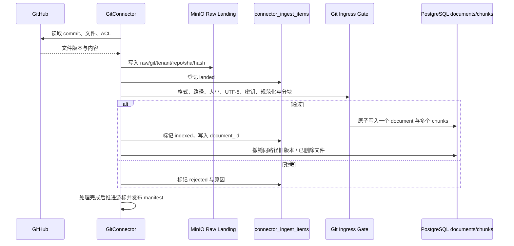

# DataAlchemy 当前软件架构

> 当前代码基线：`feat/phase-4-governance-learning`。DataAlchemy 是**内部发布候选**，
> 不是已通过真实客户验收的正式生产版。阶段交付与未关闭门禁以
> [Phase 0--4 交付总览](./PHASE_DELIVERY_SUMMARY.md) 为准。

## 1. 架构原则与边界

- **单一运行时**：`Plan → Act → Observe → Replan` 是唯一任务编排路径；不以多 Agent
  图或第二套调度器作为线上权威。
- **PostgreSQL 是事务与知识权威**：任务、事件、审批、文档、chunk、pgvector、FTS、
  ACL、记忆、审计和发布记录全部受 tenant RLS 约束。
- **MinIO 不是检索索引**：只保存 Git 原始不可变对象、运行 manifest、备份和其他运行
  产物；检索永远从 PostgreSQL 读取。
- **Redis 不是长期状态**：只保存 tenant scope + TTL 的会话、缓存、锁和队列。
- **Spark/K3d 是条件能力**：Spark 用于大规模历史回灌和批量粗清洗；K3d 只用于本地
  Kubernetes/Helm 验证。它们不属于内部 Alpha 的必经在线依赖。
- **训练默认关闭**：只有已审核、具有来源与 tenant 许可的反馈可成为训练候选；未通过
  固定评测与审批的 LoRA 不发布。

## 2. 当前软件架构图

```mermaid
flowchart TB
    User[试点用户 / 管理员] --> UI[FastAPI WebUI / API]
    IdP[OIDC Provider] -->|授权码 + PKCE| UI

    subgraph Control[控制面：单智能体与治理]
        UI --> Auth[服务端身份、角色与 tenant 映射]
        Auth --> Runtime[AgentRuntime\nPlan → Act → Observe → Replan]
        Runtime --> Gateway[Tool Gateway\nSchema / RBAC / Approval / Rate Limit / Retry]
        Runtime --> Audit[AuditLog]
        Runtime --> Release[Release Governance\nCandidate → Shadow → Canary → Promote/Rollback]
        Runtime --> Memory[Memory Governance\nApproval / Expiry / Conflict / Delete]
    end

    subgraph Knowledge[知识面：唯一在线权威]
        Gateway -->|rag_chat| Retriever[Retriever\npgvector + FTS → RRF → CrossEncoder]
        Retriever --> PG[(PostgreSQL + pgvector)]
        Memory --> PG
        Audit --> PG
        Release --> PG
        PG --> RLS[Tenant RLS + 文档/记忆 ACL]
    end

    subgraph Ingress[数据接入：Git 试点]
        Git[GitHub Read-only API] --> Connector[GitConnector\nCommit / ACL / version / deletion]
        Connector --> Raw[MinIO 受限原始区\nraw/git/...]
        Connector --> Gate[Git Ingress Gate\n类型/路径/大小/编码/密钥/规范化]
        Gate --> Chunk[Markdown 或 Recursive Chunker]
        Chunk -->|原子发布| PG
        Gateway -->|sync_git，经审批| Connector
    end

    subgraph ShortState[短期状态与可观测性]
        Runtime --> Redis[(Redis\nTTL cache / session / lock / queue)]
        Release --> Eval[离线评测 / 内部 Alpha / SLO 汇总]
        Eval --> PG
        Connector --> Manifest[runs/{run_id}/manifest.json]
        Manifest --> Raw
    end

    subgraph Conditional[条件扩展：不在默认在线路径]
        BatchSources[Jira / Confluence / Git PR / PDF-DOCX / Feedback] --> Spark[Spark 清洗、去重与分块]
        Spark --> Raw
        K3d[K3d + Helm + Operator\n本地验证] -.部署验证.-> Spark
        Email[Email / 邮箱连接器\n尚未实现] -.未来接入.-> Gate
    end
```

## 3. 在线请求与任务执行

1. WebUI/API 通过 OIDC（生产）或受控本地身份（开发）得到服务端验证的用户、角色和
   tenant；生产环境拒绝默认管理员与本地密码登录。
2. `AgentRuntime` 在 PostgreSQL 创建任务、计划和事件。工具调用先经过统一网关的 schema、
   RBAC、审批、幂等、限流、重试预算和敏感字段脱敏检查。
3. `rag_chat` 用同一 tenant identity 查询 PostgreSQL：pgvector 与 FTS 分别召回，RRF 合并，
   再由 CrossEncoder 精排。RLS 与 ACL 在数据库中限制可见文档。
4. 运行时可暂停、恢复或失败；任务、工具结果和审计记录均可关联查询。Redis 丢失不会改变
   任务、记忆或检索权威状态。
5. 版本发布必须包含评测结果、guardrail 和回滚目标；候选依次经历 shadow、canary、
   promote，异常自动回滚。

## 4. Git 数据接入与清洗

Git 连接器**不直接把外部文件写入可检索表**。同步是同步执行的两阶段流程，失败时不推进
连接器游标：

```mermaid
sequenceDiagram
    participant G as GitHub
    participant C as GitConnector
    participant M as MinIO Raw Landing
    participant I as connector_ingest_items
    participant P as Git Ingress Gate
    participant D as PostgreSQL documents/chunks

    C->>G: 读取 commit、文件、ACL
    G-->>C: 文件版本与内容
    C->>M: 写入 raw/git/tenant/repo/sha/hash
    C->>I: 登记 landed
    C->>P: 格式、路径、大小、UTF-8、密钥、规范化与分块
    alt 通过
        P->>D: 原子写入一个 document 与多个 chunks
        C->>I: 标记 indexed，写入 document_id
        C->>D: 撤销同路径旧版本 / 已删除文件
    else 拒绝
        C->>I: 标记 rejected 与原因
    end
    C->>C: 处理完成后推进游标并发布 manifest
```

当前门禁拒绝二进制或非 UTF-8 内容、超过索引上限的文件、依赖/构建目录、锁文件、已知
二进制后缀和疑似密钥。原始对象保留在受限区用于审计、重放和后续 Spark 回灌；只有通过
门禁的规范化文本才进入 `documents` / `document_chunks`。

Markdown 按标题分块，其他文本按递归文本边界分块。一个源文件对应一个 document，多个
chunk 作为其子记录原子发布，避免旧实现把每个 chunk 伪装成独立文档。

## 5. 存储、权限与恢复

| 数据类别 | 权威位置 | 访问与恢复规则 |
| --- | --- | --- |
| 任务、事件、审批、工具幂等 | PostgreSQL | tenant RLS；检查点用于恢复 |
| 文档、chunk、向量、FTS、ACL | PostgreSQL + pgvector | RLS 与 ACL 先于检索结果可见性 |
| 记忆与策略事件 | PostgreSQL | 候选需审批；可过期、更正、删除和回放 |
| Git 原始版本、运行 manifest | MinIO | 受限写入；按哈希核验，可用于重放 |
| 缓存、会话、锁、队列 | Redis | tenant scope + TTL；不可作为长期事实 |
| 发布与审计 | PostgreSQL | 管理员 RLS；审计字段脱敏 |

恢复演练只允许恢复到预创建的隔离数据库。恢复后必须验证 pgvector、治理表、连接器游标、
manifest 以及 tenant 隔离；不得将恢复命令指向源库。

## 6. 条件扩展与非当前能力

| 能力 | 当前定位 | 启用条件 |
| --- | --- | --- |
| Spark / Operator | Jira、Confluence、Git PR、PDF/DOCX、反馈等既有批量源的清洗执行器 | 单机 Worker/Job 无法满足真实吞吐或回灌规模 |
| K3d | 本地集群验证 | 验证 Helm、Operator、卷与 NodePort 时 |
| Email / 邮箱连接器 | 尚未实现 | 明确试点需求、源 ACL 与接入门禁设计完成后 |
| LoRA 训练 | 受控实验入口 | 审核反馈、固定评测优于基线且获得发布审批 |
| 云增强模型 | 显式可选路径 | 满足外发策略、脱敏与审计要求 |
| 图记忆 / 多智能体 | 未采用 | 真实任务证明单运行时或 pgvector 无法满足需求 |

## 7. 发布状态

工程门禁、双 tenant 压缩预演、受控发布与隔离恢复已通过，项目处于内部发布候选状态。
正式 GA 仍依赖 `GA-01`：两支独立真实团队连续四周试点、周度审计，并签署价值与安全结果。
本地测试或模拟预演不能替代该外部验收。

相关文档：[产品路线图](./PRODUCT_ROADMAP.md)、[改进计划](./IMPROVEMENT_PLAN.md)、
[Phase 4 发布候选报告](./PHASE4_RELEASE_CANDIDATE_REPORT.md)、[GA-01 试点包](./GA01_PILOT_PACK.md)。
