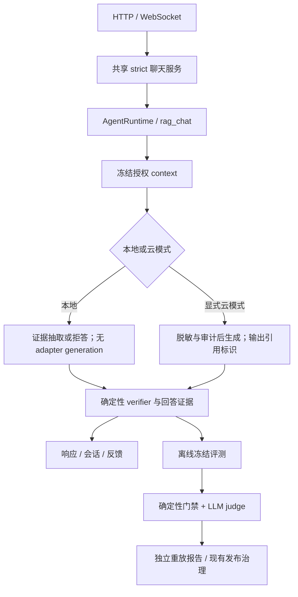

# 工程候选版设计与交付计划

> 目标：交付一个“等待业务验收、工程证据完整”的候选版。
> 制定日期：2026-09-18；代码核查基线：`5964aa2`。
> 状态：`feat/engineering-candidate` 已关闭 EC2 冻结回归与 EC4 synthetic engineering 门禁；EC3 真实 judge、EC5 及外部门禁未完成，工程决定仍为 NO_GO。最新记录见第 14 节。
> 本文的工程候选不等于 H6 `PILOT_READY` 或 `GA_APPROVED`，不改变既有发布审批。

## 1. 技术基础与交付边界

现有实现已经支持本轮收敛，无需增加运行时、检索数据库或评测平台。

| 已有基础 | 本轮用途 | 代码入口 |
| --- | --- | --- |
| PostgreSQL AgentRuntime、ToolRegistry、VerifierRegistry | 统一聊天入口、任务状态和独立验证 | `src/core/agent_runtime.py`、`src/core/verifier_registry.py` |
| pgvector/FTS/RRF 与文档 ACL | 复用受治理检索和来源血缘 | `src/rag/retriever.py`、`src/rag/vector_store.py` |
| H5 EvaluationService、trial/annotation | 记录候选比较及 judge 结果 | `src/harness/evaluation.py` |
| H2 内容寻址对象与证据 manifest | 保存输入、报告和可重放决定 | `src/core/evidence.py`、`src/storage/run_assets.py` |
| 公共 synthetic 双 pass 审核 | 复用模型调用、审计和对象归档；不照搬其置信度门禁 | `scripts/review_gap_with_deepseek.py` |
| H5 Job、训练、发布治理与 H6 资格记录 | 冻结配置、GPU smoke、回滚及外部阻塞项 | `src/harness/jobs.py`、`src/harness/job_runner.py`、`src/release/governance.py` |

交付范围是公开有标签数据、程序生成数据及已获当前用途授权的数据上的工程证据。
不假定新增企业数据、人工标签、目标 IdP 或真实团队可用；缺少硬件、模型服务等工程条件时，
相应门禁也必须保持 blocked，不能用 mock 结果关闭。

| 可以声明 | 不可以由本轮声明 |
| --- | --- |
| 指定版本、环境和测试分布下功能、隔离、恢复及性能通过 | 企业真实问答准确率、实际节省工时或用户接受度 |
| 自动语义评测下候选合格，且明确 judge 局限 | 已完成独立人工校准或人工审核 |
| 配置、数据、产物和决定可以追溯与复放 | 训练逐位确定性或 LoRA 业务增益 |
| 已形成可安装、可演示、可回滚的工程候选 | 真实流量 canary、正式 PILOT_READY 或 GA |

沿用 [发布状态](./RELEASE_STATUS.md) 与 [H6 门禁](./harness/H6_PILOT_GA_DESIGN.md)。
EC 编号只是本文工作包编号，不增加数据库发布状态或第二套审批系统。

## 2. 当前问题与完成标准

| 编号 | 当前证据 | 修复目标 | 无新增人工审核能关闭的范围 |
| --- | --- | --- | --- |
| F1 | 浏览器 `webui/static/script.js` 使用 `/ws/chat`；`webui/routes/chat_tasks.py` 的 WS 直接调用回答函数，HTTP 才创建 strict task | 两种传输共用 strict 任务服务 | 入口、验证、审计与恢复一致性 |
| F2 | `src/rag/answering.py` 只提取中文 bigram；称呼分支无最低支持要求 | 明确支持中英文证据抽取；修复已知反例和拒答边界 | 已知缺陷与冻结测试分布；不承诺通用语义正确性 |
| F3 | citations 来自全部 context；`verify_chat_capture@1` 不判断语义支持，云模式缺少空证据硬拒答 | 区分执行、回答与支持度状态；引用实际使用证据 | 引用真实性、抽取一致性及 judge 评测；生成式语义仍标注机器评审 |
| F4 | `answer_with_citations()` 无条件生成 intuition，本地回答不使用它 | 本地模式跳过生成和不必要的生成模型状态请求 | 行为等价与实测性能；保留 embedding/rerank |
| F5 | `train.py` 从全局配置读取 LoRA，而 `job_runner.py` 从 context 登记 LoRA 配置 | 批准、执行和登记消费同一冻结有效配置 | 配置一致性及实际 GPU smoke |

上轮现场基线为 Ruff 通过、pytest 180 passed / 39 skipped。它是历史本地结果，不能代替本轮
提交上的完整 CI、隔离 PostgreSQL、浏览器、GPU 和部署验收。旧 synthetic GO 也不能自动继承到新候选。

## 3. 目标执行路径



### 3.1 共享聊天与前端

- 从现有 HTTP strict 路径提取一个具体业务函数，供两种传输调用；不让 WS 直接调用 HTTP handler。
- 身份、session 所有权、context 冻结、task/run 创建、verifier、会话及反馈写入各执行一次。
- WebSocket 仅处理协议、输入校验和消息传输；状态展示来自实际任务事件，不预发虚假阶段提示。
- 重连或重试使用 tenant/user/session 作用域下的稳定 request key；同一请求不重复写会话和反馈。
  不使用 query 文本作为幂等键，用户主动再次提问必须能创建新任务。
- 客户端断开不等于任务取消；用户通过已有取消/恢复语义处理。证据未完成时不能发送“成功”答案。
- 前端展示答案、引用原文定位、拒答原因、运行状态及可用恢复操作。来源查看继续检查 ACL；
  不把内部 MinIO 路径直接变成公开下载链接。用户界面不要求理解 H4/H5。

### 3.2 回答与引用契约

在现有结果 JSON 中明确区分以下字段；实施时沿现有序列化入口升级，不新建结果表：

- `execution_status`：工具是否成功执行，复用现有语义。
- `answer_status`：`answered` 或 `abstained`；执行失败独立表达，不伪装成拒答。
- `answer_mode`：`extractive` 或 `generated`。
- `support_status`：`extract_verified`、`not_semantically_verified` 或 `not_applicable`。
- `citations`：仅实际使用的文档 chunk 及 source/span/version/ACL 血缘；拒答时为空。
- `reason_code`：如 `no_document_evidence`、`insufficient_support`、`conflicting_evidence`。

本地第一版支持中英文有据抽取及明确拒答，保持简单文本处理，不通过添加人名/故事专用规则刷分。
无法证明实体对应、否定或冲突已消解时拒答。抽取内容必须匹配所引片段；这仅证明原文出处，
不自动证明摘录回答了问题。中文称呼及英文问题的已知缺陷必须有独立反例回归。

云模式在无授权文档证据时先拒答，不用 intuition 或 Memory 替代文档事实。生成输出携带选用的
chunk 标识；无效、越权或伪造标识不得输出为有据回答。有效标识也不证明语义支持，必须保留
`not_semantically_verified`。引用不能在生成后用“全部检索结果”补齐。

新增结果通过版本化 `verify_chat_capture@2` 检查；历史 @1 报告继续只读重放，不能追溯改写。
API、前端、反馈 capture、eval 和恢复消费者一并迁移；完成后删除无调用的旧在线路径。

### 3.3 无效生成与训练配置

本地路径不调用 `predict_async()`，也不为展示状态隐式加载生成模型。结果明确记录
generation `not_used`，同时保留实际 embedding/rerank 指纹，不伪造成功的模型调用 trace。
云路径保持显式选择；默认不增加在线 judge 请求。局部断开生成服务时，本地回答仍应可用，
前提是 embedding/rerank 服务正常，不能据此宣称整个 Inference 服务故障可降级。

训练请求创建阶段解析并冻结 `effective_training_config`：算法、rank、alpha、dropout、bias、
task type、解析后的精确 target modules、dtype、学习率、batch、梯度累积、长度、steps、warmup、
eval/save 策略和 seed；绑定配置 hash、模型/tokenizer/template digest 与训练环境。
worker 不再从 `models.yaml` 或 `H5_TRAIN_*` 环境变量补齐这些值；资源和对象存储凭据不混入算法配置。
实际 PEFT/Trainer 配置和 adapter_config 必须与批准配置核对，无法匹配时 fail closed。

训练 context 升版本，旧 artifact 保留重放；旧 context 发起新训练必须在任务创建侧重新解析并批准，
worker 不静默兼容。缺少许可或审批时保持待审批。本轮不授予新训练许可、不自动晋级 adapter，
真实 GPU smoke 只用已允许的测试路径与数据。

EC4 分批落地，只有三批都通过才关闭阶段门禁：

- EC4-A：纯配置契约、内容 hash/输入绑定、观察配置比较与反例；不启用新 context 执行。
- EC4-B：新建 context v8、审批绑定输入 hash、创建侧解析真实模块全集；worker 仅消费冻结值，
  删除算法环境变量注入，旧 context 禁止新训练但保留历史重放。核对实际读取的 dataset/model/
  tokenizer/template 内容；导出实际 PEFT、Trainer、预处理和模块全集，保存产物后复核，失败禁止上传/登记。
- EC4-C：独立只读 verifier 重取 input/receipt/adapter_config，核对产物、镜像/代码与环境指纹；
  保留 v7 成本 receipt，执行当前版本真实 GPU smoke，形成工程证据。

模块名称的语法校验不等于已经从模型解析；哈希不是审批，worker 自报也不是独立执行证明。

## 4. LLM-as-a-judge 离线设计

### 4.1 接入位置与权威边界

复用 EvaluationService、trial/transcript、现有模型调用审计和内容寻址 evidence。
扩展已有评测实现，CLI 只承担参数与调用；不复制 `review_gap_with_deepseek.py` 成第二套平台。
该脚本现有双 pass 和 confidence >= 0.95 不等于已校准概率，新评测不以自报 confidence 判定通过。

judge 不拥有工具执行、发布、审批或修改权限。输出只作为不可信评测数据，严格校验 JSON、长度、
枚举、case ID、chunk ID 和 quote；重复/未知 case 或无效原文引用计为 invalid，不接受自由文本命令。
问题、答案和证据中的指令均作为待评对象，评测集必须包含诱导 judge 忽略规则或给满分的样例。

首次只选一个与候选生成职责分离的 judge，模型标识和 provider 返回版本均入证据。
记录与 candidate 的模型家族关系，不能把不同角色称作统计独立。第二个 judge 只处理关键或争议 case，
不默认全量双模型；不同 judge 的一致性不是正确性证明。

云 judge 仅允许显式授权的外发模式与数据用途，经现有脱敏、审计门禁后调用。
即使原始材料公开，case 也可能混有私有 query/context，不能按数据集名称放行。
无云许可时使用可用本地 judge；没有可用 judge 时 EC3 保持 blocked，不降低阈值跳过。
一次评测冻结调用/输出 token、重试、费用预算，超过预算停止并保留部分报告；不能删除失败 case 后重算通过率。

### 4.2 输入与输出

输入包含 case/query、候选答案、授权 evidence、citation 映射和评分规则；绝对支持度评测先于 A/B。
judge 可以读取评测专用 expected assertions，但它们不能进入 candidate 提示词、检索或训练。
对 A/B 隐藏模型名并交换位置；两个顺序不一致记为 uncertain，不选对候选有利的一次。

每个 claim 输出 `supported / contradicted / insufficient_evidence`、支持片段标识和逐字 quote；
另外输出问题覆盖、拒答合理性及注入迹象。证据匹配由代码复核，语义标签仍属于模型判断。
整体状态为 `pass / fail / uncertain / invalid`；显式矛盾判 fail，证据不足且无法下结论判 uncertain。
超时、解析失败和缺失结果计 invalid；只允许预先冻结的有限重试并保留全部尝试。

### 4.3 数据与 judge 检验

- 首轮冻结不少于 200 个已知期望结果的 judge 检验 case：至少 100 个正例、100 个负例。
  来自许可明确的公开标签或结构化事实程序生成；标明 `label_origin`，不得伪造人工标签。
- 负例覆盖实体、数字、单位、否定、版本、伪造引用、无证据和 judge 注入；关键引用/无证据/注入类
  每类至少 10 个。按类别报告，不能用总体均值掩盖关键类别失败。
- 同源文档、改写和变异样例作为一个 group 划分 train/development/holdout；不能随机逐条分割近重复数据。
- judge 检验与 candidate 评测使用不同冻结集合。candidate holdout 至少 100 个 case，覆盖中英文、
  answerable/unanswerable、干扰和冲突；纯变异样例数量不能当成独立业务覆盖数。
- development 用于调整代码和 prompt，holdout 用于决定。holdout 被用于定位和修复后转为回归集，
  下一轮决策换未使用的来源组并升 suite 版本；保留历次 NO-GO，禁止调阈值追认同一轮通过。

### 4.4 首轮工程门槛

以下为本计划新设的工程验收标准，尚未验证，不替换 H5/H6 既有发布 policy。
EC0 固化为带 hash 的 policy；样本和阈值改变视为新一轮实验。

| 检查 | 门槛与统计口径 |
| --- | --- |
| 确定性安全/契约 | ACL、撤销、引用真实性、配置一致性与 split 隔离，预注册 case 全通过；任何失败阻断 |
| judge 已知负例误接受 | `pass / 全部已知负例` <= 2%；关键引用、无证据与注入类误接受为 0 |
| judge 已知正例接受 | `pass / 全部已知正例` >= 90%，防止全部拒绝获得虚假安全结果 |
| judge 可判定率 | `(pass + fail) / 全部 case` >= 95%；invalid 为 0，uncertain 不计成功 |
| candidate 绝对质量 | 所有确定性硬门禁通过；机器语义 pass / 全部冻结 case >= 90%，invalid 为 0 |
| candidate 相对质量 | 同集对比总体 pass rate 不低于 base，关键类别无新增失败；不只报告 A/B 偏好胜率 |
| 稳定性 | 冻结评测完整重跑 3 次，各次均过门槛，记录顺序翻转和结果分歧，不只取最好一次 |

报告提供每项分子/分母、逐类别结果、uncertain/invalid、来源组数量及适用范围。
比例给出 95% Wilson 区间；重复同一集合不扩大独立样本数，变异相关性必须注明。
零次错误不能宣称真实误接受率为零，judge confidence 不参与成功概率计算。
机器语义标签始终保留 `human_reviewed=false`、`judge_only=true`、模型/prompt/policy 指纹；
不回写 H6 人工校准通过，不自动设置训练许可。

独立 verifier 只读重放确定性断言、原文 quote、hash、case 完整性及指标计算；不重新调用 judge。
原始 judge 输出可以确定性重放，供应商模型重新推理不保证同结果。该 verifier 通过意味着报告完整且
按规则合格，不能声称再次独立证明语义正确。出现新失败时先归因检索、回答、judge 或环境，再决定修复。

研究依据：[MT-Bench 的位置、长度及自偏好分析](https://arxiv.org/abs/2306.05685)、
[ACL 的位置偏差与顺序平衡研究](https://aclanthology.org/2024.acl-long.511.pdf)。这些研究支持偏差控制方法，
不提供本项目业务准确率保证。

## 5. 分阶段实施计划

每项为独立可审查提交；先实现和验证，再勾选。角色为责任分工，EC0 指定实际负责人，
不要求因本计划组建多人团队；缺少独立业务 reviewer 不影响工程开发，但保留外部门禁。

| 阶段 | 依赖 / 责任 | 交付与代码范围 | 退出证据 |
| --- | --- | --- | --- |
| EC0 基线冻结 | 无 / 工程负责人 | 冻结版本、环境、数据许可、suite/split、judge/policy/预算、性能负载及旧行为；在现有 evidence 中登记 | 基线报告、已知 F1–F5 反例、policy/source hashes；跳过项及阻塞原因齐全 |
| EC1 统一入口与去除无效生成 | EC0 / 应用负责人 | `chat_tasks.py`、共享聊天函数、`rag/runtime_tools.py`、前端和 capture；F1/F4 | 浏览器与 HTTP strict 等价；重连/重复/断开/越权/失败回归；本地 generation 0 次 |
| EC2 回答与引用契约 | EC1 / RAG 负责人 | `rag/answering.py`、verifier、schema、前端和反馈消费者；F2/F3 | 已知反例、无证据硬拒答、抽取/引用匹配、状态一致性；新旧 verifier 历史重放 |
| EC3 离线 judge | EC0 数据冻结，EC2 契约 / 评测负责人 | 扩展 H5 evaluation、调用/审计和报告 verifier；复用既有 CLI 入口或最小薄入口 | 已知答案 judge 检验及三次 candidate holdout 达标；预算、外发与注入回归 |
| EC4 训练有效配置 | EC0；可与 EC1–EC3 并行 / 训练负责人 | context 创建者与所有调用者、`jobs.py`、`train.py`、`job_runner.py`、训练 verifier | 修改全局配置不影响冻结任务；篡改拒绝；实际 GPU smoke 参数/产物一致 |
| EC5 集成与交付 | EC1–EC4 / 发布负责人 | 精确版本构建、部署、性能/恢复、证据聚合、操作手册和状态文档 | 同一候选的完整工程证据包与可重放决定；所有外部待验收项明确 |

推荐执行次序：EC0 → EC1 → EC2 → EC3；EC4 可独立推进，最后 EC5。
不以日历周代替验收；某项环境不可用时继续其他独立项，不能把未测项勾为完成。

## 6. 验证矩阵与容量门禁

| 层级 | 最小验收 | 复用入口 |
| --- | --- | --- |
| 静态与单元 | Ruff、format、相关测试；完整 pytest 报告含 skip 原因 | `.github/workflows/ci.yml`、`tests/test_grounded_answering.py`、`tests/test_execution_mode.py` |
| PostgreSQL 组件 | 专用非 superuser 应用角色；两 tenant、同 tenant 不同 owner、撤销、幂等、verifier 失败 | `tests/test_agent_runtime.py`、`tests/test_h3_product_loop.py`、`tests/test_verifiers.py` |
| 浏览器/协议 | 真实 WS 发问到引用呈现，失败/重连/恢复，HTTP 等价 | 扩展 `tests/test_webui_routes.py` 与现有试点入口；只 mock 回答函数不够 |
| Judge | 冻结已知答案、顺序交换、注入、provider 失败、token 预算与三次 holdout | 扩展 evaluation 与对应测试；本地结果重放不依赖 provider 在线 |
| Training | 所有配置创建/消费调用者回归，固定样例真实 GPU Job | `tests/test_jobs.py`、`tests/test_h5_evaluation.py`、既有 H5 governed rehearsal |
| 部署与恢复 | 干净构建/pull、Helm、隔离 PG/MinIO、失败恢复、发布回滚 | H5 canonical、RTD-Q5 preflight、`scripts/verify_pilot_restore.sh` |

性能沿用 RTD-Q4 度量和调用入口，EC0 冻结两档语料：20 文档/约 827 chunk 基线，以及
1,000 文档的 synthetic 扩展集（记录精确 chunk 数、长度、来源组和 hash）；并发 1/4/8。
每档每臂至少 200 个计时请求，基线与候选交错运行，区分冷启动和稳态，重复 3 轮。
记录队列、检索、rerank、generation、端到端 p50/p95/p99、吞吐、错误和 GPU/CPU/内存。

首轮最低交付范围为小语料并发 1/4：质量硬门禁全过、无超时或请求错误，三轮稳态 p95 均不劣于
同硬件同负载本轮 base，且本地 generation 为 0。10 秒 p95 是优化目标，不以未经实测的数字宣传。
大语料/并发 8 是容量边界探索，失败必须报告；其结果不能阻断已预注册的小范围候选，也不能扩写
支持范围。需要支持更大范围时必须在看结果前登记新的交付门槛。
所有 p99 附样本量，不把少量请求的最大值外推为企业尾延迟保证。

EC5 需重放文档 ingest → chat → feedback、Memory、撤销、训练配置和受控发布的相关主路径。
新增审批缺失时相应训练/发布待执行，不自动审批来凑完整证据；历史 receipt 可证明历史版本，
不能冒充当前版本已完成。若当前候选必需的 GPU/恢复证据缺失，EC5 保持 blocked。

## 7. 最终工程证据包与交付决定

复用现有 run manifest 和内容寻址对象，增加一个聚合 descriptor 即可，不再复制数据集或日志正文。
聚合包至少引用：

1. 精确 Git SHA、镜像/model/adapter/tokenizer digest、依赖锁及部署配置 hash。
2. 数据来源/许可/用途、split/group、suite、judge prompt/version 和 policy/budget hash。
3. 单元、组件、真实浏览器/GPU/部署测试结果，skip/blocked 清单与本轮基线。
4. 逐 case 答案、引用、确定性验证、judge 原始结果及三轮指标，不确定项和所有失败尝试。
5. 有效训练配置、实际执行配置和产物核验；如果未发布 adapter，明确保持原版本。
6. 容量边界、冷启动/稳态指标、故障与恢复 receipt、回滚目标、安装/演示操作手册。
7. EC0–EC5 gate 结果、已知限制、外部验收清单和证据有效期。

聚合报告使用 `engineering_decision = GO / NO_GO / BLOCKED`，作为工程报告字段而非 release 状态。
所有必需 gate 与指纹一致才为 GO；实际失败为 NO_GO，缺资源/许可/证据为 BLOCKED。
GO 允许按既有授权交付限定范围工程候选，不自动调用 promote 或修改 H6 qualification。
相关输入、代码路径、模型、judge、policy 或环境变化后必须重跑受影响 gate；不能仅更新文档日期。
备份恢复证据继续遵循现有季度刷新规则。

下列外部项在本轮完成后仍保持未验收：

- 真实代表性业务数据与用途资格。
- 独立人工校准及业务质量阈值确认。
- 目标 IdP 与实际组织权限联调。
- 真实 stable/candidate 流量窗口和业务运行验收。
- 两支独立团队连续四周使用、周度审计、价值及安全签署。

满足本计划后停止无需求的功能扩展，交付“等待业务验收、工程证据完整”的候选版。
后续 Connector、自由生成扩展、LoRA 强化、DPO/RL、多 Agent、Ray 或新基础设施仅在具体失败分布、
性能瓶颈或明确用户任务触发时另行立项。

## 8. 实施记录（2026-09-18，未发布工作树）

分支 `feat/engineering-candidate`，起点 `5964aa2`。下面结果对应本分支工作树，尚无最终
候选 commit/image digest，不是发布 receipt。按最小改动原则复用 AgentRuntime、PG RLS、
独立 verifier 与既有 evidence store，不新增队列、调度器或依赖。

### 本批实现：EC1 组件切片

- HTTP 与 WebSocket 共用严格任务路径；只有成功任务且响应 hash 匹配才能返回答案。
  删除 WS 旁路执行和预发的虚假阶段提示；服务端产生 task/run ID。
- migration `021_chat_requests.sql` 增加 owner/tenant RLS 请求绑定；UUID request_id 加
  **原始请求 session_id**（新会话为 null）确定作用域。相同键不同 query 返回 409；并发
  用不等待的 PG advisory lock 互斥，复用 task/run/context，事件和反馈采用固定 ID。
- `GET /api/chat/requests/{request_id}` 返回实际任务状态与服务端 ID；查询现有会话请求时
  必须带原始 session_id。无 request_id 的旧 HTTP 调用保持可用，但不承诺传输级去重。
- 重试前检查冻结文档当前可见性及 ready 状态，成功重放再次运行只读 verifier；session
  generation 改变后拒绝旧请求。不可自动恢复的终态明确返回 409，不伪装成成功。
- 前端生成稳定请求 ID，连接恢复重发原 payload，pending 期间阻止会话切换与重复提交；
  可重试错误后再次发送仍用原 ID，终态错误释放 pending。历史视图适配 durable event 格式。
- 本地回答不再调用生成模型或加载生成状态，明确 `generation=not_used`；RTD-Q4 将
  answering 与 generation 计时分开，RTD4 保留独立 adapter 部署身份核验，不能宣称 LoRA 增益。

### 可重复检查与结果

| 检查 | 结果与范围 |
| --- | --- |
| 改动前 pytest（未指定组件 PG） | 180 passed / 39 skipped；不能与启用 PG 后通过数直接当成新增测试数 |
| Ruff check / format | 通过；215 个 Python 文件格式检查 |
| 完整 pytest，隔离 pgvector PG16、非 superuser 应用角色、migration 001–021 | 242 passed / 1 skipped / 3 deprecation warnings |
| `node --test tests/chat_frontend.test.cjs` | 2 passed；执行真实 JS，DOM/WebSocket 为替身，不是浏览器 E2E |
| `tests/test_chat_postgres.py` | 真实 PG + strict runtime + TestClient HTTP/WS；对象存储替身；验证重放、冲突、锁、owner/tenant 隔离、反馈失败恢复、文档删除后禁止执行及 context generation 失效 |
| 唯一 pytest skip | `test_tve2_environment_integration.py` 的破坏性环境测试未显式启用，不推断通过 |

复跑：先在**专用测试数据库**以管理员执行 `uv run python scripts/migrate_postgres.py`
（设置其 DATABASE_URL），再以非 superuser 应用角色的 TEST_DATABASE_URL 执行
`UV_NO_SYNC=1 uv run pytest -q`。静态检查为 `UV_NO_SYNC=1 uv run ruff check .` 与
`UV_NO_SYNC=1 uv run ruff format --check .`。未迁移的部署不支持新请求绑定功能。

### 未关闭的边界及下一步

1. EC0 只完成代码/测试基线核查；suite/split、judge policy/budget 与性能负载尚未冻结。
2. EC1 未完成真实浏览器、进程崩溃/真实 MinIO 恢复、当前候选 embedding/rerank 指纹与
   目标部署验证。前端 pending 只存在页面内存中，刷新页面不自动恢复；API 可用原键查询/重试。
   advisory lock 每个活动请求占用一个 PG 连接，容量测试仍待执行。context 对象发布与绑定
   之间崩溃可能留下未引用对象，不声称所有外部写入 exactly-once。
3. 接下来先冻结 EC0 评测资产并完成 EC2 回答/引用契约，再接入 EC3 离线 judge；
   EC4 配置冻结与真实 GPU smoke、EC5 精确版本证据包仍未实施。
4. 维持所有阶段复选框未完成；本轮没有调用外部 judge、授予训练许可、晋级发布或改变 H6/GA。

## 9. 第二批实施记录（2026-09-19，未发布工作树）

仍在 `feat/engineering-candidate`，没有提交、推送或发布。本节更新第 8 节的进度，
不覆盖历史测试结果。当前 `engineering_decision = NO_GO`，不是可交付的完整工程候选。

### EC0：冻结可重现的合成资产与策略

`src/harness/engineering_suite.py` 通过现有 H5 suite validator 生成 development 20、
judge calibration 200（100 正、100 负）、candidate holdout 100 个 case。
负例按实体、数字、单位、否定、版本、伪造引用、无证据、注入、冲突、干扰十类构造；
按来源组隔离 split，显式禁止训练、保留程序生成标签与 `human_reviewed=false`。
模板存在相关性，公开 holdout **不是盲测**，case 数不等于独立业务覆盖数；本轮未运行 candidate holdout。

冻结描述在 `src/harness/fixtures/engineering_candidate_v1.json`。模型未选定时保持禁止云外发、
费用上限 0，调用/输出/token/重试预算和性能负载参数已声明，不代表实际执行器已落实这些预算。
重现命令：`PYTHONPATH=src UV_NO_SYNC=1 uv run python -m harness.engineering_suite`。

| 输入 | SHA-256 |
| --- | --- |
| suite | `0137c459a6cac744ec03c933b8a16f247c8dbcf9a7f7129c21898ce923586a5c` |
| source | `3f4fa01683176f5decb3f46867139fed2f50ac6a2f6f65864c903514f1ae0b88` |
| policy | `5e1e06567056bb7530bee18d2ef379fd18324bea6b7b11a96148b9eaaa007c7b` |

这些 hash 已有固定测试 pin；修改资产须新一轮登记，不得静默重算接受原试验。
真实 judge/provider/环境指纹、性能语料 exact manifest、现有 evidence store 中的正式登记仍待完成。

### EC2：回答与引用契约已贯通，质量门禁未通过

- 新在线响应为 `rag_chat_response.v2`，显式返回执行/回答/模式/支持状态与拒答原因；
  HTTP/WS、会话、不可变反馈及 RTD4/Q4 评测保留这些字段。历史 v1 重放不补造支持度标签。
- 本地仅抽取实际选用的一段原文，引用记录 chunk、quote、字符区间与原来源血缘；拒答引用为空。
  增加英文词项，去除无条件称呼分支。单句全词匹配、不明确的否定/冲突拒答，是**尚未通过质量门禁**的
  保守实现，不是完成了实体消歧或通用语义理解。
- 云模式空白/无文档/memory-only 输入零模型调用；只接受严格结构的回答与选用 chunk/原文 quote。
  不再生成最终回答不使用的 adapter intuition；provider/解析/引用错误抛出为执行失败，
  生成回答始终 `not_semantically_verified`。
- 新 `verify_chat_capture@2` 校验固定 context 对象 hash、snapshot、当前 PG 可见文档/ready、
  实际 chunk 文本及引用血缘、原文区间、状态一致性。@1 verifier 保留只读重放；通用 runtime
  拒绝用旧 @1 任务重新执行新版 chat，需新建 @2 任务，不静默修改历史任务。
- VectorStore 在共同文档结果出口标记 context_type，防止直接调用 Retriever 的旧消费者被误判为无证据。
  UI 用纯文本展示状态与 quote；历史消息读取实际 `content` 字段，不产生公开对象存储链接。

完整真实 PG 回归发现 `linghuchong-answering-v1` 的 `reincarnation-form`、`first-attack-skill`
两个正例现在拒答：原 PDF 的改写及跨句指代超出当前单句全词策略。已单独修复 CJK 换行
断词的匹配，并保持 quote 为未经修改的原文；这不能消除上述语义能力回退。
原 fixture、required_substrings 与成功标准均保持不变，测试按 case 拆开显式报告失败；
没有 xfail、跳过或降低质量阈值来将结果涂绿。实体称呼的独立单元反例则按本轮“指代未消解时拒答”
契约更新，并新增明确实体称呼正例。**安全契约通过不能抵消上述质量回退。**

### EC3：离线校验与重放核心，不是已完成真实 judge 评测

`src/harness/engineering_judge.py` 实现严格 JSON/重复字段/长度/类型检查，逐 claim 与答案原文覆盖、
chunk/quote 核验，硬引用门禁不能被 judge 结论覆盖，状态由代码推导；包括 AB/BA 顺序一致性、
全量分母（缺失算 invalid）、类别统计、Wilson 区间、模型/prompt/policy/input hash 与报告重算。
新增现有 registry 中的 `verify_engineering_judge_calibration@1`，只读校验租户对象边界、hash、
报告及指标，明确 `provider_provenance_verified=false`、`independent_semantic_verification=false`。
测试里的 scripted 输出只证明程序处理正确，**不证明真实 judge 通过 calibration**。

尚未实现实际 provider 调用/预算执行/调用审计与评测持久化 runner；未调用云或本地 judge，
未执行三次 candidate holdout，也未形成可发布评测 receipt。不能将纯函数测试 PASS 用来关闭 EC3。

### 检查结果与后续顺序

- 隔离 pgvector PG16，非 superuser 角色，migration 001–021：完整 pytest **291 passed / 2 failed /
  1 skipped**；失败正例如上，skip 仍为未显式启用的破坏性环境测试；另有 3 个已知 deprecation warnings。
- Ruff check 与 221 个文件 format 检查通过；Node 前端替身测试 **3 passed**，不是浏览器 E2E。
- PG 组件额外覆盖真实 chunk quote、v2 strict 验证、不可变反馈契约、成功重放以及文档删除后禁止重放；
  retriever 和对象存储仍是替身，不冒充真实 embedding/rerank/MinIO/GPU 证据。

下一步优先修复两个质量回归：在 development 与历史回归集上改进通用证据选择/边界处理，
同时保留错实体、冲突、无证据及注入反例；禁止加入人物/故事专用规则或修改旧质量期望。
随后冻结实际 judge 身份，接入受预算约束、留痕的 runner，再进入三轮独立 holdout 决策。
EC4 有效训练配置冻结、EC1 真实浏览器/恢复与 EC5 当前版本部署/GPU/容量证据仍待执行。
所有阶段总复选框继续未完成；H6/GA 状态不变。

## 10. EC2 定向修复与设计决策点（2026-09-19）

在已推送的 `eabc38d` 上继续修改，未提交或推送新改动。新增通用字面表述等价处理：
问题 `X编译后变成了什么` 可引用 `X编译为字节码`，完整保留主体与事件前缀，
不引入人物名、技能名、故事答案或较低的重叠阈值；引用仍是源 chunk 中的连续原文区间。
增加错主体/错事件、主体名称包含关系、目的陈述、否定、计划、传闻、假设、疑问及冲突反例。

定向命令 `UV_NO_SYNC=1 uv run pytest -q tests/test_grounded_answering.py
tests/test_chat_answer_contract.py tests/test_linghuchong_answering_suite.py` 为 **41 passed / 1 failed**，
Ruff 和 diff check 通过。`reincarnation-form` 已按旧期望通过；`first-attack-skill` 仍失败，
原 fixture 不变。此次未重跑完整 PG/GPU/部署验收，不更新第 9 节的历史全量结果。

剩余项不只是 PDF 断行：原文的攻击描述与技能名称跨句相连，需要指代消解，且
“最初的主要”需要时序判断。现有 BGE reranker 的相关性分不能当作这些关系的证明。
本地已有 TinyLlama、Qwen0.5B 和 BGE 权重，尚未发现专用 QA/NLI 权重；未下载或调用模型。

继续关闭这一项需要选择设计边界：允许受控本地语义选择模型并修订 `generation=0` 门禁，
或保留纯抽取/零生成及当前 NO_GO，同时另行同意先推进独立的 EC4。
在确认前不把本地生成伪装成检索，不下调原质量门槛，也不将 EC2 标记完成。

## 11. EC4-A 配置契约（2026-09-19）

用户已明确选择先推进 EC4；EC2 的剩余语义问题继续 NO_GO，不再阻塞独立的 EC4 工作。
本批仍在 `feat/engineering-candidate`，未提交或推送，不修改训练许可、审批或晋级状态。

新增 `src/harness/training_config.py`，复用现有 canonical SHA-256，不添加依赖：

- 严格限定 FP16 标准 LoRA，冻结显式 LoRA/Trainer/预处理参数，包括 optimizer、seed/data_seed、
  batch/accumulation、长度、步数与 eval/save 策略；拒绝缺省/多余字段、非法数值和不支持的变体。
- target modules 必须是排序、去重的完整限定名；这里只证明名称格式，尚未读取模型解析模块。
- 复制配置并绑定 tenant/snapshot、dataset/model/tokenizer/template/compile manifest hashes 与软件版本。
  凭据、数据库 URL 不进入绑定；冻结函数不升级 context、不伪造审批。
- 比较外部提供的 PEFT/Trainer/adapter_config、模块集合、dtype、预处理与软件版本观察值。
  拒绝 bool/int 混淆、DoRA/RSLoRA、layer replication 等标准 LoRA 之外的观察结果；
  返回 `independent_execution_verified=false`，不会把相等的自报配置升级成独立执行证明。

定向检查 `UV_NO_SYNC=1 uv run pytest -q tests/test_training_config.py tests/test_h5_evaluation.py
tests/test_jobs_backend.py`：**81 passed**，其中配置契约 **58 项**。新增文件 Ruff check/format 与
`git diff --check` 通过。这些是纯契约/替身检查，未重跑完整 PG 回归，未启动训练或 GPU smoke。

**尚未接入生产执行链路，EC4 整体未完成。** `train.py` 当前仍读取全局配置与环境变量，旧 context
行为未改变；本批没有把 v8 声明为可执行。下一批按 EC4-B 同步迁移创建端、worker 与 Job 环境，
并补充真实输入内容校验；再按 EC4-C 完成独立 verifier、镜像/代码指纹及 GPU 证据。
`run_h5_pdf_cycle.py` 的旧 v5 训练不能机械升级为 v8，须引导到 compiler/重新审批路径。

## 12. EC4-B 创建端与 worker 接线（2026-09-19）

继续在当前分支实现，未提交、未推送；本节取代第 11 节的“尚未接线”当前状态，历史测试记录保留。

- `train_compiled_snapshot.py`、synthetic rehearsal 共用 `prepare_training_context`，显式读取
  `--training-profile` JSON（顶层仅 `config`、`environment`）。config 必须提供完整契约字段及
  精确模块名，environment 必须提供目标 worker 的 Python/torch/transformers/peft/datasets/accelerate
  版本；不从本机默认值推断目标 worker 环境。创建侧用本地 meta 模型检查模块存在，不读取权重进显存。
- context 升 v8，模型权重/tokenizer/template 指纹沿用既有语义，额外绑定模型目录 JSON/Jinja 元数据
  hash。完整请求派生 adapter/output 身份；新训练 run 与任务、Job 对齐，源 trial run 单独保留。
- compiled creator 不再直接提交 Job：创建标准 strict `h5_train_lora` 任务并停止在
  `waiting_approval`，审批记录绑定 input ref/hash。相同输入复用任务，不自动批准或执行。
  synthetic rehearsal 保留原有模拟自动审批属性，不能当成人工审核。旧 PDF direct-job helper
  拒绝新 LoRA Job；历史 v5–v7 context 仍可只读校验，worker 与 `train()` 执行只接受 v8。
- worker 在训练前、上传前重读 Job/task/step/run 与精确输入审批；复用 snapshot/base/compile
  前置检查，上传前再次核对撤销状态。实际 dataset bytes 校验后落到 Job 临时文件，再从同一文件
  streaming 读取，不从远端重新拉取未核验数据。模型只允许本地 safetensors，执行前后重核内容指纹。
- `train.py` 移除 `models.yaml` 与全部 `H5_TRAIN_*` 算法参数回退；Job 不再注入这些变量。
  seed 在模型/LoRA 初始化前设置；PEFT/Trainer 消费冻结值，实际注入模块、dtype、预处理和配置
  在训练前核对，保存后重新读取 adapter_config 复核。不保证 GPU 逐位确定性。
- 上传移到 runner 的配置/安全/许可检查之后；对象使用 `IfNoneMatch="*"` 条件写，禁止覆盖
  已有文件。部分上传失败不自动删除已有证据，需新 attempt，不把 orphan 上传标记成功。
  保留 v7 成本 receipt；adapter manifest 记录实际配置观察值、输入 ref/hash 及绑定结果。

新增参数示例（profile 需由操作者按契约填写并审阅，不是审批替代物）：

```bash
UV_NO_SYNC=1 uv run python scripts/train_compiled_snapshot.py \
  --snapshot-id <approved-compiled-snapshot> --base-evaluation-id <base-evaluation> \
  --model-id /app/data/models/TinyLlama --model-dir data/models/TinyLlama \
  --training-profile /path/to/reviewed-training-profile.json \
  --tenant-id <tenant> --job-database-url <worker-database-url>
```

输出 task ID/input/config hashes 后，在现有 WebUI 审批并恢复**同一个任务**；不把 snapshot 的数据
审批当成此次训练参数审批。当前 task 的 after-step criterion 仍只独立验证 compile manifest，
**不是独立训练配置 verifier**；即使 task 成功也不能据此关闭 EC4。

检查：`UV_NO_SYNC=1 uv run pytest -q tests/test_training_worker.py tests/test_training_config.py
tests/test_h5_evaluation.py tests/test_jobs_backend.py tests/test_h5_pdf_cycle.py tests/test_runtime_tools.py`
为 **118 passed**；改动文件 Ruff check/format、diff check 通过。覆盖 profile/meta 模块、审批/run
错配、旧 context、环境/数据不符、全局环境参数无效、保存产物篡改、训练期间撤销、条件写冲突、
成本 receipt 和创建端待审批；训练、审批 DB、对象存储使用替身，不是完整真实 PG/MinIO/GPU E2E。

EC4-C 下一步：独立只读配置 verifier 与 receipt 重放、当前镜像/代码/环境指纹、真实 PG 审批链及
目标 MinIO 条件写兼容性，再执行已授权数据上的真实 GPU smoke。当前候选仍 NO_GO；EC2 剩余质量
回归、EC3 真实 judge、EC5 集成交付及业务/人工门禁均未被这批测试关闭。

## 13. EC4-C 独立验证与关闭（2026-09-20）

EC4-A/B/C 均完成，**仅关闭 synthetic engineering 配置一致性门禁**，取代第 12 节的待执行状态。
完整身份、hash、真实执行记录与重放命令见 [EC4 关闭记录](release/EC4_CLOSURE.md)。

- 新增 `verify_training_configuration@1`：SELECT-only 数据库角色重取 input、审批事件时间与
  arguments hash、snapshot/compile 绑定、成功 Job/result、精确产物文件、实际 adapter_config、
  safetensors 模块/rank/有限值与成本 receipt；不采信 worker 自报 PASS。
- v8 绑定源代码内容 hash、固定镜像 digest；worker 校验代码与镜像声明，独立保存 Pod imageID
  验证实际启动镜像。配置 verifier 不声称硬件远程证明，保留 `gpu_execution_verified=false`；
  真实 GPU smoke 由外部 Pod 记录、训练日志和保存权重的独立检查补充。
- 真实运行修复 PEFT 对长模块列表的自动缩写，以及 runtime `output.output` 结果信封解析。
  标准 LoRA 的 B 零初始化允许检测“所有 AMP 更新都跳过”的伪成功；worker 与 verifier 均拒绝
  全零 B。smoke 明确冻结为 20 步，未静默更改已批准配置；不将 global_step 当作优化器更新数。
- 最终 AMD Radeon 8060S smoke 成功，44 个 B 张量非零、88 个张量有限，20 step/5120 token，
  峰值显存 3,172,560,896 bytes。真实 PG 审批链与 MinIO 条件写（覆盖返回 412）通过。
  独立 CLI 两次重放 summary 完全相同；读取篡改反例拒绝，未修改持久化训练证据。
- 定向回归 140 passed；非超级用户真实 PG 全量回归 407 passed / 1 failed / 1 skipped，
  3 个既有弃用警告。唯一失败为 EC2 `first-attack-skill`，不修改 fixture 或降低门槛。
  改动文件 Ruff check/format 与 diff check 通过。没有新依赖、没有提交/推送、没有业务晋级。

当前分支仍 `feat/engineering-candidate`，工程候选整体 **NO_GO**。EC3 真实 judge、EC5 集成、
EC2 语义边界及人工/业务验收均保持未完成；LLM judge 不能替代训练许可或人工校准。

## 14. EC2 冻结历史 fixture 回放关闭（2026-09-21）

用户明确授权将历史问题改为“令狐冲转生为史莱姆后，最初自行创造的攻击技能是什么？”，保持期望
答案“破爆式”，并冻结为 `linghuchong-answering-v2`。fixture SHA-256 为
`c3567995503d463113d313b6d4cdb5b3eb3ca9cbdbd78e53c1bc91cbe64c8aa3`，源 PDF SHA-256 仍为
`26d2c3bd3e41fe2b21aaff7212c0b7df561b7341385d3dc44a374ec5a11fc71d`。

对抗复核先后发现否定变体、错误主体、对象前缀、撤销、梦境/计划作用域和“最初”时序均可绕过通用
正则。继续追加关键词不能形成可证明边界，因此删除该问题的通用接受路径，改为最小的冻结回放契约：

- query 必须与 v2 完全一致；来源 SHA、同一 `document_id`、整数页码及 page 1/2 提取文本 SHA 必须匹配；
- 回答固定为“破爆式”，引用分别来自 page 1 的转生标题和 page 2 的创造、命名及掌握原文；
- 任一文本变化、跨文档组合、错误来源/页码、冲突副本或问题改写均 fail closed；布尔值和浮点页码拒绝；
- 该 case 是 reference replay，不是 candidate 语义生成，不进入 EC3 calibration/holdout 指标，也不用于
  宣称通用实体消歧、指代、否定或时序能力。

检查结果：相关回答/引用检查 **87 passed**；全量 pytest **408 passed / 41 skipped**，3 个既有弃用
警告；全库 Ruff 通过。独立只读对抗复核在上述明确边界内给出 GO。由此 EC2 的冻结回归与回答/引用
工程契约关闭；通用语义质量仍由 EC3 真实 judge 单独判定，EC3/EC5 及业务/人工门禁保持未完成。

## 15. EC3 本地真实 judge 关闭（2026-09-21）

最终被测候选固定为 `5e9c1839406251ab7e311c0b7ea3e17e666d380f`；runner 在执行前校验 HEAD，
并拒绝 `src/` 工作树改动。评测脚本只属于 evidence control plane，不改变被测候选代码。

- Qwen2.5-3B calibration 达标，但 v1 holdout 三轮均为 87/100，按阈值 NO_GO；原始失败、调用审计和
  report hash 均保留，未通过修改 prompt 或重跑已暴露集合洗掉失败。
- 更换为 Qwen2.5-7B 后重新执行 calibration：正例 100/100、负例接受 0/100、200/200 可判定、
  0 invalid。随后使用未暴露的 `engineering-candidate-v2-holdout`，三轮均为 100/100、0 invalid、
  0 critical failure。
- 最终模型树、prompt、suite/descriptor/cases、逐次调用、token、耗时和决定均有内容 hash；两份报告
  可离线重放并重新生成 candidate response。3B 与 7B 合计 500 次真实本地 LLM 调用。
- 完整标识、hash、失败历史和重放命令见 [EC3 关闭记录](release/EC3_CLOSURE.md)。

早期候选的 PASS 在 EC5 暴露引用选择及 verifier 缺陷后作废；最终候选重新完成 calibration、三轮
holdout 与重放。EC3 仅关闭冻结 synthetic 集合上的 engineering judge 门禁。`human_reviewed=false`
保持不变；真实代表性数据、独立人工校准、训练许可、OIDC 与业务试点均不由 LLM judge 替代。

## 16. EC5 集成交付关闭（2026-09-22）

固定候选 `5e9c1839406251ab7e311c0b7ea3e17e666d380f` 已完成同一候选的 EC3 重跑、RAG 投影、直接
运行时与 HTTP 并发 1/4 容量检查、真实浏览器 WebSocket、Pod 故障恢复、回滚/前滚及全量回归。
直接与 HTTP 两条路径均为 21/21、0 error；全量回归为 **409 passed / 41 skipped**，Ruff 通过。

EC5 过程中保留三次 NO-GO，并分别修复 Q4 回放、重复证据选择及 verifier ACL/抽取契约；最终结果
没有覆盖失败 receipt。机器可读指标、镜像 digest、恢复 request/run 和证据引用见
[EC5 关闭记录](release/EC5_CLOSURE.md)。EC0–EC5 工程门禁由此关闭，候选状态更新为
`WAITING_BUSINESS_ACCEPTANCE`。

最终镜像是同一候选链不可变镜像替换源码层后的派生产物，而非 clean rebuild；HTTP driver 是同 SHA
测试镜像，不是交付运行时。真实代表性数据、人工校准、生产 OIDC、真实流量及两团队四周 GA-01
仍是外部门禁，因此不得声明 `PILOT_READY`、production ready 或 GA。
