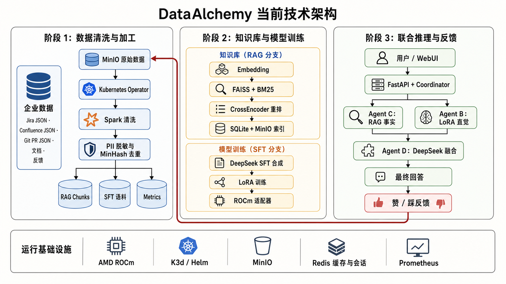
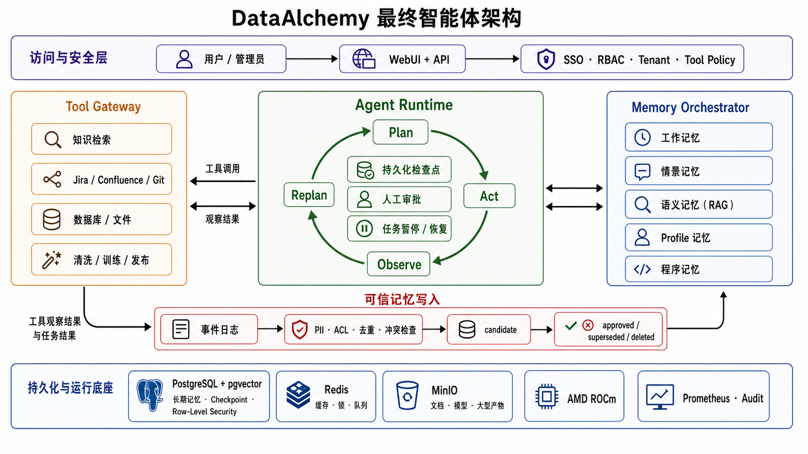

# DataAlchemy 产品发展路线图

> 修订日期：2026-07-29  
> 输入依据：[产品评估报告](./PRODUCT_ASSESSMENT.md)、[技术架构评估](./TECHNICAL_ARCHITECTURE_ASSESSMENT.md)与[项目改进计划](./IMPROVEMENT_PLAN.md)  
> 最终目标：从固定知识问答流水线演进为可记忆、可规划、可调用工具、可暂停恢复且全程可审计的企业智能体

## 一、现有技术亮点与目标可达性

DataAlchemy 已经具备数据处理、混合检索、模型训练与推理、反馈回流、WebUI、对象存储和 ROCm 部署基础。下一步无需重写这些能力，而应在其上增加智能体运行时、工具网关和受治理的分层记忆。

### 技术架构演进图

当前架构已打通数据加工、知识库、模型训练、联合推理和反馈回流，但 Coordinator 仍是固定流水线，Agent A/B/C/D 更接近功能节点，而不是能够自主规划和恢复的智能体。



最终架构以单智能体运行时为控制中心，将现有模块收敛为工具；RAG 保留为语义记忆，Redis 收缩为短期状态基础设施，并以 PostgreSQL + pgvector 承载持久记忆、检查点、权限和生命周期治理。



### 现有能力如何支撑最终目标

| 最终目标所需能力 | 当前技术基础 | 演进方式 | 尚需补齐 |
| --- | --- | --- | --- |
| 规划、执行与恢复 | `Coordinator`、`AgentManager`、`PipelineManager` 已能串联任务 | 增加 `Plan → Act → Observe → Replan` 运行时，把固定步骤改为有状态任务图 | 检查点、暂停恢复、人工审批、失败补偿 |
| 企业工具调用 | 清洗、SFT、索引、训练、推理、发布均已有调用入口 | 将 Agent A/B/C/D 和各流水线封装为受权限控制的工具/节点 | 统一工具契约、超时、幂等、授权和审计 |
| 语义记忆 | FAISS、BM25、CrossEncoder、SQLite 元数据与 MinIO 同步已形成混合 RAG | 直接纳入分层记忆，继续负责企业事实和引用检索 | ACL、版本、时间有效性、真实评测 |
| 工作记忆 | Redis 已承载会话和缓存 | 只保留短期状态、缓存、锁和队列，不承载长期事实 | tenant/user/version 隔离、TTL 和清理边界 |
| 持久记忆与恢复 | 会话、反馈、运行结果和资产已分散保存 | 新增 PostgreSQL + pgvector，统一保存事件、记忆记录、任务检查点和权限 | 数据模型、RLS、删除/遗忘、冲突处理 |
| 不可变产物 | MinIO 已存储数据、索引和 LoRA 适配器 | 继续保存大文件与版本化产物，数据库只保存元数据和引用 | manifest、哈希、原子 `current` 与回滚 |
| 人机协同产品 | FastAPI/WebUI 已有认证、历史、反馈和 WebSocket 状态 | 扩展为任务计划、工具调用、审批、暂停恢复和记忆管理界面 | 真实连接器、审批策略、任务可观测性 |
| 本地智能与数据主权 | ROCm、FP16、动态批处理、LoRA 热加载和模型配置已存在 | 作为本地推理/执行底座，云模型仅作为可审计的可选升级 | 纯本地验证、模型能力声明、安全回退 |
| 持续改进 | 数据清洗、训练、反馈与发布链路已存在 | 先形成不可变事件，再从事件提炼候选记忆或训练数据 | 评测、审批、灰度、晋级和回滚 |

### 为什么目标可达

- **M0 不重写系统**：只修复安全、失败语义、版本和评测基线。
- **M1 不拆现有功能**：先加入单智能体运行时，再把现有 Agent A/B/C/D 逐步注册为工具。
- **M2 不替换 RAG**：混合 RAG 直接成为语义记忆；新旧检索通过双写和影子流量比较。
- **M2 不依赖 Redis 保存长期事实**：PostgreSQL + pgvector 接管持久记忆和检查点，Redis 继续做其擅长的短期基础设施。
- **M3 复用现有 WebUI 和部署骨架**：重点补一个真实工具、任务交互和企业权限，不重建前后端。
- **M4 利用现有反馈闭环**：在自动写记忆、训练和发布前加入验证、审批、灰度与回滚。

主要风险不是基础技术缺失，而是当前能力缺少统一任务状态、记忆治理、权限边界和可验证的用户价值。按阶段门禁演进，最终目标可达。

## 二、产品目标

### 目标客户

首要服务于知识和操作分散在 Jira、Confluence、Git、数据库和内部文档中的研发团队与知识密集型组织。这些团队既需要查询事实，也需要智能体在明确授权下执行检索、分析、数据处理、训练或发布任务。

### 核心定位

> 面向重视数据主权的企业，在 AMD 本地算力上提供能够记忆上下文、规划步骤、调用内部工具并交付可追踪结果的企业智能体。

### 北极星指标

> 每周由智能体成功完成、经用户确认有效且全程可追踪的企业任务数量。

一项任务只有同时满足“完成目标、权限正确、证据完整、用户确认”才计入。Agent 数量、记忆条目数、训练次数和工具数量不作为成功指标。

## 三、路线图总览

以下周期按 2～3 名全职工程人员估算。人员不足时顺延，不跳过阶段门禁。

| 阶段 | 建议周期 | 版本目标 | 用户结果 | 退出门禁 |
| --- | --- | --- | --- | --- |
| M0 | 第 1～4 周 | 安全与工程基线 | 系统不越权、不假成功，现状可测量 | P0 安全关闭；任务与记忆评测基线建立 |
| M1 | 第 5～10 周 | 单智能体运行时 | 智能体能规划、调用工具、审批并从检查点恢复 | 5～10 个真实任务端到端稳定完成 |
| M2 | 第 11～18 周 | 分层记忆系统 | 智能体跨会话记住正确、可追踪、可删除的信息 | 双写/影子评测通过，跨租户泄漏为零 |
| M3 | 第 19～30 周 | 可试点智能体 | 客户可接入一个真实系统并完成有价值任务 | 两个试点团队持续使用四周 |
| M4 | 门禁通过后 | 企业治理与可控学习 | 记忆、工具、模型和发布均可治理、可回滚 | 企业验收和两个安全发布周期通过 |

## 四、M0：安全、边界与评测基线

### 阶段目标

冻结新 Agent、图记忆和多连接器开发，先建立不会泄漏、不会假成功且能够证明改进的底座。

### 关键交付

1. 会话、反馈、缓存和 WebSocket 统一执行 owner/tenant 校验。
2. 缓存键加入 tenant、user、模型和索引版本；只清理 DataAlchemy 自有前缀。
3. 生产环境弱密钥、默认账户或默认对象存储密码时拒绝启动；收缩容器权限和 Kubernetes RBAC。
4. 清洗、合成、索引、训练、上传和发布使用统一阶段结果；必需产物缺失时整项任务失败。
5. 反馈默认改为 `unrated`；未经审核不得写入训练集或长期记忆。
6. 修复 CLI、编译和批处理正确性；建立编译、Ruff、pytest、Helm 和启动检查。
7. 从真实业务定义 5～10 个智能体任务、20～50 个记忆问题，以及当前 RAG/延迟/成功率基线。
8. 定义最小任务状态和事件字段，但本阶段不引入新数据库或编排框架。

### 退出标准

- 跨用户会话、缓存和文档访问全部被拒绝；
- 外发行为可配置、可脱敏、可审计，纯本地模式无公网请求；
- 各阶段故障注入均正确失败并保留原因；
- 真实任务集、记忆集、RAG 质量和运行成本有可复现基线；
- P0 安全问题为零，CI 稳定通过。

## 五、M1：单智能体运行时

### 阶段目标

先让一个智能体可靠完成任务。多智能体不进入本阶段。

### 产品交付

1. WebUI 展示目标、当前计划、执行步骤、工具输入输出和最终证据。
2. 高风险动作在执行前请求人工批准；用户可以拒绝、修改或继续。
3. 长任务可以暂停、恢复和重试，服务重启后不丢失进度。
4. 每次任务都可查看完整时间线和失败原因。

### 技术交付

1. 引入最小 Agent Runtime，推荐先验证 LangGraph 的持久化和 Human-in-the-loop 能力。
2. 建立统一任务状态：目标、计划、当前步骤、观察、工具结果、审批状态、预算和终止原因。
3. 实现 `Plan → Act → Observe → Replan` 循环、最大步数和失败退出。
4. 为任务建立持久检查点、暂停/恢复和幂等重试。
5. 建立 Tool Gateway：工具注册、JSON Schema、权限、超时、幂等键、结果大小和审计。
6. 将现有 RAG、清洗、训练、评测和发布能力封装为工具；Agent A/B/C/D 退回工具或节点角色。
7. 记录不可变任务事件，为后续记忆提炼提供唯一事实来源。

### 退出标准

- 5～10 个真实任务可以端到端完成，并提供证据和完整追踪；
- 服务重启或工具暂时失败后可从检查点继续，而不是从头执行；
- 未批准的高风险工具调用为零；
- 同一幂等键不会重复执行写操作；
- 单智能体未证明不足前，不增加多智能体协调层。

## 六、M2：分层记忆与渐进迁移

### 阶段目标

让智能体在正确范围内记住有用信息，同时保证来源、权限、时间、冲突和删除均可治理。

### 目标记忆模型

| 记忆类型 | 内容 | 默认存储与策略 |
| --- | --- | --- |
| 工作记忆 | 当前任务步骤、临时观察、上下文摘要 | Runtime 状态 + Redis TTL |
| 情景记忆 | 谁在何时做了什么、结果如何 | PostgreSQL 事件与记忆记录 |
| 语义记忆 | 企业文档、事实、引用和向量 | 现有混合 RAG + pgvector 元数据/向量 |
| 用户/组织画像 | 偏好、职责、常用范围和约束 | PostgreSQL，显式 scope、同意和可删除 |
| 程序记忆 | 已批准的工作流、工具使用经验 | PostgreSQL 版本记录，审批后生效 |

### 技术交付

1. 部署 PostgreSQL + pgvector，启用 tenant/user scope、RLS、审计和备份。
2. 采用不可变事件日志作为事实源；长期记忆是可重建的派生数据，不直接覆盖历史。
3. 统一 `MemoryRecord`：类型、内容、来源事件、tenant/user、时间范围、置信度、状态、版本和保留策略。
4. 建立可信写入门：PII/权限检查、去重、冲突检测和人工审批；状态为 candidate、approved、superseded、deleted。
5. 建立 Memory Orchestrator：按任务读取不同记忆，执行权限过滤、混合召回、重排和上下文预算。
6. 保留现有 RAG 为语义记忆；以双写、影子检索和离线回放比较新旧结果，禁止一次性切换。
7. Redis 只保留缓存、锁、队列和短期工作状态；长期事实迁移完成后删除对应 Redis 写入。
8. 提供查看、更正、遗忘和级联删除能力，并验证向量、缓存和派生记忆同步失效。

### 退出标准

- 记忆召回正确率、错误记忆率、陈旧记忆率和对任务成功率的影响均有基线；
- 任何记忆都能追溯到事件、用户/文档、版本和写入决策；
- 跨租户记忆召回为零；删除/遗忘在约定时限内影响数据库、向量和缓存；
- 影子评测未达到现有 RAG 质量时，不切换默认检索；
- 只有通过写入门的内容进入长期记忆。

## 七、M3：可试点智能体产品

### 阶段目标

让目标客户不依赖项目作者，也能部署、连接一个真实系统并完成第一项有价值任务。

### 关键交付

1. 提供单机默认启动路径，Kubernetes 作为企业部署选项。
2. 根据首批客户选择 Jira、Confluence 或 Git 中一个连接器，不并行建设多个。
3. Tool Gateway 覆盖授权、增量读取、写操作审批、超时、重试、幂等和审计。
4. 源系统 ACL 贯通检索、记忆、缓存和工具调用。
5. WebUI 支持任务发起、计划查看、审批、暂停恢复、错误重试和记忆查看/删除。
6. 先迁移画像和情景记忆，再根据影子评测决定语义记忆的存储收敛。
7. 拆分在线、ETL、训练和开发依赖；避免让 WebUI 携带 Spark、训练和集群依赖。

### 退出标准

- 从安装到首个成功智能体任务不超过 30 分钟；
- 一个真实连接器完成读取、更新、删除、权限变化和失败恢复；
- 工具成功率、任务完成率、人工接管率和检查点恢复率达到试点前约定目标；
- 至少两个真实团队连续使用四周，北极星指标持续增长；
- 无权限用户不能通过检索、记忆、缓存或工具间接获得受限内容。

## 八、M4：企业治理与可控学习

### 阶段目标

把“自进化”收敛为可验证、可审批、可停止和可回滚的持续改进机制。

### 关键交付

1. SSO、RBAC、tenant、文档 ACL、工具策略、审批策略和操作审计。
2. PostgreSQL、MinIO、Redis、配置和版本指针的备份恢复与灾难演练。
3. 记忆合并、衰减、冲突、过期、遗忘和保留策略；所有策略可回放验证。
4. 数据、索引、记忆、Prompt、模型和工具版本统一追踪。
5. 新版本通过离线评测、影子流量、灰度和审批后晋级；退化时自动回滚。
6. 只有在真实时间关系问题中显著优于 pgvector 时才引入 Graphiti/Zep 类时序图记忆。
7. 只有单智能体在任务分工或并发上出现可测瓶颈时才引入多智能体。

### 退出标准

- 企业身份、权限、审计和备份恢复通过试点验收；
- 至少两个发布周期安全完成评测、灰度、晋级或回滚；
- 线上任务可追踪到事件、记忆、工具、数据、模型和审批版本；
- 至少一个客户确认智能体节省了可量化的处理时间或操作成本。

## 九、关键技术决策门禁

| 能力 | 继续投入条件 | 条件不满足时 |
| --- | --- | --- |
| Agent Runtime 框架 | 两周验证可持久化、HITL、恢复和现有 FastAPI 集成 | 保留最小自研状态机，不迁入复杂框架 |
| PostgreSQL + pgvector | 影子评测不低于现有检索，且权限/运维可控 | 仅存事件、检查点和画像，语义检索继续沿用现有 RAG |
| RAG 存储迁移 | 新路径在质量、延迟或运维上有明确收益 | 保留 FAISS/BM25/CrossEncoder 默认路径 |
| Redis 长期数据迁出 | PostgreSQL 路径稳定且完成回放、备份和删除验证 | 继续双写，不提前删除旧数据 |
| 图记忆 | 时间关系或实体关系任务显著受益 | 不引入图数据库和第二套记忆框架 |
| 多智能体 | 单智能体基线显示任务分工/并发瓶颈，收益覆盖成本 | 保持单智能体 + 工具 |
| LoRA | 固定评测集上稳定优于 RAG/Prompt 基线 | 默认关闭，保留实验入口 |
| Spark/Operator | 真实规模或多实例调谐需求已出现 | 使用单机处理与 Job/CronJob |
| 新连接器 | 有明确试点客户、使用频率和验收指标 | 不提前建设 |

## 十、指标体系

| 类别 | 核心指标 | 目的 |
| --- | --- | --- |
| 任务 | 端到端完成率、用户确认率、平均完成时长 | 衡量真实价值 |
| 运行时 | 工具成功率、重试率、检查点恢复率、人工接管率 | 衡量可靠性 |
| 安全 | 越权调用数、跨租户召回数、外发审计覆盖率 | 验证企业边界 |
| 记忆 | 召回正确率、错误/陈旧记忆率、删除完成时间 | 决定记忆策略 |
| 知识 | Recall@K、MRR/nDCG、引用正确率、忠实度 | 保证 RAG 不退化 |
| 使用 | 周活用户、每周有效任务、复访率 | 衡量采用 |
| 性能 | 首次响应、任务 P50/P95、GPU/存储使用 | 约束体验与容量 |
| 成本 | 单任务模型、工具和存储成本 | 约束架构复杂度 |

阈值由 M0 基线和首批试点校准，不在缺少数据时做营销承诺。

## 十一、明确暂缓事项

M0～M2 暂不实施：

- 一次性替换现有 RAG 或清空 Redis；
- 多智能体角色扩张和复杂协调协议；
- 图数据库、第二套向量数据库或多个记忆框架并存；
- 没有客户需求的新连接器；
- 全自动记忆写入、自动训练晋级和无人审批发布；
- 数字孪生和无法量化的“完全自进化”承诺。

最短且可验证的发展顺序是：

```text
安全基线 → 单智能体运行时 → 分层记忆 → 工具化试点 → 企业治理 → 可控学习
```

只有上一阶段退出门禁通过，下一阶段才成为产品承诺。
