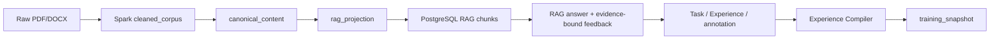

# RAG 与后训练数据边界设计

> 状态：RTD0–RTD4 工程门禁已关闭；真实业务数据与 GA-01 仍未开始
>
> 复核日期：2026-09-03
>
> 目标：让同一份企业原始数据可以安全地派生 RAG 索引和训练数据，同时避免把检索 chunk、
> 模型回答或用户评分直接当作训练真值。

## 1. 决策摘要

DataAlchemy 采用“一份不可变源、一个规范化内容层、两个独立投影、一个训练 compiler”：

1. 原始对象及其版本、ACL、许可是共同来源；
2. 规范化内容层尽量保留结构和 source span，不针对检索或模型模板优化；
3. RAG 投影为召回和引用生成 chunk、embedding、FTS 与检索元数据；
4. 学习投影只生成带任务、证据、期望行为、人工许可和 verifier 结果的候选；
5. Experience Compiler 是生成可训练 snapshot 的唯一入口；
6. 企业事实默认留在 RAG，后训练优先学习检索、引用、拒答、冲突处理和工具使用行为。

Spark、Ray Data 或普通 Python 只是投影构建器的执行后端，不改变本设计的数据权威和治理边界。
Ray Data 是否进入实现由 [Ray Data 候选评估路线图](./RAY_DATA_EVALUATION_ROADMAP.md) 单独判定。

## 2. 当前实现与问题

### 2.1 当前路径



已有正确边界：

- 原始对象保存在 MinIO，RAG 发布只读取经过 hash 验证的 `rag_projection`；
- annotation 默认不可训练，reviewer 必须明确设置 `training_allowed`、purpose 和 permission version；
- snapshot 再次核对 tenant、source hash、许可和 split；
- Experience Compiler 排除 holdout、未授权、无有效标签和目标模型已解决的任务。

实施前问题与当前处置：

1. PDF candidate 导入器已删除，直接 snapshot 路径已 fail-closed；
2. canonical span 与 RAG chunk 已统一使用稳定 `span_id` 和 `locator`；
3. feedback 已绑定 retrieval report、citation/span、模型执行和回答策略；
4. compiler 已强制 `split_group` 并拒绝跨 split 污染；
5. RAG 与 learning projection 已各自携带版本化 policy 与权限证据；
6. source/ACL/permission 影响查询和级联撤销已落地；模型参数仍只能通过阻断、回滚和干净重训处理，
   不声明精确遗忘。

## 3. 目标与非目标

### 3.1 目标

- 任意 RAG chunk 和 training item 都能追溯到原始 source asset、version 和 span；
- RAG 与训练可采用不同清洗、分块和去重策略，不复制权威正文；
- 未经人工许可和独立验证的内容不能进入训练 snapshot；
- source/ACL/许可撤销能阻止后续编译，并传播到 snapshot、adapter 和 release；
- 训练只固化经过验证的期望行为，不把一次模型回答或用户好评自动当作 ground truth；
- 通过联合评测证明 adapter 改善任务行为且没有损害 RAG 引用、拒答和权限边界。

### 3.2 非目标

- 不新建 Canonical Content 微服务、第二个数据库或第二套工作流；
- 不把 PostgreSQL RAG chunk 直接作为训练记录；
- 不为每个文档 chunk 自动生成 QA 并默认批准；
- 不把 adapter 当作企业事实权威或 RAG 的替代品；
- 不在本设计中决定 Spark、Ray Data 或 Python 的最终取舍；
- 不为了统一 schema 而删除原始对象、历史 Experience 或发布证据。

## 4. 目标数据分层

| 层 | 内容 | 权威位置 | 是否可重建 |
| --- | --- | --- | --- |
| L0 Source Asset | 原始对象、source version、ACL、许可、保留策略 | MinIO + PostgreSQL 投影 | 否，原始证据 |
| L1 Canonical Content | 解析后的结构、span、文本、locator、policy labels | MinIO artifact + PostgreSQL关系投影 | 是，由 L0 重建 |
| L2-R RAG Projection | retrieval chunk、parent context、embedding、FTS、metadata | PostgreSQL + pgvector | 是，由 L1 重建 |
| L2-L Learning Candidate | Task、Experience、evidence refs、annotation、期望行为 | MinIO + PostgreSQL annotation | 是，由 L0/L1 与 run evidence 重建 |
| L3 Compiled Dataset | 目标模型 chat template、completion mask、split、manifest | MinIO + training snapshot | 是，由 L2-L 重编译 |
| L4 Model Artifact | adapter、evaluation、release | MinIO + release tables | 是，由冻结 snapshot 重训 |

`L1` 是两条投影的共同引用层，不是新的业务权威。L0 原始对象和 PostgreSQL 中的权限/状态仍是
不可替代的事实源。

## 5. Canonical Content 契约

每个可引用 span 至少包含：

```json
{
  "schema_version": "canonical_span.v1",
  "source_asset_id": "...",
  "source_uri": "...",
  "source_version": "sha256:...",
  "span_id": "...",
  "parent_span_id": null,
  "text": "...",
  "structure": {
    "title": null,
    "section": null,
    "page": 2,
    "paragraph": 4,
    "content_type": "paragraph"
  },
  "tenant_id": "...",
  "acl_digest": "...",
  "trust_label": "untrusted_external",
  "content_sha256": "...",
  "pii_labels": [],
  "parse_policy_version": "..."
}
```

约束：

- `span_id` 由 source asset/version、locator 和 content hash 稳定派生；
- Canonical Content 保留标题、章节、页码、段落、表格/代码等已解析结构，不先压平成 RAG chunk；
- PII 和 injection 检测保存 label/decision，不覆盖 L0 原始对象；
- rejected/quarantined span 保留受限证据，但不能进入默认 RAG 或学习投影；
- policy 变化产生新 artifact/version，不原地覆盖旧 artifact。

第一版已将原 `normalized_documents` 拆为 MinIO 中的 `canonical_content.v1` 与
`rag_projection.v1`，未新建服务或正文表；PostgreSQL 仍只保存检索 projection。

## 6. RAG 投影

RAG builder 从允许检索的 canonical spans 生成：

```json
{
  "rag_chunk_id": "...",
  "source_span_ids": ["..."],
  "retrieval_text": "...",
  "parent_context": "...",
  "title": "...",
  "locator": {"page": 2, "section": "Access policy"},
  "source_version": "sha256:...",
  "acl_digest": "...",
  "chunk_policy_version": "rag-structure-v1",
  "embedding_model_digest": "..."
}
```

RAG policy：

- 优化 Recall、context coverage 和 citation，不要求直接成为训练格式；
- 使用结构边界、token 上限和受控 overlap；小 child chunk 用于召回，parent context 用于回答；
- 精确重复可折叠，但保留所有 source/locator 映射；近似重复默认只标记，不物理删除；
- source version、ACL 或 chunk policy 变化时重建索引；旧版本按现有撤销语义退出检索；
- PostgreSQL `document_chunks` 只保存检索投影，不承担训练许可或监督标签权威。

Spark 当前生成但下游不消费的 `rag_chunks.jsonl` 应停止发布；RAG 分块只在一个 versioned builder
中完成，避免 Spark 分块和 `refine_records` 页/段落分块双轨。

当前实现由 `build_rag_projection()` 唯一分块，policy 为 `rag-structure-v1`；每个 PostgreSQL
chunk metadata 保存 `source_span_ids`、locator、parent context、source content hash 与 ACL digest。

## 7. 学习候选投影

Learning candidate 不是文档 chunk，而是一个可判卷任务或经审核的行为样本：

```json
{
  "schema_version": "learning_candidate.v1",
  "task_bundle_id": "...",
  "experience_ref": "minio://...",
  "prompt": [{"role": "user", "content": "..."}],
  "evidence_refs": [
    {
      "span_id": "...",
      "source_version": "sha256:...",
      "content_sha256": "..."
    }
  ],
  "expected_response": "...",
  "expected_citations": ["..."],
  "task_type": "grounded_qa",
  "annotation_id": "...",
  "verifier_ref": "minio://...",
  "training_permission": {
    "allowed": true,
    "purpose": "grounded_behavior",
    "version": "..."
  },
  "split_group": "source-asset-or-task-family",
  "transform_sha256": "..."
}
```

### 7.1 准入规则

所有条件必须满足：

1. Task、Environment 和 Verifier 均为可重放版本；
2. evidence refs 可读取、hash 匹配、tenant/ACL/许可仍有效；
3. `expected_response` 是 reviewer 批准的目标答案，不默认复用原模型 answer；
4. verifier 证明答案受 evidence 支持，或正确执行 abstain/conflict/tool-use 行为；
5. annotation 明确 `training_allowed=true`、purpose 和 permission version；
6. 不属于 evaluation holdout，且 split group 未跨 train/validation/holdout；
7. 目标模型 gap 仍存在；否则 compiler 输出 `NO-TRAIN`。

### 7.2 训练内容策略

默认训练：

- 检索与引用格式；
- 证据不足时拒答；
- 多来源冲突与人工审批；
- ACL/tenant 边界和受控工具调用；
- 任务规划、失败恢复和企业输出格式。

默认不训练：

- 可通过 RAG 获取且经常变化的企业事实；
- 客户、员工、项目等权限敏感正文；
- 无 citation/verifier 的用户好评回答；
- 从单个 chunk 自动生成且未经复核的 QA；
- 已撤销、过期、无训练许可或只属于 holdout 的内容。

## 8. 唯一编译路径

Experience Compiler 成为唯一可生成 `training_snapshot` 的入口：

```text
Task Bundle + Experience + evidence refs + approved annotation
                              ↓
                  Learning candidate verifier
                              ↓
                 model-specific gap analysis
                              ↓
                     Experience Compiler
                              ↓
 chat template + completion mask + split + compile manifest
                              ↓
                      training_snapshot
```

收敛要求：

- 离线 PDF candidate builder 已删除，不再保留无 Experience/annotation 的第二条入口；
- PDF feedback 先形成带 evidence refs 和 reviewer correction 的 Experience/annotation；
- `create_snapshot` 只接受 compiler manifest，不保留无 manifest 的第二条生产训练入口；
- model、tokenizer、chat template、compiler policy 和 completion mask 全部冻结到 manifest；
- 任一 compiled item 必须能反查 source spans、Experience、annotation 和 verifier。

## 9. Split、去重与污染控制

### 9.1 Split

先分组、后生成/编译：

- 同一 `source_asset_id + source_version` 只能属于一个 split；
- 同一 task family、问题改写和共享答案模板不能跨 split；
- holdout 在生成 candidate 前冻结，compiler 无权重新分配；
- validation/holdout 不参与 reviewer 示例、prompt 调优或 gap SFT；
- split manifest 保存分组键、seed、policy version 和每组 hash。

### 9.2 去重

- L1：只做精确 content hash 去重并保存所有来源映射；
- RAG：允许重叠和 parent/child 关系，近似重复不默认删除事实差异；
- Learning candidate：按 task、prompt、expected response 和 evidence set 去重；
- Compiled dataset：在目标 chat template 后再次检查 token-level 近重复和 split contamination；
- 任何去重都输出 kept/dropped 映射和 reason code，不能静默丢弃。

## 10. 撤销与版本传播

```text
source/ACL/permission revoked
  → Canonical span invalidated
  → RAG projection removed/rebuilt
  → Learning candidate blocked/revoked
  → unstarted snapshot invalidated
  → adapter candidate blocked
  → promoted release rollback or replacement review
```

规则：

- 文档内容更新创建新 source version，不修改旧 hash；
- RAG 可通过重新索引立即切换版本；
- 已训练模型不能声称完成精确遗忘；受影响 adapter 必须停止晋级，必要时回滚并从干净 snapshot 重训；
- release receipt 记录受影响 source permission/version 集合和回滚目标；
- 删除 L0 原始对象前，先根据保留策略处理所有引用和不可变审计例外。

## 11. 实施路线

### 当前实施状态（2026-09-03）

| 阶段 | 代码状态 | 尚未关闭的环境门禁 |
| --- | --- | --- |
| RTD0 | 已关闭：ETL/H5 镜像按 job kind 隔离；ETL 补 PDF/DOCX 依赖；真实两类文档已重放 | 无 |
| RTD1 | 已关闭：`canonical_content.v1` 与 `rag_projection.v1` 分离；Spark 双轨分块删除；运行态 lineage 与真实旧/新投影质量 A/B 已验证 | 无 |
| RTD2 | 已关闭：feedback 绑定 evidence；reviewer correction 不可变重发；真实双模型 rerollout、Experience 审批、compiler 与 snapshot 已重放 | 无 |
| RTD3 | 已关闭：冻结 split、source/ACL/permission 影响查询、RAG 撤销、adapter 阻断和 release 回滚已在隔离 tenant 重放 | 无 |
| RTD4 | 已关闭：旧 PDF direct snapshot 路径删除并加 CI ratchet；base+RAG / adapter+RAG 联合门禁已在精确 GPU 镜像重放 | 无 |

环境门禁未通过前不得把上述代码状态表述为发布完成。

### 2026-09-02 环境证据

- Helm revision 28：Web `data-alchemy:web-rtd-boundary-20260902-v4`、ETL
  `data-alchemy:etl-rtd-boundary-20260902`、H5 `data-alchemy:h5-rtd-boundary-20260902`；
- PDF run `9533b82b-f007-407d-85a0-b605d24a1829` 与 DOCX run
  `55e7a36a-d0bb-4ae8-9c26-0c93e6c36c3f` 均以
  `verified_evidence_published` 结束，Spark Job 均使用独立 ETL 镜像；
- PDF 实测生成 7 个 canonical spans 和 12 个 RAG chunks；PostgreSQL chunk 已保存
  `source_span_ids`、locator、ACL digest、source content hash 和 chunk policy；
- migration `020_training_source_revocation.sql` 已登记，source impact API 已在真实数据库执行；
- 部署重放发现并修复 embedding 自动选择 ROCm 导致的 139 退出、发布 artifact hash 口径不一致、
  连字符期望短语被 FTS 误判三个问题。
- Web GPU 已通过显式挂载节点 ROCm 7.2 userspace 修复：最小 FP16 GEMM 与真实 TinyLlama chat
  均通过；run `6c21395b-ecdd-446f-9b60-b65e6257413f` 的 bad feedback 生成 annotation
  `f12e2d69-429b-4a21-b2f8-6b7855277004`，已绑定 citation/span、ACL、context snapshot 与
  model execution。该回答虽然命中正确 DOCX span，但 TinyLlama 错误拒答，形成真实训练 gap；
- reviewer correction 现在发布内容寻址的完整 label revision，数据库同步切换 content ref/hash，
  并在 `review_revision` 中保留原评分对象引用；对应回归测试已通过。
- reviewed feedback 已通过统一桥接入口投影为原有 Task/Experience 契约，并由独立 reviewer 批准；
- Helm revision 29、Web image `data-alchemy:web-rtd-feedback-c637b8d` 上完成两模型、两 source group 的
  真实 rerollout。gap report
  `tenants/default/feedback-rerollout/c637b8d/9d4a3e0c2a4b381a53eaa4959d136294d102ed33a906bf46daab4853643887d0.json`
  验证 2/2 task 有效、0 invalid task；TinyLlama 与 Qwen2.5-0.5B 均未通过严格纠错 verifier，形成可训练 gap；
- TinyLlama 的 train/validation trial 分别发布 Experience `12fcdd87...e2deee`、
  `c0ce5dd7...1a9df4`，由 `rtd-experience-reviewer` 批准 annotation
  `c317b64c-a9ef-4733-b147-a6346b3510fc`、`a51acbaa-c5da-4a0d-a0a9-75b40fcebf97`；
- 真实 `compile_sft_experiences.py` 返回 `COMPILE`，创建 candidate snapshot
  `3e8c76fe-1b11-44a4-a989-78330c6c8d45`。内容寻址 dataset
  `d0529391...93b5a` 为 10010 bytes/2 行，split 为 1 train + 1 validation；compile manifest
  `8d7eed44...9736873` 通过 verifier，两个对象的实际 hash 均与引用一致；
- 本次是工程部署重放：验证脚本临时复制到运行 Pod，未把 Web 镜像宣称为正式 compiler 作业镜像。
  后续应由既有 H5/运维作业镜像承载该 CLI，不为此新增服务。
- RTD1 在 Helm revision 32、Web image `data-alchemy:web-rtd1-ab-b3e692f` 上完成受控 A/B；完整
  source revision 为 `b3e692f3c565d0a7c0892f1bfe3d99771b39ceff`。比较同一 PDF source version、
  相同 BGE embedding/reranker 和 7 个冻结问题下的旧 7-chunk 投影与新 12-chunk 投影；canonical
  页面正文完全一致，新投影 12/12 chunk 均携带 span/locator lineage；
- 内容寻址 report
  `tenants/default/evaluations/rag-projection-ab/sha256/e2be7011945e3cd217c140d0557b94a94bfeab5df0d8c7036c84120bbb02c307.json`
  独立读取后的 SHA-256 与对象键一致。两臂 Recall@5、context coverage 均为 1.0，MRR 均为
  0.928571；新投影 citation precision 从 0.20 提升到 0.257143，满足质量不低于基线的退出门禁；
- CPU reranker 下候选平均延迟为 23786 ms、基线为 15255 ms（1.559 倍）。该测量不阻塞 RTD1
  数据边界关闭，但作为性能观察项保留；扩大语料或调整 chunk policy 前必须复跑目标部署负载。
- RTD3 使用提交 `cc928c0eb5689e1c879cb7fd09b2a2d19f7b1d56` 构建镜像
  `data-alchemy:web-rtd3-cc928c0`（运行态 image ID
  `sha256:3581f84c8b3681956a678a66e74aa4971b8f714736224e621e42143184514165`），以一次性
  Kubernetes Job 在 tenant `rtd3-rehearsal-20260903-cc928c0` 完成非生产隔离演练；未修改
  `default` tenant；
- RAG 权限面验证 tenant reader 在 ACL 撤销前可检索、撤销后不可检索，跨 tenant 始终不可见；
  source 删除后 owner 也不可检索，数据库独立复核为 0 ready / 1 deleted；
- 训练权限面分别按 source version、ACL digest、permission version 查询并撤销三条独立影响链。
  每条均精确传播为 annotation/snapshot/adapter `revoked`、release `rolled_back`；新 adapter
  创建与 release 重新晋级均被拒绝，独立数据库复核为 3/3，撤销审计为 3/3，split
  contamination 为 0；
- 内容寻址 receipt
  `tenants/rtd3-rehearsal-20260903-cc928c0/evaluations/revocation-rehearsal/sha256/fbf4620010d5027a2265e0778cb474f0581127f27ebc6c0cc05a5062aa84335f.json`
  独立读取为 1617 bytes，SHA-256 与对象键一致。该证据关闭 RTD3 工程门禁，不代表真实业务
  数据授权或正式生产发布。
- RTD4 删除 `scripts/build_pdf_training_candidates.py` 及其旧测试，CI 明确禁止该入口恢复；关闭
  receipt 记录删除范围和回滚提交 `341ed2377f93e596042266d96206cda29a874c96`；
- 首次精确镜像 `f8113d0` 重放产生不可变 `NO-GO` receipt `e12e9158...b528b2f`，坐实门禁遗漏
  `context_type=document` 且本地回答无法处理“如何称呼”意图。共享回答路径修复后，提交
  `19eee1e1ff10a1ce0eb3ac03fdbb8fc6596ebd90`、运行镜像 ID
  `sha256:d1548b4caf8845e428e8390a784c3be51b9ff1dfb0830d0072504bc3681923e6` 的一次性 GPU Job
  `rtd4-joint-19eee1e` 退出码为 0；
- base+RAG 与 promoted-adapter+RAG 均通过 7/7 冻结问题的必需文本、页码和 citation lineage；
  adapter 精确解析为 release `5c974571-4d00-4a80-a772-5f8ea56d08fb`、adapter
  `55365867-b1cc-5899-bca3-1e99f5b923f5`、artifact SHA-256
  `561535ce98729982c208d25405a070e1abe246b82e35ec7de790b5439b305f40`。历史发布 bucket 与当前
  运行 bucket 的 50,504,601-byte artifact 树哈希均一致；
- 内容寻址关闭 receipt
  `tenants/default/evaluations/rtd4/sha256/e33a152f990e7dd26281b60c8d8094345d9da2ca21849ec144a8a798b7ab03e6.json`
  已独立复算 SHA-256 与对象键一致。当前 local policy 规定 RAG 最终答案权威、adapter intuition
  非权威，因此两臂答案和引用相同，联合效应记为 neutral；这关闭工程无回归门禁，不证明 adapter
  对真实 RAG 问答有增量收益，也不替代真实业务数据或 GA-01。

这些 run manifest、A/B report 和 receipt 关闭 RTD0–RTD4 工程门禁，不是生产发布或业务价值证据。

### RTD0：恢复基线

- 修复 `spark_rough_clean` 按 job kind 选择 ETL 镜像；
- 补齐 ETL 镜像 PDF/DOCX 依赖并完成真实 Job 回归；
- 修复或冻结 `chunk_id/page` 与 `chunk_key/locator` schema 漂移；
- 记录当前 RAG、PDF candidate 和 Experience compiler 的调用计数。

退出门禁：真实 PDF/DOCX 从 raw 到 RAG 可重放；当前训练旁路均已列明且不能静默创建 snapshot。

### RTD1：Canonical Content 与单一 RAG builder

- 将 `normalized_documents` 升级为 versioned canonical span artifact；（已完成）
- 在 `refine_corpus` 后建立唯一结构化 RAG builder；
- 停止生成无人消费的 Spark `rag_chunks.jsonl`；
- 保持 PostgreSQL/Retriever API 不变，完成新旧索引 A/B。

退出门禁：所有 RAG chunk 可反查 span 和 locator；Recall/citation 不低于基线。

### RTD2：反馈证据化与唯一 compiler

- feedback source 增加 retrieval report、citation/span refs、source version 和回答策略版本；
- reviewer 必须提交或确认 `expected_response` 与 expected citations；
- 将 PDF QA/feedback 转成 Experience + annotation；
- `create_snapshot` 强制 compile manifest，关闭直接 JSONL snapshot 路径。

退出门禁：任取 training item 均可重放 evidence、review、verifier 和 transform；无 evidence 的好评不能训练。

### RTD3：Split、撤销与权限传播

- 按 source/task family 建立冻结 split manifest；（已完成）
- 为 source/ACL/permission 变化建立 candidate → snapshot → adapter → release 影响查询；（已完成）
- 完成撤销、删除、adapter 回滚及撤销后禁止重新晋级演练。（已完成）

退出门禁：零 split contamination；撤销后不能创建或晋级受影响 adapter。

### RTD4：联合评测与旧路径删除

- 对当前与目标 RAG 投影进行受控 A/B；（已完成）
- 比较 base+RAG 与 adapter+RAG；（已完成）
- 根据调用证据删除 `build_pdf_training_candidates` 直接训练路径；无 manifest snapshot 已 fail closed；（已完成）
- 发布不可变关闭 receipt，记录删除范围、验证结果和回滚 commit。（已完成）

退出门禁：RAG、训练数据、模型、安全和撤销门禁全部通过；旧路径无调用且已删除。

## 12. 验证矩阵

| 风险 | 最小自动化检查 | 环境级验证 |
| --- | --- | --- |
| Canonical 信息损失 | span/text/locator/hash round-trip | 真实 PDF/DOCX 表格、标题、跨页样本抽查 |
| RAG 退化 | Recall@K、MRR/nDCG、citation precision | 真实问题 context coverage 与答案完整性 |
| 错误训练标签 | expected response evidence entailment | 独立 reviewer 校准与抽样复核 |
| 训练/评测污染 | source/task-family split graph 检查 | 冻结 holdout 重放 |
| PII/权限 | tenant、ACL、permission fail-closed | 撤销与跨 tenant 攻击测试 |
| 事实参数化 | 无 RAG/旧版本事实探针 | 文档更新前后 base/adapter+RAG 对比 |
| 编译漂移 | tokenizer/template/mask digest | 干净镜像重复编译 hash 一致 |
| 撤销传播 | source → release 影响图断言 | adapter 阻断、回滚、干净重训演练 |

联合发布门禁至少比较：

- RAG：Recall@5/10、context coverage、citation precision/coverage、faithfulness；
- 数据集：label error、evidence entailment、重复率、PII/许可违规、split contamination；
- 模型：correctness、completeness、abstention、工具成功率、无证据事实生成率；
- 治理：任一 item 的端到端 lineage、撤销时间和受影响 release 可定位性。

adapter 只提高无 RAG 背诵能力，或降低 citation、faithfulness、abstention、ACL 安全时，决策必须为
`NO-GO`。

## 13. 计划修改点

实施时优先复用现有模块：

| 位置 | 预期职责变化 |
| --- | --- |
| `src/harness/product_loop.py` | Canonical span 和稳定 locator/schema |
| `src/core/runtime_tool_handlers.py` | 分离 canonical refine 与唯一 RAG projection builder |
| `src/rag/vector_store.py` | 只消费 RAG projection，保存 span/parent metadata |
| `src/feedback.py` | feedback 绑定 retrieval/citation evidence |
| `src/harness/evaluation.py` | annotation 修订、许可和撤销权威 |
| `src/harness/compiler.py` | 唯一 Learning candidate → snapshot 编译入口 |
| `scripts/run_h5_pdf_cycle.py` | 复用 compiler，不自行按顺序切 split |
| verifier registry | canonical、evidence entailment、split、撤销和 compile manifest 检查 |

不新增通用 repository、factory 或投影框架。只有两个真实 builder 出现重复代码时，才提取共享函数。
