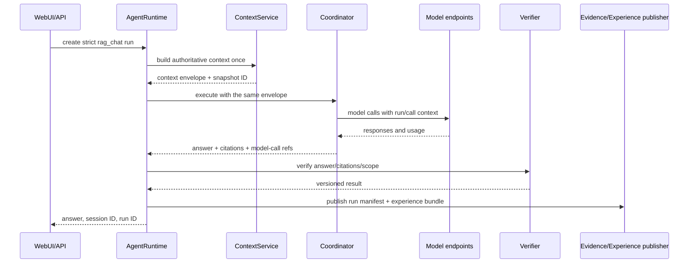

# Task-Environment-Verifier-first Agent Learning 设计

> 状态：TVE-0 已验证；TVE-1 已实现但尚未通过真实 PostgreSQL trial 集成门禁；TVE-2 已在预注册 k3d 测试环境通过真实 reset/preflight/cleanup 门禁。
> 起始代码基线：`main`（2026-08-23）。
> 本设计复用 H0--H6 已有的 `AgentRuntime`、PostgreSQL RLS、MinIO、H2 evidence、
> H5 evaluation/annotation/snapshot 和 `ReleaseGovernance`，不引入第二个运行时或长期资产库。
> 实施顺序与退出门禁见
> [Task-Environment-Verifier-first Agent Learning 实施计划](./EXPERIENCE_FIRST_AGENT_LEARNING_PLAN.md)。

## 1. 决策与目标

DataAlchemy 先建设可重复执行、可独立判卷的任务系统，再保存其执行经验：

```text
Task Bundle + 可重置 Environment + 独立 Verifier
                 ↓
            有效、可比较的 rollout
                 ↓
        受治理的原始 Experience
                 ↓
          Experience Compiler
          ├─ SFT dataset
          ├─ DPO pairs
          └─ RL rollouts
                 ↓
       模型相关 snapshot / adapter
```

LoRA、checkpoint 和已编译训练集都是可由上游资产重新生成的衍生物。项目的资产优先级是：

1. 可复现的 Environment 与独立 Verifier；
2. 高质量、可重放的 Task；
3. 带完整来源、结果和反馈的可观察 Experience；
4. 面向特定模型和算法编译的数据集；
5. LoRA、checkpoint 和 release artifact。

这是一项架构优先级，不是所有业务场景下的绝对经济价值排序。原始 Experience 由特定模型和
policy 产生，但可以跨模型重新解释和编译；compiled dataset、token IDs 和 adapter 明确属于
模型相关资产。

### 1.1 完成定义

只有同时满足以下条件，项目才具备可用于 Agent Learning 的执行基础：

- Task、Environment、Verifier 三者均有不可变版本和内容 hash，且不依赖旧模型回答；
- 同一 Task Bundle reset 三次得到相同初始状态摘要；
- 环境/fixture/verifier 故障稳定进入 `invalidated`，模型行为错误稳定进入 `failed`；
- 两个不同 model fingerprint 能在同一 Task Bundle 上完成独立判卷的 re-rollout；
- 任意受支持的在线或评测 run 都能查询其 Task、context、每次模型调用、工具调用与 observation、
  verifier、outcome、反馈和执行 fingerprint；
- 新模型先经过 gap analysis，已解决任务默认不训练；
- 训练数据只能由版本化 compiler 从已授权 Experience 产生；
- 任意 compiled item 能反向追溯到 source experience、label、compiler policy 和目标模型；
- 来源撤销能阻止后续编译，并沿现有 snapshot → adapter → release 链传播。

## 2. 范围与非目标

### 2.1 本设计实现

- 先冻结 Task Bundle、Environment reset/preflight 与独立 Verifier 契约；
- 以现有 PDF/RAG 链路完成第一个可重置、可复核的端到端纵切；
- 在同一 Task Bundle 上完成两个真实 model fingerprint 的 re-rollout；
- 将真实 `/api/chat` 与 H5 evaluation 纳入同一个 run/experience 证据边界；
- 保存完整**可观察**轨迹：模型 request/response、tool call/observation、环境引用、结果和标签；
- 定义可跨模型执行的 `task_bundle.v1`；
- 定义内容寻址的 `experience_bundle.v1`；
- 定义面向 SFT、DPO、RL 的 `compile_manifest.v1`；
- 增加 base-model re-rollout、gap analysis 和 no-train stop gate；
- 第一阶段只落地成功路径 SFT compiler，DPO/RL 由证据门禁决定是否启用。

### 2.2 本设计不实现

- 不保存模型服务没有主动返回的隐藏 chain-of-thought；
- 不把日志、trace 或用户反馈自动视为可训练数据；
- 不新建 Experience Store 微服务、第二套数据库、向量库、消息队列或工作流引擎；
- 不建设通用 sandbox 或第二套 Environment 平台；第一版只复用已注册测试环境、Kubernetes、
  PostgreSQL、MinIO、Redis 和现有 reset 脚本；
- 不复制 H5 annotation、snapshot、evaluation 和 release 状态机；
- 不因采用 span/event 术语而立即引入 OpenTelemetry 或 Agent Lightning；
- 不在缺少可重放环境、稳定 verifier 和收益证据时实施 RL；
- 不用 synthetic、小样本或单次 demo 宣称跨模型复用已验证。

## 3. 当前基础与关键缺口

| 能力 | 当前基础 | 尚未满足的 TEV-first Agent Learning 要求 |
| --- | --- | --- |
| Task/run | `AgentRuntime` 已保存 TaskSpec、plan、tool contract、run ID 和事件。 | 缺少与单次 run 解耦、内容寻址且不包含旧答案的 Task Bundle；`/api/chat` 也未稳定绑定 strict run。 |
| Environment | H2 保存执行 fingerprint；H6 提供预注册测试环境和安全 reset。 | reset plan、fixture、初始状态摘要、preflight、隔离边界与 Task Bundle 尚未不可变绑定。 |
| Verifier | H1 已有版本化、只读 verifier registry。 | 缺少 environment/process/outcome/safety 分层；H5 evaluator 仍有字符串断言，不能独立证明业务结果。 |
| Context | conversation event 与 context snapshot 已持久化。 | snapshot 目前只是调用前证据；实际 Coordinator 会再次 retrieval，不能证明模型使用了该 envelope。 |
| Tool | `agent_tool_runs` 保存 attempt、ToolResult、artifact 和 verifier。 | 在线 retrieval、local inference、cloud fusion 没有统一父子事件。 |
| Model call | 本地和云模型调用代码均存在。 | cloud audit 只保存 component/model/字段名；没有精确 prompt/response、参数、usage 或统一 run 关联。 |
| Evaluation | H5 已有 campaign、trial、annotation、snapshot、base/candidate 门禁。 | PDF H5 流程会在真实模型评测前完成 trial；evaluator 不保存实际 answer/transcript。 |
| Fingerprint | H2 保存代码、镜像、依赖锁等 fingerprint；adapter 保存 model/tokenizer digest。 | 在线调用缺少 model revision、tokenizer、chat template、generation config 和 environment reset ref。 |
| Training | approved annotation 可生成 train/validation snapshot 并执行受控 LoRA。 | 当前直接把 query/answer 编为 Alpaca SFT；没有路径选择、gap selection、DPO/RL 或 compiler manifest。 |
| Replay | H2 manifest 可回放执行证据。 | 没有独立、可多次实例化的 Task + Environment + Verifier bundle。 |

当前证据入口：

- [`AgentRuntime`](../../src/core/agent_runtime.py)；
- [H2 evidence](../../src/core/evidence.py)；
- [conversation/context](../../src/memory/context.py)；
- [H5 evaluation persistence](../../src/harness/evaluation.py)；
- [H5 evaluator](../../src/harness/evaluation_runner.py)；
- [PDF H5 cycle](../../scripts/run_h5_pdf_cycle.py)；
- [当前在线 chat](../../webui/app.py) 与 [Coordinator](../../src/agents/coordinator.py)。

## 4. 资产分层与权威关系

### 4.1 六层资产

| 层 | 内容 | 模型关系 | 权威位置 |
| --- | --- | --- | --- |
| Tasks | task input、initial state ref、tool contract、limits、split 与治理 | 模型无关 | PostgreSQL 索引 + MinIO Task Bundle |
| Environments | fixture、reset/preflight、隔离边界、初始状态与执行 receipt | 模型无关 | 现有环境注册、H2 manifest + MinIO evidence |
| Verifiers/Labels | verifier contract/result、reward dimensions、human review、user feedback | 尽量模型无关，必须版本化 | 现有 verification/evaluation/annotation 表 |
| Experiences | 模型调用、工具交互、observation、环境状态引用、outcome | 由源模型产生，但可跨模型复用 | H0--H2 run facts + MinIO Experience Bundle |
| Compiled datasets | SFT、DPO、RL 输入及 selection/transform lineage | 目标模型、tokenizer、template 和算法相关 | H5 training snapshot + MinIO Compile Manifest |
| Model artifacts | LoRA、checkpoint、evaluation、release | 模型相关 | 现有 adapter/release 表 + MinIO artifacts |

### 4.2 存储边界

- PostgreSQL 保存 tenant、状态、关系、审批、RLS、hash 和可查询投影；
- MinIO 保存按 SHA-256 寻址的大正文、完整 request/response、Task Bundle、Experience Bundle、
  Compile Manifest 和数据集；
- H2 run manifest 继续是单次执行的 canonical evidence；Experience Bundle 是其学习用途投影，
  只能引用已有权威事实，不能改写 run 结论；
- Redis 仍只保存可重建的 TTL 状态；
- Git 只保存 schema、脱敏 fixture 和测试，不保存真实 prompt、业务 observation 或训练正文。

第一版不新增通用 registry。Task Bundle 使用内容 hash 作为稳定 ID，evaluation campaign 继续按
suite/policy 聚合；只有实际查询规模证明 JSONB/fingerprint 索引不足时才新增专用表。

## 5. 核心标识与不变量

### 5.1 标识

| 标识 | 语义 |
| --- | --- |
| `task_bundle_id` | canonical `task_bundle.v1` 的 SHA-256；同一 bundle 可产生多个 rollout。 |
| `run_id` | 一次端到端执行；重跑必须产生新 run。 |
| `attempt` | 同一 run 内的基础设施重试；不能掩盖新的模型采样。 |
| `event_sequence` | run 内单调递增顺序；不能依赖跨主机时钟恢复顺序。 |
| `call_id` | 一次模型调用；retry 产生新 call ID，并以 `retry_of` 关联。 |
| `trial_id` | evaluation 中一个 case 的一次有效或无效执行。 |
| `compiler_run_id` | 一次不可变编译决策；相同输入与配置应产生相同输出 digest。 |
| `snapshot_id` | 现有 H5 模型相关训练快照。 |

### 5.2 不变量

1. 模型调用必须属于一个 run；生产学习路径不接受孤立 cloud-audit UUID。
2. request、response、tool observation 和环境正文只存受限对象；事件投影保存 ref/hash。
3. 每个事件写入 tenant、sequence、parent、producer 和 schema version；发布后不可覆盖。
4. `succeeded` 必须来自独立 verifier，不由 HTTP 200、模型自评或 tool result 单独决定。
5. user feedback 是 signal，不是 ground truth；未经 review 和训练许可不得编译。
6. hidden chain-of-thought 不属于资产契约；结构化 action、工具参数、模型公开 response 和
   显式 decision summary 可以保存。
7. evaluation holdout、revoked source、跨 tenant source 或缺失 ACL/许可的数据不得进入 compiler。
8. compiled dataset 必须绑定目标 model、tokenizer、chat template 和 compiler policy。

## 6. TEV 契约与派生契约

### 6.1 `task_bundle.v1`

Task Bundle 表达“换任何合规模型都可以重新执行什么”，不保存旧模型答案：

```json
{
  "schema_version": "task_bundle.v1",
  "task": {
    "case_id": "pdf-rag-123",
    "type": "rag_answer_with_citation",
    "input_ref": "minio://...",
    "input_sha256": "...",
    "input_tenant_id": "tenant-a",
    "split": "evaluation_holdout"
  },
  "environment": {
    "snapshot_ref": "minio://...",
    "snapshot_sha256": "...",
    "snapshot_tenant_id": "tenant-a",
    "reset_contract": {"kind": "registered-script", "ref": "reset-v1", "sha256": "..."}
  },
  "tools": [{"name": "rag_chat", "version": 1, "contract_sha256": "..."}],
  "verifiers": [{"name": "verify_rag_outcome", "version": 1, "contract_sha256": "..."}],
  "limits": {"max_steps": 20, "deadline_seconds": 1800},
  "governance": {
    "tenant_id": "tenant-a",
    "acl_sha256": "...",
    "permission_version": "task-use-v1",
    "retention_until": "2027-08-23T00:00:00Z"
  }
}
```

环境不能安全 reset 或 verifier 不能独立运行时，bundle 状态为 `invalid`，不得用于 gap analysis
或训练。

Task Bundle 与 run 必须分离：bundle 可重复实例化，每次 rollout 创建新 `run_id`；expected answer、
隐藏断言和 verifier 凭据不得出现在模型可见输入中。

PDF/RAG case 发布为四个内容寻址对象：sanitized model input、environment snapshot、verifier-only
criteria 和 Task Bundle。Task Bundle 只保存公开 input/environment ref/hash，并以 verifier
`contract_sha256` 绑定 verifier-only criteria；criteria 的 ref/hash 进入 trial fingerprint，不进入模型
输入。H5 worker context 将 `cases`（只允许 `case_id/query`）与 `verifier_cases` 分开，predictor 只能接收
前者。

### 6.2 Environment reset/preflight 与 `environment_receipt.v1`

Environment 不是名称或部署地址，而是可恢复的初始世界与受控 action/observation 边界。每次 rollout
必须保存：

- 已注册测试环境、Kubernetes namespace/image digest、PostgreSQL database/schema、MinIO/Redis prefix；
- fixture/source object、依赖和工具版本的 ref/hash；
- 允许的读写、网络、tenant/ACL、secret 注入方式和资源上限；
- reset plan hash、reset receipt、preflight result、初始状态摘要和必要的最终状态 delta；
- cleanup result；生产或共享目标必须 fail closed。

执行顺序固定为：

```text
验证 Task Bundle
  -> reset 已注册测试环境
  -> 恢复 fixture 并计算 initial_state_sha256
  -> environment preflight
  -> rollout
  -> process/outcome/safety verifier
  -> succeeded | failed | invalidated
  -> cleanup
  -> 发布有效 Experience；无效运行只保留诊断证据
```

同一 bundle 连续 reset 三次必须得到相同初始状态摘要。环境、fixture、preflight 或 verifier 自身故障
进入 `invalidated`，不产生模型负 reward；模型在有效环境中的错误进入 `failed`。

TVE-2 复用 `environment_receipt.v1`、现有 Evidence Object Store 和 k3d 服务：reset UUID 不参与
`initial_state_sha256`，相同 bundle、registry、fixture、runtime、target 与 preflight facts 三次生成相同
摘要；preflight 与 receipt 分别内容寻址并按 tenant 发布。真实门禁在预注册
`dataalchemy-gpu-test` 执行三次：只重建 `dataalchemy_tve_pilot` schema、清理专用 MinIO/Redis prefix、
恢复 PDF fixture，验证 Kubernetes workload、PostgreSQL RLS、MinIO/Redis 哈希、source permission 与
Task Bundle target，最后发布 final delta 并 cleanup。cleanup 后专用 schema/prefix/key 均为空，receipt
仍保留在 tenant evidence prefix。

### 6.3 独立 Verifier 与 `verifier_result.v1`

Verifier 使用现有 `VerifierSpec`/`VerificationResult` 和只读凭据，不新增第二套框架。判定分层为：

| 层 | 职责 | 典型结果 |
| --- | --- | --- |
| Environment | reset、fixture、依赖、ACL 和服务是否使本次试验有效 | invalidated / valid |
| Process | 工具、scope、预算、终止和副作用是否合规 | hard gate |
| Outcome | 业务结果是否满足 Task 成功标准 | succeeded / failed |
| Safety | 跨 tenant、PII、prompt injection 和越权是否发生 | hard gate |
| Quality | 硬门禁通过后的正确性、稳定性、成本和延迟 | versioned scores |

结果必须包含 status、分项 hard gates/scores、稳定 failure code、evidence refs、verifier version 与
contract digest；聚合 reward 不能替代原始判定。Verifier 必须能对保存的同一份证据重复运行并得到
相同结果，LLM judge 只能作为经过人工校准的辅助信号。

### 6.4 `experience_bundle.v1`

Experience Bundle 是单个 run 的内容寻址学习投影：

```json
{
  "schema_version": "experience_bundle.v1",
  "task_bundle_id": "sha256:...",
  "run_id": "uuid",
  "source_manifest_sha256": "...",
  "producer": {
    "model": "provider/model@revision-or-digest",
    "tokenizer_sha256": "...",
    "chat_template_sha256": "...",
    "policy_sha256": "..."
  },
  "environment_sha256": "...",
  "events": [
    {"sequence": 1, "type": "context_built", "content_ref": "minio://...", "sha256": "..."},
    {"sequence": 2, "type": "model_call", "call_id": "uuid", "content_ref": "minio://...", "sha256": "..."},
    {"sequence": 3, "type": "tool_observation", "parent_call_id": "uuid", "content_ref": "minio://...", "sha256": "..."}
  ],
  "outcome": {"state": "succeeded", "verifier_refs": ["..."], "reward": {"task": 1.0}},
  "labels": {"success": true, "failure_code": null, "annotation_refs": []}
}
```

一个 `model_call` 受限对象至少保存：请求 messages、response、status、generation config、usage、
latency、provider request ID、model revision/digest，以及可用时的 prompt/response token IDs 和
logprobs。不可用字段写 `null` 和稳定 reason code，不能伪造或重新 tokenize 后冒充 rollout 原值。

### 6.5 `compile_manifest.v1`

```json
{
  "schema_version": "compile_manifest.v1",
  "compiler": {"name": "sft-success", "version": 1, "config_sha256": "..."},
  "algorithm": "sft",
  "target": {
    "model_sha256": "...",
    "tokenizer_sha256": "...",
    "chat_template_sha256": "..."
  },
  "sources": [{"experience_sha256": "...", "label_refs": ["..."], "selection": "verified_success"}],
  "exclusions": [{"experience_sha256": "...", "reason": "base_already_solves"}],
  "output": {"dataset_key": "minio://...", "dataset_sha256": "...", "records": 100},
  "split": {"train": 80, "validation": 20},
  "created_by": "compiler-service"
}
```

H5 `training_snapshots` 继续保存数据集、split、base model 和审批状态，但需增加 compile manifest、
target tokenizer、chat template 和 algorithm 的 key/hash。snapshot 不是原始 Experience。

### 6.6 第一条纵切：PDF/RAG 可验证任务

第一阶段不建设通用 Agent sandbox，只证明现有 PDF/RAG 链路可以重复考试：

- Task：给定固定 PDF hash、tenant/ACL 和问题，要求有证据回答；无证据时必须 abstain；
- Environment：使用预注册测试环境，绑定 PostgreSQL、MinIO fixture/prefix、Redis prefix、namespace、
  image digest、reset plan/receipt 和初始状态摘要；
- Verifier：先校验环境与 ACL，再校验 document/chunk 持久化、citation 对应 source/page/hash、答案
  得到证据支持或正确 abstain，并拒绝 prompt injection、PII 与跨 tenant 读取；
- Replay：Model A 和 Model B 使用相同 bundle、有效环境、generation policy、trial 数和 verifier policy。

字符串包含断言只保留为配置 smoke test，不作为该纵切的 outcome verifier。

## 7. 统一事件模型

第一版复用 `agent_events`、`agent_tool_runs`、`agent_step_verifications`、conversation events 和 H5
trial/annotation，不新增通用 event table。Experience publisher 按 run 聚合下列逻辑事件：

| 事件 | 必需内容 |
| --- | --- |
| `rollout_started` | task bundle、run、attempt、identity/tenant digest、开始时间。 |
| `context_built` | 实际使用的 context snapshot/ref、pack、可见 source refs、预算。 |
| `model_call` | request/response ref、model/policy/template、usage、latency、status、retry relation。 |
| `tool_call` | ToolSpec digest、参数 ref/hash、scope、approval、parent call。 |
| `tool_observation` | ToolResult ref/hash、artifact、failure、environment delta。 |
| `verifier_result` | verifier/version/contract、input digest、分项结论、error code。 |
| `reward` | versioned dimensions；保留原始 verifier，不只保留聚合 scalar。 |
| `user_feedback` | source feedback、review state、permission 和 annotation ref。 |
| `rollout_finished` | final outcome、failure taxonomy、manifest/experience digest。 |

`agent_events` 只保存小投影。完整内容经字段分级、脱敏和大小检查后写 MinIO；secret 字段不得出现在
日志、H2 公共投影或 compiler 输出。

## 8. 在线 chat 捕获流程

当前 `/api/chat` 的 context snapshot 与实际 Coordinator retrieval 分离。目标流程为：



约束：

- `ContextService` 构造的 envelope 必须是实际调用输入，Coordinator 不得再次独立 retrieval；
- Agent B local inference、Agent C cloud rewrite、Agent D fusion 和 SFT synthesis 使用同一个 recorder；
- 模型 recorder 只负责观测，不参与模型选择、重试决策或业务状态机；
- response 返回用户前可以先落 append-only event；experience 发布失败不能把业务回答伪装成已形成
  可训练资产，而应留下 `experience_pending/blocked` 诊断状态。

## 9. Evaluation trial 修复

H5 的 `trajectory_trials` 必须代表真实模型执行，而不是 case 占位记录：

1. campaign 为每个 case 创建 trial 和 strict run；
2. model-evaluate Job 接收 `case_id → trial_id/run_id` 映射；
3. evaluator 保存实际 prompt、answer、case assertion、latency 和 model fingerprint；
4. Job 完成后逐 trial 调用 `finish_trial`，写 transcript key/hash 和 verifier outcome；
5. 环境错误进入 `invalidated` 并补跑，模型错误进入 `failed`；
6. 所需有效 trial 完成后才能汇总 campaign；
7. 禁止在模型调用前写 `succeeded`，禁止只保存 `case_id/passed` 丢弃答案。

现有 base/candidate 同 suite hash、policy 和 required trial 数比较继续保留。

## 10. 模型迁移与 gap analysis

新基座不直接消费旧 compiled dataset，而先消费 Task Bundle：

```text
选定 target model fingerprint
  -> 在冻结 Task Bundle 上重新 rollout
  -> verifier 独立评分
  -> 与旧模型/当前 release 对齐比较
  -> solved / weak / failed / invalid
  -> 只从 weak + 合规 failed 中选择训练来源
  -> Experience Compiler
  -> candidate evaluation
```

分类规则由版本化 policy 冻结：

| 分类 | 定义 | 默认动作 |
| --- | --- | --- |
| `solved` | 所有 hard gate 通过且 capability 达到目标。 | 不训练；保留为 regression/evaluation evidence。 |
| `weak` | hard gate 通过，但质量、稳定性、成本或延迟未达目标。 | 可进入人工抽样和 compiler selection。 |
| `failed` | 有效环境中任务失败或 hard gate 失败。 | 优先诊断；只有修正标签和训练许可完整时才可编译。 |
| `invalid` | 环境、fixture、verifier 或基础设施无效。 | 修复环境并重新 rollout，不进入训练。 |

停止门禁：

- target base 已达到发布 policy：停止训练；
- gap 样本不足、许可不完整或 verifier 未校准：停止编译；
- candidate 未相对 base 改进或 regression 退化：撤销 candidate，不发布；
- 训练成本超过获批预算：停止当前 compiler/training run；
- 不允许以“已有旧 adapter”作为必须训练新 adapter 的理由。

## 11. Experience Compiler

### 11.1 SFT：第一阶段唯一必做 compiler

`sft-success@1` 只选择：

- environment 有效；
- final verifier 通过；
- 来源仍可访问且 `training_allowed=true`；
- 不属于 evaluation holdout；
- prompt/response 与目标 chat template 可无损编译；
- 人工或确定性规则确认输出是期望行为。

多步 agent 不把失败重试拼成一个“成功答案”。compiler 按事件父子关系和 artifact/verifier 依赖提取
完成成功所必需的公开模型调用；恢复行为另标 `recovery`，未经专门 policy 不进入普通 SFT。

### 11.2 DPO：条件能力

DPO pair 必须来自相同 Task Bundle、environment、decision point、tool contract 和可比较 prompt。
good/bad 的差异应由 verifier、人工 preference 或明确 outcome 支撑，不能用不同任务的高低分答案
强行配对。

### 11.3 RL：后置能力

RL 使用完整可观察 trajectory 和 versioned reward dimensions。开始前必须证明：

- 环境可批量安全 reset；
- reward 与业务成功一致，并有 reward-hacking fixture；
- token IDs/logprobs 的采集语义正确；
- rollout-level advantage/loss normalization 决策已记录；
- SFT/DPO 的收益不足以达到目标；
- 训练与 rollout 资源、预算和停止规则已批准。

## 12. 安全、隐私与生命周期

### 12.1 数据分级

| 内容 | 默认策略 |
| --- | --- |
| ID、hash、状态、版本、计数 | PostgreSQL 可查询投影。 |
| prompt、response、tool observation、environment diff | tenant-scoped 加密 MinIO object。 |
| access token、cookie、credential、原始 secret | 不保存；只保存拒绝事件或不可逆 digest。 |
| hidden reasoning / provider internal state | 不采集、不推断。 |
| 用户反馈 | `unrated` 起步；review 后才可能获得训练许可。 |

### 12.2 删除与撤销

- Experience Bundle 引用 source ACL、permission、retention 和 annotation；
- source 删除、ACL/许可撤销或 retention 到期后，compiler 必须拒绝新使用；
- 已生成 snapshot 沿现有 H5/H6 撤销链使 adapter/release 失效；
- 不能保留的正文从 MinIO 删除，PostgreSQL 保留 tombstone、hash、原因和必要审计；
- 已训练参数不能伪装成可从单条数据原地删除，只能撤销 artifact，并从剩余合法资产重新训练。

## 13. Agent Lightning 边界

本设计借鉴其“agent execution 与训练解耦、按 rollout 记录模型边界事件”的思想，但第一阶段不引入
依赖。DataAlchemy 已有单一运行时、Kubernetes Job、PostgreSQL 状态、MinIO evidence 和发布治理；
直接加入另一套 controller/store 会形成重复权威。

截至 2026-08-18，Agent Lightning v1.0 的中心组件已是 API Gateway、Rollout Controller 和
trainer；API Gateway 保存 rollout、model 与 append-only events，并记录模型 request/response token
信息。旧版 LightningStore/spans 文档仍可用于理解 trace，但不是本设计绑定的 API。

只有 RL 门禁通过后，才评估两种集成方式：

1. DataAlchemy 导出 Task Bundle，由 Agent Lightning 作为临时 rollout/training 执行平面，完成后将
   Experience/Compile Manifest 回写 DataAlchemy；
2. 复用其 LLM proxy 采集精确 token/logprob，但 DataAlchemy 仍是长期资产、许可和发布权威。

参考：

- [Agent Lightning v1.0 paper](https://arxiv.org/abs/2608.17528)
- [Agent Lightning legacy trace tutorial](https://github.com/microsoft/agent-lightning/blob/main/docs/tutorials/traces.md)

## 14. Verifier 与退出门禁

| Verifier | 必查项 |
| --- | --- |
| `verify_task_bundle@1` | input/environment/reset/tool/verifier hash 完整；tenant、ACL、许可有效。 |
| `verify_environment@1` | 注册目标、reset receipt、fixture、服务健康、隔离边界和 initial-state hash 有效。 |
| `verify_task_run@1` | process/outcome/safety hard gate 完整；failed 与 invalidated 分类有证据。 |
| `verify_rag_outcome@1` | source/page/hash 与 citation 对齐；答案有证据或正确 abstain；无跨 tenant 泄漏。 |
| `verify_experience_bundle@1` | run manifest 一致；事件有序；所有 call/tool/outcome 可追溯；无未分类 secret。 |
| `verify_trial_transcript@1` | trial 在实际模型调用后结束；prompt/answer/fingerprint/transcript hash 一致。 |
| `verify_gap_report@1` | 同 bundle、suite、policy、环境要求；invalid 不计能力缺口。 |
| `verify_compile_manifest@1` | source 合法、holdout 隔离、目标 fingerprint、transform 和 output hash 正确。 |
| `verify_model_migration@1` | base 先评测；candidate 相对比较；regression、成本和许可门禁通过。 |

本设计的总退出门禁：

- 同一 Task Bundle 连续 reset 三次的初始状态摘要一致；
- expected answer、隐藏断言和 verifier credential 不进入模型可见输入；
- 环境/fixture/verifier 故障进入 `invalidated` 且不计模型 reward，模型错误进入 `failed`；
- verifier 对同一份保存证据重复执行得到相同结论；
- 跨 tenant 读取/reset 被拒绝，source 撤销会阻止后续 replay；
- 两个不同 model fingerprint 能在同一 Task Bundle 上完成可验证 re-rollout；
- 任取一个 run，可重建其全部可观察事件并核验 Experience Bundle hash；
- 新 base 已解决的 task 不进入训练 snapshot；
- SFT dataset 中不存在未授权、holdout、invalid 或失败重试污染；
- source 撤销会阻止编译并使依赖 candidate/release 失效；
- 在真实 PostgreSQL + MinIO 上完成一次 base → gap → compile → train/no-train → evaluation 的受控 A/B；
- 未满足 DPO/RL 门禁时，项目状态明确保持 `not_enabled`，不得以设计文档宣称已实现。

## 15. 与现有阶段的关系

- H0/H1 提供 TaskSpec、ToolResult 和独立 verifier；
- H2 提供 run manifest、fingerprint、MinIO evidence 和恢复；
- H3/H4 提供真实产品输入、conversation/context 与 memory 治理；
- H5 提供 trial/annotation/snapshot/adapter/evaluation/release；
- H6 继续负责真实数据资格、人工校准、candidate runtime 和 GA；
- TVE-0--TVE-4 先把 Task、Environment、Verifier 组合成可重复执行的评测资产；
- EL-1 以后才把有效 rollout 发布为 Experience，并进行 compiler/SFT/DPO/RL；
- 本工作不是跳过 H6 的新发布阶段，而是修复并扩展 H0--H5 的学习资产语义。

因此，完成本设计的工程门禁也不代表 `PILOT_READY` 或 `GA_APPROVED`。
