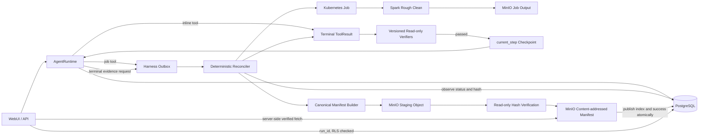

# H2 设计：统一运行证据、异步 Job 与恢复

> 状态：工程实现完成，真实 k3d Spark 退出门禁已通过。分支：`feat/harness-h2-evidence-recovery`；基线：`feat/harness`
> 提交 `0be5f8e`。H2 只建立可回放证据、受控 Spark Job 和 checkpoint 恢复；产品闭环页面、
> memory distillation、LoRA 质量门禁和真实试点分别属于 H3、H4、H5、H6。

## 1. 当前基线与问题

H0/H1 已提供可复用的执行事实：

- `agent_tasks.run_id` 是一次任务的唯一运行编号；TaskSpec、计划版本、lease 和 `current_step`
  已持久化。
- `agent_tool_runs` 保存 task/step/idempotency/attempt 和不可变 terminal `ToolResult`。
- `agent_step_verifications` 追加保存版本化 verifier 结论；required verifier 未通过前不推进
  `current_step`。
- PostgreSQL RLS 是 tenant、任务、工具结果和验证结论的访问权威；MinIO 已保存原始对象和部分
  Connector manifest。

尚未闭合的 H2 问题：

1. 给定 `run_id` 还不能得到一个完整、按 hash 校验、可长期读取的运行证据包。
2. PostgreSQL 和 MinIO 之间没有事务；上传成功但数据库未提交、数据库已登记但对象缺失时没有
   收敛机制。
3. Spark 仍通过 Kubernetes annotation 和同步等待触发，绕过 AgentRuntime 的 task/step、审批、
   取消和恢复语义。
4. `run_agents.py full-cycle` 将清洗、索引、训练串在一个不可恢复进程中；任一后段失败都无法从最近
   已验证 checkpoint 恢复。
5. 现有 `src/storage/run_assets.py` 只支持本地目录和 `current` 指针，不具备 tenant RLS、MinIO
   原子发布、outbox、保留和删除传播能力，不能作为 H2 的线上权威。

## 2. 目标、完成定义与非目标

H2 的完成路径是：

```text
TaskSpec
  → inline ToolResult 或受控 JobHandle
  → terminal ToolResult
  → 独立 verifier
  → current_step checkpoint
  → canonical manifest
  → MinIO hash 验证并发布
  → verified success / diagnosable failure
```

完成定义：

- 一个成功 strict run 只有在 required verifier 全部通过且 manifest 已发布后才能进入
  `succeeded`。
- 一个失败 run 保留此前全部已验证 checkpoint，并异步发布失败证据；证据发布失败不能伪装成
  业务成功。
- 给定 `run_id` 可以校验并展示 TaskSpec、输入版本、计划、审批、ToolResult、Job、verifier、
  checkpoint、fingerprint 和最终结论，但不会重放副作用。
- 恢复从 `agent_tasks.current_step` 指向的首个未验证步骤继续；已有 terminal ToolResult 和通过的
  verifier 不重复执行不可撤销操作。

H2 明确不做：

- 不新增第二个 Agent 编排器、工作流 DSL、事件总线或通用 artifact catalog。
- 不把 MinIO 变成状态数据库，也不把 PostgreSQL 大字段复制成第二套事实表。
- 不在 H2 开放训练、评测、release 工具；它们继续 `blocked_pending_h5`。H2 只冻结其未来需要的
  evidence/job 协议。
- 不实现 H3 的完整产品演示页、H4 的 Context/Memory、H5 的 LLM judge 或 H6 的外部试点。

## 3. 核心设计决策

### 3.1 权威划分

| 事实 | 权威位置 | H2 规则 |
| --- | --- | --- |
| task、plan、审批、checkpoint | PostgreSQL 现有表 | `current_step` 只在 verifier 通过后推进。 |
| terminal ToolResult | `agent_tool_runs.result_json` | 首次写入后不可覆盖。 |
| verification attempt | `agent_step_verifications` | append-only，保留所有尝试。 |
| Job handle/状态 | PostgreSQL `agent_jobs` | Kubernetes 只是被观察的执行后端。 |
| manifest 发布索引 | PostgreSQL `run_manifests` | 保存 key、digest、状态和保留策略，不保存第二份完整 manifest。 |
| 完整证据包、Job 日志 | MinIO | content-addressed、hash 校验、只能由 API 经 RLS 返回。 |
| 跨存储待办 | PostgreSQL `harness_outbox` | 至少一次执行，靠 dedupe key 和内容 hash 幂等收敛。 |

不新增 `agent_checkpoints`：H1 的 `current_step + ToolResult + passed verification` 已是完整 checkpoint。
不新增通用 `run_artifacts`：artifact 仍由 ToolResult 表达，manifest 只做不可变快照。

### 3.2 单运行时边界

`AgentRuntime` 继续是唯一计划和状态机权威。H2 增加的 reconciler 只执行确定性的 outbox、
Kubernetes Job 状态同步和 manifest 发布，不生成计划、不选择工具、不修改 TaskSpec，也不是第二个
Agent runtime。

初版 reconciler 作为 WebUI lifespan 的后台循环运行，使用数据库 lease 支持进程重启和多副本抢占。
当真实吞吐证明 WebUI 生命周期不足时，才把同一 reconciler 命令部署为独立 Worker；数据库协议和
状态机不变。

## 4. 目标架构



## 5. PostgreSQL 数据模型

迁移 `010_harness_evidence_recovery.sql` 只新增三张表。

### 5.1 `run_manifests`

一条 run 一行，记录跨存储发布状态；该行是可变索引，不是不可变证据正文。

| 列 | 约束与用途 |
| --- | --- |
| `run_id UUID PRIMARY KEY` | FK 到 `agent_tasks(run_id)`。 |
| `task_id UUID UNIQUE NOT NULL` | FK 到 `agent_tasks(task_id)`，防止 run/task 配错。 |
| `tenant_id TEXT NOT NULL` | 强制 RLS。 |
| `state TEXT NOT NULL` | `requested/staged/verified/published/publish_blocked/corrupt/deleting/deleted`。 |
| `schema_version INTEGER` | H2 固定为 1。 |
| `staging_key TEXT` | 发布完成后清空；不得由客户端传入。 |
| `object_key TEXT` | 仅 published content-addressed key。 |
| `manifest_sha256 TEXT` | canonical bytes 的 64 位 SHA-256。 |
| `manifest_size BIGINT` | 上限默认 1 MiB，超限 fail closed。 |
| `fingerprint_digest TEXT` | manifest 内 fingerprint 的 canonical digest。 |
| `attempt INTEGER` | manifest 发布尝试次数。 |
| `last_error_code TEXT` | 固定错误码，不保存未脱敏异常。 |
| `retention_until TIMESTAMPTZ` | tenant 策略计算；不可由普通用户延长。 |
| 时间列 | requested/staged/verified/published/deleted 时间。 |

`object_key + manifest_sha256` 在 `published` 后不可修改；数据库 trigger 拒绝覆盖。删除只把状态变为
`deleted` 并保留 digest/tombstone，不复用原 key。

### 5.2 `harness_outbox`

统一处理 PostgreSQL → Kubernetes/MinIO 的跨边界动作：

```text
publish_manifest | delete_manifest | submit_job | cancel_job | capture_job_logs
```

关键列为 `outbox_id`、tenant/run/task/step/job、`kind`、`dedupe_key UNIQUE`、最小 `payload_json`、
`state(pending/processing/retry/completed/dead)`、attempt、available_at、lease_owner、lease_expires_at、
last_error_code 和时间列。payload 只允许服务端生成的 ID、digest、deadline 和对象 key，不保存凭据、
原文、任意命令或 Kubernetes YAML。

业务数据库事务只插入 outbox；reconciler 使用 `FOR UPDATE SKIP LOCKED` 领取，超时 lease 可被其他实例
接管。`dead` 不自动重试，必须由管理员在修复依赖后使用 CAS 重新排队。

### 5.3 `agent_jobs`

| 列 | 约束与用途 |
| --- | --- |
| `job_id UUID PRIMARY KEY` | 逻辑 Job handle。 |
| tenant/run/task/step | FK 与唯一 `(task_id, step_id)`；一个 plan step 只有一个逻辑 Job。 |
| `kind` | H2 只允许 `spark_rough_clean`；训练/评测仅保留未启用枚举前缀。 |
| `backend` | H2 固定 `kubernetes`，不做插件框架。 |
| `state` | `requested/submitting/running/succeeded/failed/cancel_requested/cancelled/orphaned/reconciliation_required`。 |
| `external_name`, `external_uid` | 服务端生成的 Kubernetes Job name/UID。 |
| `attempt` | 逻辑 Job 的提交尝试；外部名称带 attempt。 |
| `input_key/input_sha256` | 冻结的 Job 输入描述，不是任意 bucket prefix。 |
| `result_key/result_sha256` | Worker 结果 manifest；成功前必须 hash 校验。 |
| `log_key/log_sha256` | reconciler 捕获的脱敏日志对象。 |
| `last_observed_at`, `deadline_at` | Kubernetes 状态观察 heartbeat 与超时。 |
| `error_code` | 固定失败分类。 |

表启用并强制 tenant RLS。普通 task owner/admin 可读；只有应用角色写。Job Pod 不获得应用数据库凭据。

## 6. Manifest v1

### 6.1 Canonical 规则

- UTF-8 JSON、key 排序、无无意义空白、时间统一 UTC RFC 3339、UUID 小写字符串。
- digest 对最终 bytes 计算 SHA-256；manifest 内不自包含自己的 digest，避免递归。
- array 使用业务稳定顺序：plan 按 step index，events 按 `occurred_at,event_id`，verification 按
  step/criterion/attempt，Job 按 step。
- 构建时使用 PostgreSQL `REPEATABLE READ, READ ONLY` 快照；对象上传发生在事务外。
- manifest 最大 1 MiB；超限时保留结构化 evidence，日志和大报告只保存独立 content-addressed ref。

### 6.2 顶层结构

```json
{
  "schema_version": 1,
  "run": {
    "run_id": "...",
    "task_id": "...",
    "tenant_id": "...",
    "outcome": "succeeded",
    "finish_reason": "verified_evidence_published"
  },
  "task_contract": {
    "task_spec": {},
    "task_spec_digest": "...",
    "plan_versions": [],
    "final_plan_digest": "..."
  },
  "inputs": [],
  "approvals": [],
  "steps": [
    {
      "step_id": "...",
      "tool_contract": {},
      "input_refs": [],
      "tool_result": {},
      "tool_result_digest": "...",
      "job": null,
      "verifications": [],
      "checkpoint_committed": true
    }
  ],
  "timeline": [],
  "fingerprint": {},
  "integrity": {
    "source_snapshot_completed_at": "...",
    "redaction_policy_version": 1
  }
}
```

`inputs` 保存 source ref、version、hash、ACL snapshot digest 和原始对象 ref，不复制原文。`timeline`
只包含 allowlist event type、时间、step/criterion/job ID 和固定错误码；不复制任意 event payload。

### 6.3 字段级证据投影

manifest builder 不直接序列化数据库整行：

- `ToolResult.output` 必须按 ToolSpec 的 `result_sensitivity` 投影；`secret` 删除，`internal` 只保留
  digest 或计数，`public` 才可原样进入 manifest。
- 未分类的新 output 字段在 strict evidence 发布中 fail closed，并进入 `publish_blocked`。
- artifact 只保留 store/kind/id/version/hash/size/content_type；不保存带凭据 URL。
- verifier summary 使用 H1 allowlist；异常、模型私有推理、prompt 原文、token、authorization header、
  文档正文和聊天正文均不得进入 manifest。
- Job 日志先用现有 secret pattern 和固定大小上限脱敏；完整未脱敏 Pod 日志不进入证据 bucket。

## 7. Harness fingerprint

fingerprint 记录“哪个确定性环境产生了这些事实”，不追求保存整个容器：

| 组件 | 取值来源 |
| --- | --- |
| source revision | 构建注入的 `BUILD_GIT_SHA`；生产缺失则成功发布被阻塞。 |
| image | 构建注入的 OCI image digest；本地可标为 `unavailable`，不能伪造 `latest` 的 digest。 |
| database | `schema_migrations` 的有序 version 列表及 digest。 |
| Python dependencies | `uv.lock` 文件 digest，由构建注入或启动时只读计算。 |
| model/tokenizer/index | Task 实际使用的 ID/revision 与现有 `MODEL_VERSION/INDEX_VERSION`。 |
| prompt | 实际使用 prompt 模板的版本/hash；未使用模型的任务标为 `not_applicable`。 |
| ToolSpec/verifier | H1 已冻结的 name/version/contract digest。 |
| Context/Skill | H4 前明确记录 `not_configured`；不得写虚假版本。 |
| non-secret config | execution mode、chunker/rule version、Spark image digest和证据策略版本。 |

每项包含 `value/source/availability`。生产成功 run 的必需项为 Git、镜像、migration、依赖和实际使用的
模型/工具；开发环境允许 `unavailable`，但 manifest outcome 标记为 `development_evidence`。

## 8. Manifest 发布协议

对象 key：

```text
evidence/<tenant_id>/<run_id>/staging/<outbox_id>.json
evidence/<tenant_id>/<run_id>/manifests/sha256/<digest>.json
evidence/<tenant_id>/<run_id>/jobs/<job_id>/result-<digest>.json
evidence/<tenant_id>/<run_id>/jobs/<job_id>/log-<digest>.txt
```

发布顺序：

1. task 到达需要证据的终态时，在同一 PostgreSQL 事务中 upsert `run_manifests(requested)`、插入
   `publish_manifest` outbox 和 `evidence_requested` event。
2. reconciler 领取 outbox，在只读 repeatable-read 快照中生成 canonical manifest 和 digest。
3. 写 staging key；使用只读 evidence verifier 凭据重新读取并检查 size/hash，数据库状态变为
   `verified`。
4. 将相同 bytes 复制到 content-addressed final key；若 key 已存在，只接受 size/hash 完全一致。
5. 再次以只读凭据读取 final key。随后在一个 PostgreSQL 事务中把 index 置为 `published`、完成
   outbox、写 `evidence_published` event；成功 run 同事务从 `evidence_pending` 进入 `succeeded`。
6. staging 对象由后续 outbox 清理。清理失败不撤销已验证 final object，只产生审计告警。

MinIO 不能参与 PostgreSQL 事务，因此“原子”指客户端只能通过 PostgreSQL published index 看到一个
已校验 final object；staging 和孤儿 final key永远不是已发布证据。

### 8.1 故障收敛

| 故障点 | 重启后的确定性处理 |
| --- | --- |
| DB 提交 outbox 前失败 | 没有外部副作用，原业务事务回滚。 |
| staging 上传后 DB 未更新 | 重新生成相同 digest；复用或覆盖同一 staging bytes。 |
| final copy 后 DB 未发布 | HEAD/GET final key，hash 相同则只补 DB 发布事务。 |
| DB published 前 final 校验失败 | `publish_blocked`，成功 task 保持 `evidence_pending`。 |
| published 对象后续缺失/篡改 | index 置 `corrupt`、审计告警；不得静默重建并伪装原对象从未丢失。 |
| outbox lease owner 丢失 | lease 超时后由其他 reconciler 接管，dedupe key 防止重复副作用。 |

## 9. 受控异步 Job

### 9.1 ToolSpec 与状态机

H2 给 ToolSpec 增加最小字段 `execution = inline | kubernetes_job` 和 `job_kind`。只有
`spark_rough_clean` 使用 `kubernetes_job`；不建立通用 backend 插件体系。

同时在现有 registry 增加 `verify_rough_clean@1`：通过只读 evidence 凭据读取 Job result 与
`cleaned_corpus/rejections/metrics` artifact，校验对象 hash、固定 schema、输入/输出/拒绝计数、
去重统计和敏感规则版本。它不运行 Spark、不改写对象，也不以 Job 自报计数为唯一依据。

```text
created/running task
  → validate tool/scope/approval
  → INSERT agent_jobs(requested) + submit_job outbox
  → task waiting_job, release execution lease
  → reconciler creates/observes Kubernetes Job
  → running
      → succeeded + valid result manifest → terminal ToolResult → verify_rough_clean
      → failed/missing result/hash mismatch → failed ToolResult → task failed
      → disappeared/unknown side effect → reconciliation_required
  → verifier passed → checkpoint → next step
```

Job handle 不是成功 ToolResult。`agent_tool_runs.result_json` 在 Job terminal 且 result manifest 校验前
保持 NULL；因此 Kubernetes `Complete=True` 也不能单独推进 checkpoint。

### 9.2 Job 创建

- Gateway 根据冻结的 JobSpec 生成 Job；客户端和外部文本不能提交 image、command、namespace、
  serviceAccount 或任意 YAML。
- Job name 为 `da-<run8>-<step8>-a<attempt>`，labels/annotations 保存完整 run/task/step/job ID 和
  ToolSpec digest。
- 输入是 exact `input_key + input_sha256`，禁止默认扫描整个 `raw/` bucket。
- H2 Spark Job 直接运行现有 `src.etl.main`，但输入、输出和结果 manifest 都使用 run-scoped prefix。
- Pod 只获得其输入前缀只读、Job 输出前缀写入的 MinIO 凭据；不获得应用 PostgreSQL、发布或 verifier
  凭据。
- `backoffLimit=0`；重试由 AgentRuntime/reconciler 根据幂等契约决定，不能由 Kubernetes 隐式重放。

H2 在线路径不再 patch `dataalchemy.io/request-ingest` 或 `request-full-cycle` annotation。Operator 继续
管理 Redis/MinIO 等基础设施；Job 由受 RBAC 限制的 harness service account 创建。现有 annotation、
`AgentA.clean_and_split()` 和 `/api/jobs/full-cycle` 标记为 deprecated：生产返回明确拒绝，开发 CLI
只作为诊断路径且不能关闭 harness 门禁。

### 9.3 观察、取消和孤儿处理

- reconciler 读取 Kubernetes Job condition、UID 和 resourceVersion，每次观察更新
  `last_observed_at`；不长期持有 AgentRuntime execution lease。
- Pod 完成后，reconciler 捕获限长、脱敏日志并写 content-addressed log object，再读取 Job result
  manifest、校验 artifact hash，最后构建 terminal ToolResult。
- task cancel/deadline 写 `cancel_job` outbox；只有确认 Job 删除/终止且不存在成功 result 后才进入
  `cancelled`。删除超时进入 `reconciliation_required`。
- pause 不假装暂停 Spark：Job 继续运行，task 在 Job terminal 的安全点进入 `paused`。
- Job 创建后找不到对象但尚在 submit grace period：以相同 dedupe key补提交；运行中的 UID 消失、
  result 不存在：`orphaned → reconciliation_required`。
- terminal Job 失败不在同一步自动重跑。修复输入或配置后通过 replan 产生新 step ID；原失败 Job 和
  ToolResult 保留。

## 10. Checkpoint 恢复与 replay

必须区分三个动作：

1. **evidence replay**：只读取并校验 published manifest，重建时间线，不执行工具。
2. **resume**：同一 task/run 从 `current_step` 继续；已验证 prefix 不变，当前未完成 step 按
   ToolResult/Job 状态恢复。
3. **rerun**：创建新的 task/run；旧 run 永不改写，可在新 TaskSpec metadata 引用 `parent_run_id`。

恢复算法：

- 对 `index < current_step`：必须存在 terminal succeeded ToolResult 和 required passed verification；
  只校验 digest，不调用工具。
- 对 `index == current_step`：
  - terminal succeeded ToolResult 存在但 verification 未完成：只继续 verifier；
  - Job requested/running：只恢复状态观察；
  - Job succeeded且 result 已校验：只物化 ToolResult；
  - 无 ToolResult/Job 且工具无副作用：允许执行；
  - 副作用状态未知：进入 `reconciliation_required`。
- 对后续步骤：保持未开始；前一步 required verifier 未通过时禁止提交 Job。

resume/reconcile API 必须携带 task expected version；reconciler 的每次状态更新也使用 CAS 或当前
Job state 条件，避免用户控制请求与后台观察相互覆盖。

## 11. API 与 WebUI 边界

H2 增加：

- `GET /api/runs/{run_id}`：RLS 后返回 manifest index、task 摘要、Job 与 verification 状态。
- `GET /api/runs/{run_id}/manifest`：服务端读取 published key、重新校验 hash 后返回脱敏 manifest；
  不返回 MinIO 管理凭据或永久公开 URL。
- `POST /api/runs/{run_id}/reconcile`：admin + expected version，仅重新排队 `publish_blocked/dead` 的
  确定性动作，不改变业务结论。
- 现有 task pause/cancel/replan 扩展到 `waiting_job/evidence_pending`，保持 CAS。

H2 WebUI 只在现有 task details 中增加 manifest/Job/checkpoint 摘要和下载证据按钮。完整跨阶段产品
时间线属于 H3，H2 不提前建设第二套控制台。

## 12. 安全、ACL、加密、保留与删除

- 所有 run 查询先通过 PostgreSQL RLS 解析 owner/admin；MinIO prefix 不是授权机制。
- 生产至少使用三类对象存储凭据：Job prefix 最小读写、evidence publisher 写、evidence verifier 只读；
  删除凭据只给 retention janitor。开发环境可共用 MinIO 实例，但不能共用逻辑权限声明。
- evidence bucket 在生产启用 TLS、server-side encryption 和 versioning；配置缺失时生产启动失败。
- published prefix 的 publisher IAM 不允许 Delete；同 digest key 只接受相同 bytes。
- 默认只保存引用、hash、计数和脱敏日志，不在证据包复制原文。源 document/memory 删除后，manifest
  中的引用和审计 hash按 tenant 审计保留期保留；不会使已删除正文重新可见。
- 显式 run/tenant 删除请求写 `delete_manifest` outbox：先删除 Job 日志和 manifest 对象，再把
  `run_manifests` 置为 tombstone。失败可重试；不得先删除 PostgreSQL index 而留下无法发现的对象。
- legal hold/审计保留优先于普通用户删除；策略和决定进入审计事件。H2 不实现通用合规引擎。

## 13. 实施范围

| 位置 | H2 改动 |
| --- | --- |
| `src/storage/migrations/010_harness_evidence_recovery.sql` | 三张表、约束、RLS、trigger 和 grants。 |
| `src/core/agent_runtime.py` | waiting_job/evidence_pending、异步 ToolResult 恢复、checkpoint 前缀校验。 |
| `src/core/runtime_tools.py` | 启用 `spark_rough_clean` JobSpec；训练/发布继续 blocked。 |
| `src/core/evidence.py` | canonical manifest builder、字段投影、fingerprint 和 digest。 |
| `src/core/reconciler.py` | outbox lease、Job 状态同步、manifest publish/delete。 |
| `src/utils/s3_utils.py` | H2 所需的 strict head/get/put/copy/delete；保留旧兼容方法。 |
| `src/etl/main.py` | exact input/output、run/job 参数和 Job result manifest。 |
| `webui/app.py` | run 查询、manifest 获取、reconcile API；移除 annotation bypass。 |
| Helm/Operator templates | harness RBAC、run labels、最小凭据、构建 fingerprint。 |
| tests | manifest、outbox、Job、恢复、RLS、MinIO 故障注入和 k3d smoke。 |

`src/storage/run_assets.py` 只保留给 Git Connector 的本地 pilot manifest，H2 不扩展它为线上框架；
待 Git Connector 迁入统一 evidence 后再删除，避免一次改动两套已工作的路径。

## 14. 实施顺序

### H2-A：证据数据层

1. 增加 010 migration、RLS、不可覆盖约束和 outbox lease。
2. 实现 canonical manifest/fingerprint/evidence projection。
3. 完成 PostgreSQL-only snapshot 测试和跨 tenant 拒绝。

### H2-B：MinIO 发布与恢复

1. 实现 staging → read-only verify → content-addressed final → published index。
2. 覆盖每个跨存储故障点及 outbox 接管。
3. 增加 integrity audit、retention 和 delete outbox。

### H2-C：受控 Spark Job

1. 增加 `agent_jobs` repository 和 `spark_rough_clean` JobSpec。
2. 用 run-scoped input/output 替换 annotation 触发；实现观察、日志、取消、deadline 和 orphan。
3. Job terminal 后物化 H1 ToolResult envelope，由 `verify_rough_clean` 关闭该步骤门禁；后续文档入库
   步骤仍复用 `verify_ingest/verify_retrieval`。

### H2-D：checkpoint 与 API

1. 成功 task 加入 `evidence_pending → succeeded`；失败 task 异步保存失败证据。
2. 实现 resume/reconcile/replay 和 API 摘要。
3. WebUI 展示 Job、checkpoint、manifest state 和 digest。

### H2-E：退出验证与文档

1. 隔离 PostgreSQL/MinIO 故障注入、Worker 丢失、取消竞态和跨 tenant 测试。
2. k3d 执行一个真实小型 Spark rough-clean Job；不模拟 Job 成功。
3. 更新执行计划、TODO、架构和 H2 退出报告。

## 15. 必测轨迹

| 轨迹 | 必须观察到的结论 |
| --- | --- |
| inline 多步成功 | final verifier 后先 evidence_pending；manifest published 后才 succeeded。 |
| Spark 成功 | Job Complete 不足够；result/artifact hash和 verifier 通过后才 checkpoint。 |
| Spark 失败 | 后续步骤未提交，失败 Job、日志和此前 checkpoint 均可查询。 |
| result 缺失/错误 hash | 业务 failed，不接受 Kubernetes 成功状态。 |
| Worker 在 Job 提交后崩溃 | 恢复观察同一 job_id，不重复创建逻辑 Job。 |
| Worker 在 final object 后崩溃 | reconciler 复用相同 digest，只补 published DB 事务。 |
| verifier timeout | 只重试 verifier，不重放 Spark Job。 |
| cancel/timeout 竞态 | 成功证据与删除结果按 UID/resourceVersion 收敛；不同时声称成功和取消。 |
| prompt injection 输入 | 只能进入 run-scoped data，不改变 command、scope、JobSpec 或 manifest schema。 |
| tenant B 读取 run A | PostgreSQL RLS 返回不可见；不能借 object key 绕过 API。 |
| published 对象篡改 | digest 校验失败并标记 corrupt，不能返回为有效证据。 |
| checkpoint resume | 已验证 prefix 的工具调用次数不增加，只执行首个未验证步骤。 |

## 16. H2 退出门禁

H2 只有同时满足以下条件才完成：

- 迁移可在干净 PostgreSQL 应用；三张新表强制 RLS，跨 tenant 查询与写入均失败。
- 每个 strict run 的 ToolResult、verification、Job、审批和 checkpoint 能由 `run_id` 唯一关联；
  manifest canonical digest 可重复生成。
- 成功 run 在 manifest published 前不能进入 `succeeded`；失败 run 不启动未验证后续步骤。
- PostgreSQL/MinIO 五个故障窗口、outbox lease 接管和对象篡改测试全部收敛到唯一可解释状态。
- 真实 k3d Spark rough-clean Job 使用 exact input scope，产出 hash 可验证 result，并通过 H1 verifier；
  取消、deadline、orphan 至少各有一条真实或受控故障注入轨迹。
- resume 不重放已验证 inline/Job 副作用；replay 只读且不执行任何工具。
- annotation/full-cycle 在线 bypass 已关闭；训练、评测、release 仍明确 blocked，不能用模拟产物关闭门禁。
- API/WebUI 可显示 manifest state/digest、Job 状态、checkpoint 和固定失败码；不暴露 secret/raw payload。
- 定向 pytest、Ruff、Helm lint、API schema、`git diff --check` 全部通过，并形成
  `docs/harness/H2_EXIT_REPORT.md`。

## 17. 推迟项与升级触发条件

- 不引入 Kafka/Celery/Temporal：PostgreSQL outbox + lease 足以覆盖当前单运行时和试点规模；只有持续
  吞吐证明数据库轮询成为瓶颈时再评估消息系统。
- 不建立通用 Job backend：H2 只有 Kubernetes；真实第二执行环境出现后再抽象。
- 不保存模型 chain-of-thought、原始正文或全量未脱敏日志；未来审计需求也只能增加结构化证据，不能
  破坏最小披露原则。
- 不在 H2 声称 LoRA 训练闭环完成；H5 必须用真实训练快照、固定评测、adapter hash、shadow/canary
  和回滚证据解除门禁。
