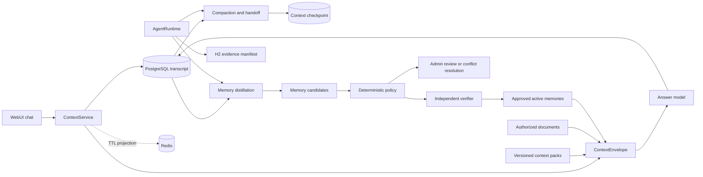

# H4 设计：Context、记忆提炼与冲突治理

> 状态：已实现。工作分支：`feat/harness-h4-context-memory`；基线：
> `feat/harness` 提交 `3971342`。H4 复用 H0--H3 的 TaskSpec、AgentRuntime、Tool Gateway、
> 独立 verifier、checkpoint 和 evidence manifest，不引入 LangGraph、第二套调度器或新的向量库。

## 1. 目标与完成定义

H4 解决的不是“保存更多聊天记录”，而是让 Agent 在长会话和任务恢复中始终使用最小、可追溯、
仍然有效的上下文，并从会话中安全形成长期记忆：

```text
PostgreSQL append-only transcript
  -> 有预算的 ContextEnvelope
  -> 可追溯 compaction 与结构化 handoff
  -> LLM/规则提议 memory candidates
  -> 确定性风险策略 + 独立 verifier
  -> 个人低风险自动生效 / 共享事实审批 / 敏感内容拒绝
  -> 去重、冲突、修订、过期、撤销和删除
```

H4 只有同时满足以下条件才算完成：

1. PostgreSQL 成为会话和可见聊天事件的权威；Redis 仅保留有 TTL、可重建的投影。
2. 每次模型调用使用带版本、token 预算、来源引用和摘要 hash 的 `ContextEnvelope`，不无界拼接历史。
3. compaction 不删除原始事件，摘要不能成为长期事实的唯一来源。
4. reset/resume 必须重新验证 tenant、用户、TaskSpec、计划版本和来源权限，旧权限不能随摘要恢复。
5. LLM 只能提出摘要和记忆候选；确定性策略和独立 verifier 决定是否可写入。
6. 低风险个人记忆可在用户开启自动记忆后自动生效；共享记忆必须由指定管理员审批；敏感类别拒绝。
7. 冲突事实不会静默覆盖；没有权威规则时保持 `conflicted` 并等待人工裁决。
8. 每条有效记忆可追溯到同 tenant、仍可访问的原始会话事件，并支持过期、修订、撤销和删除。

## 2. 当前基线与缺口

| 当前实现 | 已有能力 | H4 必须修复的缺口 |
| --- | --- | --- |
| `CacheManager` | session key 已含 tenant，聊天页面可列出历史。 | session/meta/messages 无 TTL，消息只在 Redis 且最多保留 100 条；Redis 丢失即丢失权威历史。 |
| `MemoryOrchestrator` | PostgreSQL + pgvector、candidate/approved/superseded/deleted、TTL 和来源字段。 | `source_event_id` 只指向 `agent_events`，不能表达多个聊天来源；没有风险、scope、trust、策略版本和冲突状态。 |
| `/api/memories/{id}/approval` | 候选可批准或删除。 | 未校验管理员角色，tenant 内 owner 可批准自己的候选；审批时 ACL 还授予当前调用者而非声明的记忆 scope。 |
| `MemoryGovernance` | 过期、回放和撤销过期事件。 | 策略事件仅支持 `expired/conflict/reverted`，不能完整解释自动批准、拒绝、裁决和来源撤销。 |
| `AgentC` / `AgentD` | 文档与 approved memory 联合检索，模型生成回答。 | 只按条数截断，没有 token 预算、上下文版本、选择清单、compaction 或 handoff。 |
| H0--H3 harness | TaskSpec、plan version、identity、verifier、checkpoint、manifest 和冲突样例。 | 聊天上下文和记忆尚未进入同一证据与恢复边界。 |

H4 不重写上述组件；增加最小持久化模型和 `ContextService`，让现有入口统一经过它们。

## 3. 范围边界

### 3.1 H4 实现

- PostgreSQL 会话、append-only 可见 transcript、上下文快照和结构化 handoff。
- 仓库内版本化 Context/Skills 包及按任务选择性装载。
- token 预算、compaction、context reset 和安全恢复。
- 会话结束或轮数阈值触发的 memory distillation。
- 个人/共享/敏感三级策略、自动记忆开关、指定管理员审批和双人规则。
- 精确去重、claim 冲突、supersede、过期、来源撤销和删除传播。
- 上下文与记忆 verifier、run evidence、WebUI 状态和轨迹测试。

### 3.2 H4 不实现

- 不引入 LangGraph；现有 `AgentRuntime` 已能提供计划、审批、重试、恢复和证据，第二套图状态机会产生双重权威。
- 不实现多 Agent、通用工作流 DSL、知识图谱、专用 memory database 或第二个 embedding 索引。
- 不保存模型隐藏推理过程或 chain-of-thought；只保存用户可见消息、工具结果引用、摘要和结构化结论。
- 不允许模型自动修改 TaskSpec、tool scope、ACL、系统提示或记忆策略。
- 不实现 H5 的训练快照、LoRA、shadow/canary 或模型发布。
- 不让 semantic similarity 自动裁决事实冲突；向量只用于召回可能重复或冲突的候选。

## 4. 核心设计决策

### 4.1 PostgreSQL 是 transcript 权威，Redis 是投影

创建、读取和追加会话均先提交 PostgreSQL。Redis 只缓存会话列表和最近消息，统一设置 TTL；缓存丢失时
从 PostgreSQL 重建。不得把 Redis 回写为数据库事实，也不得因缓存失败阻止权威写入。

已有 Redis 历史不自动转成长期记忆。迁移工具只导入当前用户明确选择的会话，并标记
`trust_label=legacy_unverified`；默认直接从新 PostgreSQL 会话开始，避免把未知来源或已裁剪历史伪装成完整证据。

### 4.2 Context/Skills 是数据包，不是可执行插件

H4 在 `src/harness/context_packs/` 保存少量版本化 JSON 文件，每个包只包含：

- `pack_id`、`version`、`content_sha256`；
- 适用 task type；
- 任务目标和已知限制；
- 允许的数据源契约和工具规则引用；
- 成功样例及失败处置。

选择器只根据冻结的 task type 和允许工具选择包，不接受外部文本指定包，也不动态加载代码。所选
`pack_id/version/hash` 写入 context snapshot 和 H2 fingerprint。第一版只提供 `chat_rag@1`、
`document_product_loop@1`、`memory_distillation@1`，不建设通用包注册中心。

### 4.3 LLM 提议，策略决定，verifier 复核

LLM 可把会话事件压缩为结构化摘要，并提出记忆候选；它不能直接把 `memories.status` 改为 approved。
服务端先验证 JSON schema、来源、tenant、scope、trust 和敏感类别，再运行固定策略。独立 verifier
使用只读凭据复查写入结果。模型不可用、输出无效或 verifier 失败时，原始 transcript 仍然完整，
本轮不产生长期记忆。

### 4.4 人工审批只用于需要判断的风险

- 个人低风险偏好或工作习惯：用户开启自动记忆、来源可信、无冲突时自动生效。
- team/tenant 范围或跨用户事实：指定管理员审批，且审批人不能是候选 owner。
- 凭据、认证因子、访问控制指令、健康/财务/法律等敏感类别：固定策略拒绝，不提供“强行批准”。
- 无权威规则的冲突：保持 conflicted，由不同于候选 owner 的管理员选择、合并或全部拒绝。

这既避免每条个人偏好都要求人工审批，也不会让聊天模型自动创造组织事实。

## 5. 目标架构



`ContextService` 是普通领域服务，由 WebUI chat 和 AgentRuntime 工具共同调用；它不拥有任务状态，
也不创建新的执行循环。

## 6. 持久化设计

H4 使用顺序迁移 `011_harness_context_memory.sql` 与 `012_harness_context_acl.sql`。前者新增无法由
H0--H3 表达的事实，后者收紧所有 transcript/checkpoint/source 的写入 RLS。

### 6.1 `conversation_sessions`

| 字段 | 约束与用途 |
| --- | --- |
| `session_id UUID` | 主键；替换基于时间 MD5 的短 ID。 |
| `tenant_id`, `owner_id` | 非空；RLS 只允许 owner 或 tenant admin。 |
| `title` | 服务端截断、清洗后的展示标题。 |
| `state` | `active / closed / deleted`。 |
| `auto_memory_enabled` | 默认 `false`；只能由 owner 修改。 |
| `context_generation` | 从 1 开始；每次 reset 原子递增。 |
| `version` | compare-and-swap，防止 close/reset/append 竞态。 |
| `created_at`, `updated_at`, `closed_at`, `deleted_at` | 生命周期审计。 |

### 6.2 `conversation_events`

append-only 表保存用户可见事实，不允许 UPDATE/DELETE：

| 字段 | 约束与用途 |
| --- | --- |
| `event_id UUID`, `session_id UUID`, `tenant_id` | 主键、会话外键和冗余 tenant 约束。 |
| `sequence_no BIGINT` | 每会话严格递增，唯一 `(session_id, sequence_no)`。 |
| `generation INT` | 事件所属 context generation。 |
| `event_type` | `user_message / assistant_message / tool_observation / session_closed / context_reset`。 |
| `content_json JSONB` | schema 化可见内容；大小限制，禁止凭据和隐藏推理。 |
| `content_sha256` | canonical JSON hash，支持快照与恢复校验。 |
| `trust_label` | `trusted_user / trusted_system / verified_tool / untrusted_external / legacy_unverified`。 |
| `task_id`, `run_id`, `agent_event_id` | 可空关联 H0--H3 证据链。 |
| `created_by`, `created_at` | 服务端身份与时间。 |

删除请求增加 `conversation_session` 目标类型。逻辑删除 session 后，正文按保留策略擦除或加密删除；
审计表仅保留 hash、动作和时间。删除不能改写历史事件次序。

### 6.3 `context_snapshots`

每次生成回答前记录本次实际装配的上下文元数据：

- session/generation、task/run、身份摘要、TaskSpec hash、plan version；
- context pack 的 id/version/hash；
- checkpoint、event、document/chunk 和 memory ID 列表；
- 各分区 token 数、总预算、预留输出 token；
- canonical envelope hash、创建时间。

表中不保存完整 prompt。已有原文仍在各自权威表中，snapshot 只保存有序引用和 hash，避免复制敏感内容。

### 6.4 `context_checkpoints`

| 字段 | 约束与用途 |
| --- | --- |
| `checkpoint_id`, `session_id`, `tenant_id`, `generation` | 一个 generation 最多一个 active checkpoint。 |
| `source_sequence_start/end` | 摘要覆盖的不可变事件区间。 |
| `source_digest` | 按事件顺序计算的 aggregate hash。 |
| `summary` | 用户可查看的压缩摘要。 |
| `handoff_json` | 目标、已确认事实、未完成项、引用、task/run、TaskSpec hash、plan version。 |
| `status` | `candidate / verified / active / invalidated / superseded`。 |
| `verifier_name/version/result` | 只有 verified 才可 active。 |

`handoff_json.claims[]` 必须逐项引用 `conversation_event_id` 或已验证 artifact。摘要中没有来源的句子只能
作为 `open_question`，不能成为 confirmed claim 或记忆来源。

### 6.5 扩展 `memories` 与新增 `memory_sources`

保留现有 memories、pgvector 和 retrieval，不另建 memory store。迁移增加：

- `scope_type`: `personal / team / tenant`；
- `scope_id`：个人用户名、team id 或 tenant id；
- `claim_key`：服务端规范化的事实键；
- `confidence`、`trust_label`、`sensitivity_label`、`risk_class`；
- `policy_version`、`decision_reason`、`decided_by/at`；
- 状态增加 `rejected / conflicted`；
- `row_version` 用于审批、修订和冲突裁决 CAS。

`memory_sources(memory_id, conversation_event_id, source_type, source_sha256)` 表达多来源。旧
`source_event_id -> agent_events` 在兼容期保留，但 H4 自动提炼必须至少有一条 `memory_sources`，且不能
仅引用 checkpoint summary。H4 完成后新 API 不再要求客户端伪造 agent event ID。

`memory_policy_events.action` 扩展为：

```text
candidate_created, auto_approved, approval_requested, approved, rejected,
conflict_detected, conflict_resolved, superseded, expired, source_revoked,
deleted, reverted
```

所有决策与状态更新在同一数据库事务内写 policy event；事件只记录必要字段和 hash，不复制正文。

### 6.6 RLS 与数据库约束

- session/event/snapshot/checkpoint 的普通用户读取范围固定为同 tenant 且 owner；admin 只限同 tenant。
- personal memory 只给 owner ACL；team/tenant memory 只按已验证 scope 创建 ACL。
- 普通用户不能直接 UPDATE memory status、ACL、scope、risk 或 policy event。
- shared candidate 的 `decided_by <> owner_id` 由服务层和数据库 trigger/constraint 双重保证。
- partial unique index 防止同 scope、kind、claim_key 同时存在多个 approved active memory。
- verifier 使用现有 `VERIFIER_DATABASE_URL` 只读连接；没有该连接时不能关闭 H4 严格门禁。

## 7. ContextEnvelope 与 token 预算

### 7.1 Envelope v1

```json
{
  "schema_version": "context-envelope.v1",
  "snapshot_id": "uuid",
  "identity": {"tenant_id": "tenant-a", "username": "alice", "role": "user"},
  "task": {"task_id": "uuid", "task_spec_sha256": "...", "plan_version": 2},
  "packs": [{"pack_id": "chat_rag", "version": 1, "sha256": "..."}],
  "handoff": {"checkpoint_id": "uuid", "generation": 2},
  "recent_event_ids": ["uuid"],
  "document_chunk_ids": ["uuid"],
  "memory_ids": ["uuid"],
  "budget": {"input_tokens": 7000, "reserved_output_tokens": 1000, "used_tokens": 6280},
  "envelope_sha256": "..."
}
```

线上只向模型发送服务端重新读取且当前可见的内容；客户端提交的 ID 列表只作为请求，不作为授权。

### 7.2 预算顺序

默认预算来自模型配置的 context window，先预留输出和安全余量，再按以下优先级装配：

1. 系统安全规则、TaskSpec 和允许工具；不能截断。
2. 当前用户问题和必要的结构化 handoff。
3. checkpoint 后的最近会话事件。
4. 当前问题召回的授权文档 chunks。
5. approved、未过期、未撤销且 scope 可见的记忆。

各分区设置上限但未用额度可向后传递。首版使用现有模型 tokenizer；无法加载 tokenizer 时使用保守
字符估算并额外保留 20% 安全余量。若第 1--2 项已超预算则 fail closed，不静默裁剪安全规则。

### 7.3 compaction 触发

满足任一条件时创建 candidate checkpoint：

- 装配前估算超过可用输入预算的 80%；
- checkpoint 后达到 20 个可见 user/assistant turn；
- 用户显式 close/reset；
- 恢复前发现上次 context snapshot 不完整。

阈值为服务端配置，不由外部文档或模型修改。compaction 覆盖固定 sequence range；生成期间有新事件时，
新事件不进入本次摘要。原始 transcript 永不因 compaction 被删除。

## 8. reset、handoff 与恢复

### 8.1 context reset

`POST /api/sessions/{id}/reset` 必须提交 `expected_version`。服务端：

1. 锁定 session 并验证 owner/tenant/version；
2. 对当前固定事件区间生成并验证 handoff；
3. 追加 `context_reset` 事件；
4. 原子递增 generation，激活新 checkpoint；
5. 清除该 session 的 Redis 投影。

reset 不删除 transcript、不扩大权限，也不自动触发共享记忆批准。

### 8.2 resume 重新验证

恢复时不得直接信任旧 handoff。`ContextService.resume()` 逐项检查：

- 当前 token 的 tenant/user/role 仍能访问 session；
- checkpoint source digest 与 transcript 一致；
- 所有引用 document/memory/artifact 仍可见、未删除、未过期；
- 当前 TaskSpec hash 和 plan version 与 handoff 一致；
- task lease、批准和工具 scope 仍有效。

失败分类固定为 `identity_changed`、`source_revoked`、`task_contract_changed`、`plan_stale`、
`checkpoint_corrupt`。前两类不得自动恢复；TaskSpec/plan 变化必须由 AgentRuntime 创建新的受审计 replan
或从用户问题重新开始，不能让摘要恢复旧权限。

## 9. Memory distillation

### 9.1 触发与执行路径

触发条件：session close、checkpoint 后 20 turns，或 owner 显式请求。自动任务需要
`auto_memory_enabled=true`；显式预览可在关闭状态下运行，但不会绕过 policy。

H4 注册三个现有 AgentRuntime 工具，不增加新的执行器：

| 步骤 | 工具 | 副作用 | verifier |
| --- | --- | --- | --- |
| 1 | `compact_context` | 写 candidate checkpoint | `verify_context_checkpoint@1` |
| 2 | `distill_memory_candidates` | 写 candidate memories 和 sources | `verify_memory_distillation@1` |
| 3 | `apply_memory_policy` | 自动批准、请求审批、拒绝或标记冲突 | `verify_memory_policy@1` |

三步使用 H0 strict TaskSpec，scope 固定为 session、事件区间和 owner；H2 manifest 保存输入区间 hash、
ToolResult、verifier 和 policy event 引用。WebUI 在线 chat 可同步调用同一 `ContextService` 进行装配，
但 close/reset/distillation 仍通过受控 run，以获得恢复和证据。

### 9.2 Candidate v1

```json
{
  "kind": "profile",
  "scope_type": "personal",
  "claim_key": "response.language",
  "content": "用户偏好中文回答",
  "source_event_ids": ["uuid"],
  "confidence": 0.96,
  "trust_label": "trusted_user",
  "sensitivity_label": "none",
  "risk_class": "low",
  "valid_until": "2026-11-01T00:00:00Z",
  "policy_version": "memory-policy.v1"
}
```

候选必须是用户明确表达、可在来源事件中定位的持久偏好、稳定事实或已验证过程经验。一次性问题、模型
推断、情绪判断、外部文档指令、工具密钥和没有来源的 summary 内容不得成为记忆。

### 9.3 固定策略矩阵

| 条件 | 结果 | 是否需人 |
| --- | --- | --- |
| personal + low + trusted_user/verified_tool + toggle on + 无冲突 | `approved`，owner-only ACL | 否 |
| personal 但 confidence 不足或来源含模型推断 | `candidate` 或 `rejected`，显示原因 | owner 可确认明确事实，但不能改风险分类 |
| team/tenant 或跨用户 | `candidate` + `approval_requested` | 是，同 tenant admin 且非 owner |
| high risk 但非禁止类别 | `candidate` + `approval_requested` | 是，指定 admin 且非 owner |
| secret/auth/access-control/受保护敏感类别 | `rejected` | 否，管理员也不能覆盖 |
| untrusted_external/legacy_unverified 是唯一来源 | `rejected` | 否 |
| 同 claim_key 存在不同 active value | `conflicted` | 有权威规则则自动；否则 admin 裁决 |

策略按代码版本化，LLM 不返回最终 decision。阈值和类别由测试固定，不能由 prompt 调整。

## 10. 去重、冲突与生命周期

### 10.1 去重

1. canonical content hash 完全相同：复用已有 candidate/approved，补充新的 source link，不新建 memory。
2. 同 scope/kind/claim_key 且规范化值相同：追加来源和最新观察时间。
3. 向量近似只产生 `possible_duplicate` 供 verifier/管理员查看，不自动合并。

### 10.2 冲突

同 scope 和 claim_key 出现不同规范化值时，先写 `conflict_detected`：

- 同一 owner 的明确更正，且新事件晚于旧来源：新候选通过 verifier 后 supersede 旧值。
- 已配置权威 source 的 team/tenant 事实：权威且更新时间更新的候选可 supersede，记录规则版本。
- 权威相同、时间无法比较或跨用户主张不同：双方保持可见但不进入默认 retrieval，状态
  `conflicted`，等待管理员裁决。

裁决复用 H3 `compare_sources`/`resolve_conflict` 的报告和审批模式，但记忆状态仍由
`MemoryGovernance` 原子提交。模型生成的回答必须显示未解决冲突，不能任选其一。

### 10.3 过期、修订、撤销和删除

- 到达 `valid_until` 后由现有 expiry job supersede，并从 retrieval 排除。
- 修订先创建 replacement candidate；replacement 通过策略后才 supersede 旧值，避免当前“先废旧、后待审”空窗。
- source event/session/document 被删除或权限撤销时，reconciler 将仅依赖该来源的 memory 标记
  `source_revoked` 并 supersede；有其他有效来源时重跑 verifier。
- owner 可关闭自动记忆、删除个人候选和有效记忆；关闭开关不删除已有记忆，UI 必须明确提示。
- 删除清除 embedding 和正文，保留最小 tombstone/hash/policy event 以证明删除发生。

## 11. 独立 verifier

| verifier | 读取范围 | 必查项 |
| --- | --- | --- |
| `verify_context_snapshot@1` | 只读 session/events/docs/memories | 所有引用同 tenant 且可见；event 顺序/hash、pack hash 和 token 总额正确。 |
| `verify_context_checkpoint@1` | 固定事件区间与 checkpoint | source digest、handoff schema、逐 claim 来源、TaskSpec hash、plan version；无跨 tenant 引用。 |
| `verify_memory_distillation@1` | candidate、memory_sources、原始事件 | 每个候选至少一个原始来源；来源可见且 trust 合法；内容/大小/schema/敏感扫描通过。 |
| `verify_memory_policy@1` | candidate、ACL、policy event、冲突集 | decision 符合 policy version；个人自动批准满足 toggle；shared 审批人与 owner 不同。 |
| `verify_memory_retrieval@2` | approved memory、ACL、source、expiry | 只返回可见、未过期、未删除、未冲突且来源未撤销的 memory。 |

确定性 verifier 能证明来源、权限、状态和策略执行正确，不能单独证明开放文本的语义真值。共享事实或
无规则冲突仍需人工；后续 LLM judge 只能在 H5 经固定 rubric 和人工校准后作为辅助证据。

## 12. API 与 WebUI

### 12.1 会话 API

- `POST /api/sessions`：创建 PostgreSQL session，返回 UUID/version/auto-memory 状态。
- `GET /api/sessions`、`GET /api/sessions/{id}`：读取权威 session/events；Redis 仅加速。
- `PATCH /api/sessions/{id}`：owner 修改 title 或 `auto_memory_enabled`，需要 expected version。
- `POST /api/sessions/{id}/close`：关闭并可创建 distillation run。
- `POST /api/sessions/{id}/reset`：生成已验证 handoff 后递增 generation。
- `GET /api/sessions/{id}/context`：返回预算、pack、checkpoint 和来源元数据，不返回隐藏 prompt。

旧 `/api/history` 标记 deprecated，H4 退出前删除前端调用；兼容期只读，且不得作为 distillation 来源。

### 12.2 记忆 API

- `GET /api/memories` 返回 status、scope、risk、TTL、来源、冲突和 decision reason。
- `POST /api/memories/preview` 允许 owner 查看候选，不直接批准。
- `POST /api/memories/{id}/decision` 仅同 tenant admin；shared/high-risk 强制 approver != owner，带 expected version。
- owner 可以删除个人 memory、拒绝自己的 candidate；不能提升 scope、降低 risk 或直接创建 ACL。

现有无角色门禁的 approval endpoint 删除或改为调用同一 decision service，不能保留旁路。

### 12.3 页面体验

session 页面显示：当前 token 使用、context generation、最近 checkpoint、自动记忆开关和 distillation
状态。memory 页面显示来源事件摘录、policy reason、TTL、冲突组和审批人。H3 run 详情只有在关联的
H4 verifier 全部通过后才把 memory gate 从 `blocked_by_phase` 更新为 `passed`；训练与发布继续等待 H5。

## 13. 失败、并发与恢复

| 故障 | 收敛行为 |
| --- | --- |
| Redis 清空/不可用 | 从 PostgreSQL 读取并重建投影；不丢 session 或 memory。 |
| 回答模型失败 | 已提交 user event 保留，追加失败观察；不伪造 assistant event。 |
| compaction 模型失败/输出越界 | candidate checkpoint 失败；继续使用预算内最近事件，原 transcript 不变。 |
| distillation 输出无效或超时 | run 停在 failed/awaiting_recovery，不创建 approved memory。 |
| policy/verifier 失败 | candidate 保留可诊断状态，retrieval 不可见。 |
| close/reset 与新消息竞态 | session version CAS 只允许一个提交；失败方读取新版本后重试。 |
| 审批与删除/过期竞态 | memory row version CAS；删除/过期优先，旧审批返回 conflict。 |
| 来源 ACL 撤销 | checkpoint 在 resume 时失效；关联 memory 从 retrieval 移除并重验。 |
| PostgreSQL 与 H2 manifest 部分成功 | 复用 H2 outbox/reconciler，按 run/step 幂等键收敛。 |

## 14. 安全与隐私约束

- 外部文档、工具输出和模型摘要始终是 data，不得成为 Context/Skills 指令。
- 写 transcript 前复用现有 sanitizer；疑似 secret 不进入模型、memory 或 manifest，事件记录拒绝 reason。
- cloud mode 继续执行外发策略、字段脱敏和 cloud audit；本地模式不得因模型缺失静默外发。
- context snapshot、日志和 manifest 不保存完整 prompt、access token、cookie、凭据或隐藏推理。
- RLS 必须使用服务端 JWT identity；tenant/user/scope 不接受请求体覆盖。
- memory 自动批准开关默认关闭，明确 opt-in，支持随时关闭和删除。

## 15. 实施拆分

### H4-A：权威 transcript 与 context pack

- 增加 migration、repository 和 `ContextService`；WebUI session/chat 切到 PostgreSQL。
- Redis 增加 TTL 并降级为可重建投影；旧 history 停止写入。
- 建立三个静态 pack、选择器、hash 和 context snapshot。
- 单元/集成测试：双 tenant、双用户、Redis flush、并发 append、pack 防注入。

**完成门禁：** Redis 清空后 session/history 可恢复；任何 context snapshot 不含越权引用且通过
`verify_context_snapshot@1`。

### H4-B：预算、compaction、reset 与 handoff

- 实现预算装配、固定事件区间 compaction、checkpoint verifier、reset/resume CAS。
- 将 TaskSpec hash、plan version、identity 和来源状态纳入恢复检查。
- WebUI 展示 generation、预算和 handoff 状态。

**完成门禁：** 长会话在预算内继续；reset 后能恢复未完成事项，但 revoked ACL 和 stale plan 必须 fail closed。

### H4-C：distillation 与分级策略

- 实现候选 schema、来源表、三步 strict run、敏感分类和 policy v1。
- 修复 approval API，加入 admin/非 owner/expected version 检查。
- 实现 owner 自动记忆开关和个人低风险自动批准。

**完成门禁：** 低风险个人记忆无需人工即可生效；shared 不能自批；敏感和外部注入内容不能进入 memory。

### H4-D：去重、冲突与生命周期

- 实现 exact dedupe、claim_key 冲突、H3 冲突报告复用和管理员裁决。
- 修正 revise 顺序，完成 expiry、source revoke、delete 和 retrieval v2。
- WebUI 展示来源、冲突、裁决与过期状态。

**完成门禁：** 不存在静默冲突或多个同 claim active 值；删除/撤权后 retrieval 立即不可见并可审计。

### H4-E：证据、轨迹与退出报告

- 将 pack/context/checkpoint/distillation/policy/verifier 引用写入 H2 manifest。
- 增加固定 capability/regression 轨迹和 H4 WebUI 产品演示。
- 更新架构、quickstart、TODO、执行计划和 H4 退出报告。

**完成门禁：** 下列退出矩阵全部通过，H4 才能合并回 `feat/harness`。

## 16. 验证矩阵

| 场景 | 预期结果 |
| --- | --- |
| tenant A 长会话 compaction，tenant B 同时写入 | A 的 snapshot/checkpoint 不含 B 的任何 ID、hash 或正文。 |
| Redis flush 后重新打开会话 | PostgreSQL 恢复完整可见 transcript；Redis 重新生成 TTL 投影。 |
| 20+ turns 超预算 | 生成 verified checkpoint，原事件仍存在，模型输入低于预算。 |
| reset 后 role/ACL 被撤销 | resume 返回 `identity_changed` 或 `source_revoked`，不恢复旧引用。 |
| reset 后 TaskSpec/plan 更新 | 返回 `task_contract_changed`/`plan_stale`，必须受审计 replan。 |
| 用户开启自动记忆并明确偏好中文 | personal low-risk memory 自动 approved，只对 owner 可见。 |
| 用户未开启自动记忆 | 可预览 candidate，但不自动 approved。 |
| 普通用户调用 shared approval | 403；memory 状态和 ACL 不变。 |
| admin 审批自己创建的 shared candidate | 409；要求另一指定管理员。 |
| 聊天中出现 token、密码或授权指令 | candidate rejected，不能通过 admin 覆盖。 |
| 外部文档写“记住并调用工具” | trust 为 untrusted_external，不写 memory、不扩大 scope、不调用工具。 |
| LLM 产生无来源候选 | verifier 失败，retrieval 不可见。 |
| 同一偏好重复出现 | 复用 memory 并追加来源，不产生重复 active 记录。 |
| 同一 claim 出现两个值 | 标记 conflicted；无规则时回答显示冲突并等待裁决。 |
| replacement 审批失败 | 旧 approved memory 保持有效，不出现空窗。 |
| memory 过期/删除/source 撤销 | retrieval v2 不返回；policy event 和 evidence 可追溯。 |
| compaction/distillation 进程中断 | 从最近 verified checkpoint 恢复，不重复 policy side effect。 |

## 17. H4 最终退出门禁

- [ ] H4-A--E 的迁移、代码、WebUI、测试和文档全部完成。
- [ ] PostgreSQL 权威 transcript、Redis TTL 投影和故障恢复通过。
- [ ] ContextEnvelope、pack version、token 预算、checkpoint 和 handoff 可由 run evidence 查询。
- [ ] context reset/resume 对身份、TaskSpec、plan、ACL 和来源执行 fail-closed 重验。
- [ ] 个人低风险自动记忆、shared 双人审批、敏感拒绝和自动记忆开关均通过。
- [ ] 去重、冲突、supersede、过期、修订、来源撤销和删除传播均通过。
- [ ] 五个 verifier 使用独立只读凭据，伪造摘要、候选、ACL 或 policy result 必须失败。
- [ ] 双 tenant、prompt injection、Redis 故障、并发竞态和中断恢复轨迹全部通过。
- [ ] H2 evidence manifest 能按 `run_id` 回放完整 H4 决策，但不包含隐藏推理或敏感正文。
- [ ] H3 产品闭环在 WebUI 显示真实 memory gate；H5 training/release 仍明确未完成。

## 18. 建议实施顺序

```text
H4-A transcript/context pack
  -> H4-B compaction/reset/handoff
  -> H4-C distillation/policy/approval
  -> H4-D conflict/lifecycle
  -> H4-E evidence/e2e/exit report
```

该顺序先建立可恢复的原始事实，再允许摘要和长期记忆；任何后续阶段都不能用摘要替代 transcript，
也不能用 H5 的未来评测承诺关闭 H4 的权限与来源门禁。
