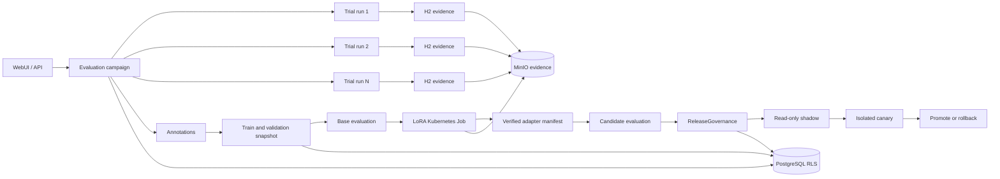

# H5 设计：轨迹评测、合规训练与受控发布

> 状态：工程实现与真实 k3d/GPU 预演已贯通；canonical 发布镜像重建仍待关闭。工作分支：
> `feat/harness-h5-evaluation-release`；基线：
> `feat/harness` 提交 `0edb7f8`。
>
> H5 复用 H0--H4 已落地的 `AgentRuntime`、Tool Gateway、verifier registry、checkpoint、
> evidence manifest、ContextService、PostgreSQL RLS、MinIO 和 `ReleaseGovernance`。不引入
> LangGraph、第二套调度器或新的长期向量库。
>
> 2026-08-03 阶段边界决策：本文定义的真实代表性数据、独立人工校准和真实隔离 canary 门禁不取消，
> 由 [H6 资格认证与 GA 设计](./H6_PILOT_GA_DESIGN.md) 的 `PILOT_READY` 承接。H5 工程预演不能
> 被解释为这些生产资格门禁已经通过。

## 1. 目标与完成定义

H5 要解决的是“模型变好了”无法被证明的问题：每一次轨迹、训练数据、adapter 评测和发布动作
都必须可追溯、可复核、可回滚。

```text
evaluation campaign
  -> 多个独立 strict task / run / manifest
  -> 脱敏轨迹与人工标注
  -> approved train/validation snapshot
  -> 固定 base evaluation
  -> 受控 LoRA Job + adapter manifest
  -> 同一固定 suite 的 adapter evaluation
  -> candidate -> shadow -> canary -> promote/rollback
```

H5 只有同时满足以下条件才算完成：

1. 每个 trial 都是独立 task/run，并拥有自己的 H2 evidence manifest；`evaluation_id` 聚合多个 trial，
   不改变 H0“一 task 一 run”的语义。
2. capability 套件度量任务价值，regression 套件对安全、tenant、证据和副作用不变量执行硬门禁。
3. 未审核、跨 tenant、未取得训练许可、来源已撤销、含敏感信息、冲突未裁决或与测试集重复的
   数据不能进入训练 snapshot。
4. 训练前必须存在已批准的训练计划、不可变 train/validation snapshot、固定 suite 的 base
   evaluation、base model/tokenizer 指纹、预算和运行环境；训练后必须存在 hash 校验的 adapter
   manifest 和同 suite 的独立评测。
5. adapter 只有在 `ReleaseGovernance` 状态为 `promoted` 且 manifest、评测、审批和 hash 全部匹配时
   才能加载；失败时保留上一版或回到 base model。
6. LLM judge 只能产生辅助质量信号。固定 rubric、有效校准和人工标注不能替代安全/权限硬门禁，
   也不能单独批准 release。

## 2. 当前基线与必须修复的缺口

| 现有代码 | 已有能力 | H5 必须修复的缺口 |
| --- | --- | --- |
| `AgentRuntime` / H2 manifest | 已记录任务、步骤、工具结果、verifier、checkpoint 和 run 证据。 | 缺少 evaluation 聚合、trial 结果和训练/发布关联。 |
| `src/core/verifiers.py` | 已有 ingest、retrieval、memory、release 以及 H4 verifier。 | 缺少 trajectory、snapshot、adapter、固定评测 verifier。 |
| `Coordinator.save_feedback` / WebUI feedback | 反馈落 MinIO，可人工审核。 | 没有 PostgreSQL 权威索引，无法可靠按 run、ACL、许可和撤销状态筛选。 |
| `src/etl/cleaners/feedback.py` | 只消费 `good + approved` 反馈并清洗。 | 路径扫描不能证明不可变 membership、来源许可、去重或测试隔离。 |
| `src/synthesis/sft_generator.py` | 可选云端生成 SFT。 | 生成结果未绑定来源、外发策略、prompt/model digest 和审批。 |
| `src/train.py` | 可执行 PEFT LoRA 并上传 adapter。 | 没有 snapshot、base evaluation、预算、manifest、扫描、审批或 run 门禁。 |
| `AgentB` / `ModelManager` | 可加载 MinIO adapter；ModelManager 是进程级单例。 | “最新对象”加载绕过 release；全局模型无法安全热切换 tenant 专属 adapter。 |
| `ReleaseGovernance` | 已有 candidate/shadow/canary/promoted/rollback 状态机。 | 单次观测可 promote，缺少样本窗口、完整指标、maker-checker 和依赖撤销传播。 |

H5 不重写这些组件；只增加缺失的数据关系、受控 Job 和 verifier，并替换被阻塞的旧
`train/evaluate/release` 工具契约。

## 3. 范围与不可破坏边界

### 3.1 H5 实现

- evaluation campaign、多 trial、固定环境指纹、失败分类和人工标注。
- capability/regression suite、base/adapter 同集比较和人工校准的辅助 LLM judge。
- 训练许可、不可变 train/validation snapshot、LoRA Job 和 adapter manifest。
- shadow 只读重放、隔离 canary、maker-checker、自动 rollback 和依赖撤销。
- WebUI 的轨迹、snapshot、评测和发布状态展示。

### 3.2 H5 不实现

- 不实现多 Agent、第二个工作流引擎或通用 Job backend。
- 不保存 chain-of-thought、秘密、原始凭据或未脱敏全文到 manifest/训练集。
- 不允许自由扫描 MinIO 或裸调用 `train.py`。
- 不把长期 memory 直接加入 H5 第一版训练数据。出现明确训练许可和删除需求后再扩展。
- 不把模拟 Job、单元测试、单次 demo 或单一 LLM judge 当作真实发布证据。
- 不关闭 H6 的两团队四周 GA 外部门禁。

模型 Job 必须使用独立的 `HARNESS_JOB_IMAGE`。Spark rough-clean 继续使用
`SPARK_IMAGE`；本地 k3d 没有 AMD device plugin 时，只有显式设置
`HARNESS_JOB_GPU_ENABLED=true` 才允许模型 Job 挂载 `/dev/kfd` 与 `/dev/dri`，默认不把 GPU
设备暴露给任意 Job。

### 3.3 LoRA 部署边界

当前 `ModelManager` 是进程级单例，因此 H5 第一版只支持 `single_tenant_lora` 部署模式：

- 一个部署只能配置一个 `MODEL_RELEASE_TENANT_ID`，训练 snapshot、release 和所有 LoRA 请求必须
  属于该 tenant。
- 多 tenant 共享部署默认禁用 LoRA，继续使用 base model；启动或请求时发现不匹配必须 fail-closed。
- H5 不做按请求热切换 tenant adapter。只有真实需求证明值得承担 adapter routing、GPU cache 和
  批处理隔离复杂度时，另立工作包。

### 3.4 不变量

1. 每个 trial 都有唯一 `run_id`，每个 run 只有一个 task 和一个 manifest；rerun 创建新 run。
2. 所有记录具有 `tenant_id` 并受 PostgreSQL RLS；训练还必须验证用途明确的训练许可。
3. 输入、模型、prompt、Context/Skill、ToolSpec、verifier、suite、代码和容器均以 digest 固定。
4. snapshot、adapter、评测报告和 release manifest 内容寻址且不可变；删除保留 tombstone 与 hash。
5. ACL、安全、越权、注入、证据完整性、失败停止和测试泄漏属于硬门禁，质量分不能覆盖。
6. 失败、指标缺失、样本不足、Worker 丢失或 hash 不匹配时不加载新 adapter。

## 4. 目标架构与权威关系



- `AgentRuntime` 是所有 trial、训练、评测和 release 副作用的唯一编排路径。
- `evaluation_id` 只是聚合标识，不是第二个运行时；每个 trial 仍是独立 strict task/run。
- PostgreSQL 保存状态、关系、审批、RLS 和 hash；MinIO 保存不可变 transcript、snapshot、报告和
  adapter；Redis 只保存可重建的 TTL 投影。
- H2 manifest 继续以 run 为单位。evaluation 汇总报告只引用各 run manifest digest，不复制证据。
- `ReleaseGovernance` 继续是唯一发布状态机。

## 5. 轨迹与评测设计

### 5.1 evaluation 与 trial

一个 `evaluation_id` 固定 subject、suite、policy、环境要求和目标 trial 数。每个 case 默认至少 3 个
有效 trial；每个 trial 创建新的 TaskSpec、task、run 和 manifest，并引用 `evaluation_id/case_id/trial_no`。

每次 trial 保存：

- 唯一 `trial_id/run_id/task_id`、case、序号、tenant 和 state；
- TaskSpec、plan、Context/Skill、模型、tokenizer、prompt、ToolSpec、verifier、suite 和代码 digest；
- 非敏感环境指纹：镜像、依赖锁、GPU/CPU、数据 hash、时区和随机种子；
- transcript 引用、工具结果、artifact/hash、verifier、checkpoint 和最终 outcome；
- failure taxonomy、tokens、cost、latency、自动评分和人工标注。

`invalidated` 只用于已证明的环境或测试资产故障。它不进入成功率，但也不减少要求的有效 trial 数：
runner 必须补跑新的 run；在目标有效数量达到前 evaluation 状态为 `blocked`。regression case 只要存在
一个有效失败即拒绝发布，不能以 invalidated 覆盖。

### 5.2 suite 与数据隔离

| 套件 | 目的 | 例子 | 门禁 |
| --- | --- | --- | --- |
| capability | 衡量真实任务价值。 | RAG 正确性、引用充分性、冲突解释、任务完成率、成本、p95。 | 达到版本化 policy 中相对 base 的非劣/提升阈值。 |
| regression | 防止过程和安全退化。 | 错误工具、越权、ACL 泄漏、注入、证据缺失、失败后继续、恢复。 | 安全/tenant/证据/停止不变量全部 trial 100% 通过。 |

suite manifest 在训练计划批准前冻结，记录 case、输入/期望 hash、rubric 和 policy version。base 与
adapter 使用相同 suite hash、generation config 和有效 trial 数。suite 不进入 training snapshot；
snapshot 只有 train/validation 两个 split。snapshot builder 对训练项、验证项和 suite case 做内容及
来源 hash 去重，任何重叠都拒绝。

硬评测至少覆盖：

1. 任务成功、grounded citation、正确选择/不选择工具；
2. tenant/ACL、敏感字段、间接 prompt injection、scope 扩大和冲突；
3. 审批拒绝、超时、Worker 丢失、checkpoint、幂等重试和取消竞态；
4. transcript、artifact、verifier、成本/延迟、shadow 隔离和 rollback 证据。

### 5.3 LLM judge 与人工抽样

LLM judge 只接收固定 rubric、脱敏 transcript 和引用，输出结构化 JSON，并记录 judge model、prompt、
rubric 和 calibration digest。policy 固定校准样本、最大校准年龄和最低一致性；缺失、过期或未达标时
judge 结果仅展示，不进入 capability gate。

每个 release 必须完成 policy 规定的失败轨迹全读和成功轨迹抽样，记录 reviewer、sample IDs、结论和
时间。LLM judge 不得决定 ACL、安全、训练许可、证据完整性或 release transition。

## 6. 数据模型与迁移

新增迁移建议为 `013_harness_evaluation_learning.sql`，只把需要 RLS、FK、审批和状态查询的字段放
PostgreSQL；大内容继续进入 MinIO。

### 6.1 `evaluation_campaigns`

evaluation 聚合父记录：`evaluation_id`、`tenant_id`、`subject_type/ref`、suite/policy digest、
`required_trials`、state（draft/running/blocked/passed/failed）、baseline evaluation ref、metrics、
hard gates、report key/hash、created/completed timestamps。它不冒充 task/run。

### 6.2 `trajectory_trials`

`trial_id`、`evaluation_id` FK、`run_id` UNIQUE FK、`task_id` UNIQUE FK、tenant、case、trial number、
state、fingerprint、transcript key/hash、outcome、metrics、failure code 和 timestamps；
`(evaluation_id, case_id, trial_no)` 唯一。

### 6.3 `trajectory_annotations`

统一保存现有用户反馈、人工 review 和 verifier 分类，避免再建重复的 `feedback_records`：
`annotation_id`、trial/run/tenant、kind（user_feedback/human_review/verifier_label）、label、rubric、
content key/hash、source ACL digest、training permission/purpose/version、reviewer、status、reason 和
timestamps。历史 MinIO feedback 以 `legacy_unindexed` 导入；来源、许可和审核未重建前不能训练。

### 6.4 `training_snapshots` 与 `training_snapshot_items`

snapshot 保存 `snapshot_id`、tenant、state（candidate/approved/rejected/consumed/expired/revoked）、
dataset key/hash/size、policy、train/validation split、base model digest、creator、approver 和 timestamps。

membership 不保存在 JSON 数组。`training_snapshot_items` 保存 snapshot、split、source type/id/hash、
source tenant、ACL digest、training permission/purpose/version 和 transform digest，并通过 FK/唯一约束
支持来源复核、删除传播和防重复。第一版 source 只允许 approved trajectory annotation。

### 6.5 `adapter_manifests`

保存 adapter、tenant、base model/tokenizer、snapshot、artifact key/hash/size、允许的 LoRA config、
training environment、safety scan、evaluation ref 和 state（candidate/verified/revoked）。`loaded` 不是
artifact 状态；各副本的 load/fallback 通过审计和运行指标记录。

adapter 只允许 safetensors 和 allowlisted JSON 配置；拒绝 pickle/可执行文件、未知文件、非有限 tensor、
不匹配的 tensor shape、base model digest 或 hash。
### 6.6 `release_records` 与审计

保留现有表，增加显式 `release_kind`、`release_scope`、adapter/evaluation/snapshot FK、baseline release、
policy、manifest hash、guardrails 和 `version`。`rollback_release_id` 必须指向同 scope 的可验证
promoted release，不能只在 JSON 中保存字符串。

状态图明确保持：

```text
candidate -> shadow | rejected
shadow -> canary | rejected
canary -> promoted | rolled_back
promoted -> rolled_back
```

复用 `audit_events` 保存 append-only transition/approval 历史，增加数据库约束禁止业务角色修改或删除
已有审计事件；`approved_by` 只作为当前投影。candidate creator 不能批准 promote，所有 transition
写入 before/after、manifest digest、actor、reason、observation window 和 CAS version。

所有新增表启用 `FORCE ROW LEVEL SECURITY`；verifier 只读。snapshot、evaluation、adapter 和 release
审批只允许指定 admin/reviewer，creator 不能批准自己创建的对象。

## 7. 合规训练与 LoRA 生命周期

### 7.1 snapshot 门禁与撤销传播

snapshot builder 只读同 tenant、仍可访问、reviewed、明确 `training_allowed=true` 且 purpose 匹配的
trajectory annotations。它必须执行脱敏/密钥/PII、ACL、许可、retention、trust、冲突、撤销、精确
去重、suite 泄漏检查，并生成不可变 train/validation manifest。

来源删除、ACL/训练许可撤销或保留期到期时，reconciler 沿 membership 传播：

```text
source revoked
  -> snapshot revoked
  -> dependent adapter revoked
  -> candidate rejected 或 active release rolled_back
  -> 服务卸载 adapter；无可用上一版则使用 base model
```

不可继续保留的正文从 MinIO 删除，PostgreSQL 只保留 tombstone、hash、撤销原因和审计所需最小字段。
已训练模型不做虚假的原地“删除”；通过撤销 adapter、停止服务和基于剩余合法数据重新训练处理。

可选 `SFTGenerator` 只是转换步骤。若启用云模型，必须同时满足现有云外发策略、脱敏、tenant 明示许可
和 cloud audit；生成项仍需重新审核。H5 第一版可直接使用 approved trajectory pairs，不依赖云生成。

### 7.2 受控训练流程

训练计划作为 strict TaskSpec 的已审批字段，不新增第二张计划表：suite hash、snapshot、base model、
LoRA config、预算、目标 release scope、rollback 和人工门禁均在执行前冻结。

```text
approve_training_plan
  -> select_and_approve_snapshot
  -> evaluate_base
  -> verify_base_evaluation
  -> train_lora
  -> verify_adapter
  -> evaluate_adapter_on_same_suite
  -> compare_and_verify_evaluation
  -> create_release_candidate
```

`train_lora` 使用现有 H2 Kubernetes Job/outbox/lease/reconciliation 机制，将 `agent_jobs.kind` 最小扩展为
`lora_train`；评测使用 `model_evaluate`。不使用 Spark 训练模型，也不建设通用 Job backend。

现有 `src/train.py` 改为受控 worker/兼容 CLI：没有 approved TaskSpec、snapshot、base evaluation、
run ID、tenant、预算和精确输出位置时直接拒绝。训练完成只产生 candidate adapter；独立 verifier
完成 hash、格式、shape、base model、日志和扫描检查后才标记 verified。

### 7.3 adapter 加载与原子切换

`AgentB` 不再扫描“最新对象”。加载器查询配置 tenant 的 promoted release，从精确内容寻址 key 下载，
验证 manifest/size/hash/base model 后在临时目录加载并 warmup。切换时暂停接收新请求、排空 in-flight
batch，再原子替换当前模型引用；失败继续使用旧引用。进程启动也执行相同验证。

多 tenant 共享部署不得加载 LoRA。若未来需要 tenant adapter，必须先实现 request-aware model routing、
per-adapter batching 和并发隔离，不能复用全局 `check_and_reload_adapter`。

## 8. Shadow、Canary、发布与回滚

`ReleaseGovernance.create_candidate` 仍是唯一 candidate 入口。manifest 必须包含 approved snapshot、
verified adapter、base/adapter 同 suite evaluation、全部 regression hard gates、安全扫描、人工抽样、
校准版本、rollback release、guardrails、maker-checker approvals 和所有 fingerprints。

### 8.1 Shadow

- 只重放已脱敏 transcript、固定工具 observation 和只读数据快照。
- candidate 不调用外部工具、不写 memory/feedback、不推进原 task，也不向用户返回答案。
- shadow 结果只进入 evaluation evidence；任何副作用尝试立即失败。

### 8.2 Canary

- candidate 必须运行在与 stable 隔离的 worker/process，不能在共享 ModelManager 中按请求热切换。
- 使用稳定分流键和预先批准的流量比例；每个请求只有一个权威执行者。
- policy 固定最小样本数、最短观察窗口、error/p95、安全事件和业务指标。缺失指标、样本不足或窗口
  未结束时保持 canary，不得 promote。
- 当前环境无法提供隔离 candidate runtime 时，真实 canary 门禁标记 blocked，不能用 shadow 模拟关闭。

### 8.3 决策与回滚

- 任何硬安全事件或 adapter/hash/许可失效立即 rollback，不等待窗口结束。
- 正常 promotion 需要完整窗口、所有指标、独立 verifier 和不同于 creator 的 admin 批准。
- rollback 目标必须仍为 promoted、未撤销且可加载；否则 fail-safe 到 base model。
- rollback 不删除失败证据；保留 transition、指标、原因和处置。

## 9. API、WebUI 与可观测性

复用现有认证、TaskSpec 创建和 run detail：

- `GET /api/evaluations/{id}` 与 `/trials`：聚合状态、每个独立 run、失败分类和证据；
- `POST /api/annotations/{id}/decision`：反馈/人工标注审核与训练许可；
- `GET /api/training-snapshots` 与 `POST .../{id}/decision`：membership、许可、hash、split 和审批；
- `GET /api/adapters`：manifest、扫描、评测、撤销和 load/fallback 事件；
- 复用 `/api/releases` 展示 transition、观察窗口、审批和 rollback。

训练、评测、shadow、canary 和 release 创建都通过 strict task + Tool Gateway，不增加可绕过 TaskSpec 的
直接 POST。正文始终脱敏，不显示 chain-of-thought。

## 10. Verifier 契约

| Verifier | 必查内容 |
| --- | --- |
| `verify_trajectory@1` | 唯一 run/manifest、TaskSpec/plan、工具/scope、审批、证据、失败停止和 outcome。 |
| `verify_training_snapshot@1` | tenant/ACL、训练许可、审核、敏感/冲突/撤销、membership、split 和 suite 隔离。 |
| `verify_base_evaluation@1` | 冻结 suite、base model、目标 trial 数、无 invalidated 缺口和 hard gates。 |
| `verify_training_input@1` | approved plan/snapshot/base evaluation、环境、预算、tenant 和 lease。 |
| `verify_adapter@1` | safetensors/config、artifact hash/size/shape、base model、扫描和训练日志。 |
| `verify_evaluation@1` | 同 suite baseline、有效 trial 数、阈值、硬门禁、judge 校准和人工抽样。 |
| `verify_release@2` | 依赖状态、maker-checker、rollback、窗口、完整指标和 promoted 可加载性。 |

verifier 使用只读或隔离凭据，不修改被验证对象；未知状态、证据缺失、版本/hash 不匹配一律 fail-closed。

## 11. 故障恢复与安全测试

至少注入：

1. annotation DB/MinIO 部分写入、outbox 重复和删除传播失败；
2. trial invalidated、目标 trial 不足、snapshot 构建中断、ACL/许可在审批前后撤销和 suite 泄漏；
3. base evaluation 缺失、训练 Job 超时/孤儿、部分 adapter 上传、恶意格式和 hash/shape 不匹配；
4. shadow 尝试副作用、canary 指标缺失/样本不足、候选隔离失效和重复 transition；
5. AgentB warmup/原子切换失败、回滚目标损坏、依赖 snapshot 在 promoted 后撤销；
6. 跨 tenant 读取、审批、训练、加载和发布，以及多 tenant 部署尝试启用 LoRA。

每个注入都要求后续副作用停止、checkpoint 可恢复、状态唯一可解释，并留下 manifest 和审计证据。
Redis 清空不能改变训练、评测、release 或 rollback 权威状态。

## 12. 实施拆分与退出门禁

### 12.1 实施顺序

- **H5-A 评测聚合与轨迹**：evaluation/trial schema、独立 run、多 trial runner、固定 suite、
  invalidated 补跑和轨迹回放。
- **H5-B 数据治理**：统一 annotation、snapshot membership、训练许可、train/validation、去重、审批、
  outbox、撤销传播和 verifier。
- **H5-C 基线与受控训练**：冻结 TaskSpec 训练计划、base evaluation、`lora_train/model_evaluate` Job、
  adapter manifest、safetensors 扫描和原子加载。
- **H5-D 固定评测**：同 suite adapter comparison、LLM judge 校准、人工抽样、failure injection。
- **H5-E 受控发布**：shadow 隔离、canary worker/窗口、maker-checker、rollback、WebUI 和退出报告。

### 12.2 H5 退出清单

以下清单继续作为完整发布安全契约。H5-A--C/F 的工程实现与真实 GPU 预演在 H5 收口；H5-D/E 中
需要真实代表性数据、人工校准和隔离 candidate runtime 的运行验收在 H6 `PILOT_READY` 关闭。
阶段迁移只改变执行归属，不改变勾选条件。

- [ ] H5-A：每个 trial 有独立 task/run/manifest；有效 trial 数达标；错误工具、越权、注入、证据缺失
  和失败后继续执行均被 regression 捕获。
- [ ] H5-B：未审核、跨 tenant、无训练许可、敏感、冲突、撤销或与 suite 重复的数据不能进入
  approved snapshot；membership/hash 不可变且撤销可传播。
- [ ] H5-C：无 approved plan/snapshot/base evaluation、lease、预算或正确 tenant 时训练拒绝；adapter
  格式/hash/shape 未验证时不能加载；多 tenant 部署不能启用 LoRA。
- [ ] H5-D：base/adapter 使用相同 suite 和有效 trial 数；硬门禁全部通过；LLM judge 单独不能关闭发布；
  人工抽样与有效校准证据可查询。
- [ ] H5-E：shadow 无副作用，canary 有隔离 runtime、稳定分流、最小样本和完整窗口；maker-checker 后
  才 promote；阈值、依赖撤销或加载失败自动 rollback/base fallback。
- [ ] H5-F：PostgreSQL/MinIO/Kubernetes Job/Redis 故障注入、RLS、API、迁移、轨迹评测和 H0--H4 回归
  全部通过；无法提供真实隔离 canary 时 H5 保持 blocked；GA-01 仍属于 H6。

## 13. 设计批准后的首个检查点

批准后先完成 H5-A：落地 evaluation/trial schema、固定 suite manifest 和一条包含 3 个独立 run 的
失败轨迹回放。只有 `evaluation_id -> trial -> run -> verifier -> evidence` 可验证后，才进入训练数据和
LoRA 改造；已有 `train.py` 能运行不代表 H5 有进展。
