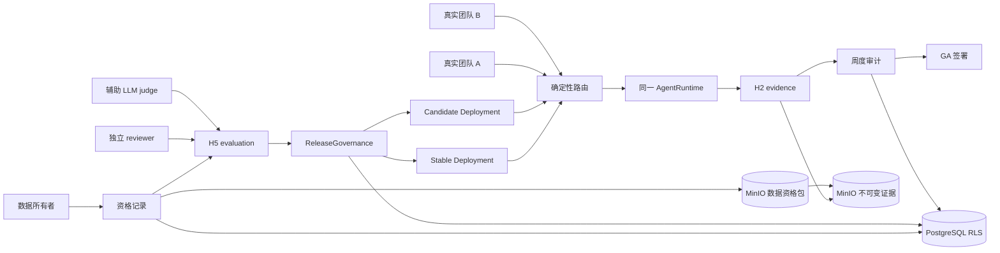

# H6 设计：真实数据资格认证、试点运维与 GA

> 状态：工程实施已通过 synthetic `PILOT_READY` 7/7 模拟预演；真实数据资格、
> 独立人工校准、生产 candidate runtime 与 `GA-01` 仍未关闭。本文中的
> `feat/harness-h5-evaluation-release` / `feat/harness-h6-pilot-ga` 分支步骤是历史实施记录；
> 相关改动已经 `feat/harness` 合并到 `main`。
>
> H5 已通过真实 k3d/GPU 的工程预演，但预演使用 synthetic 数据和本地离线镜像，且没有与 stable
> 隔离的真实 candidate runtime。H6 承接真实代表性数据、独立人工校准、真实 shadow/canary 和
> `GA-01` 外部验收；这些门禁没有降低，只是从“工程预演”中显式分离。

## 1. 目标与完成定义

H6 将当前内部发布候选变成可交给真实团队、可安全停止、可恢复且可审计的试点产品，并用外部证据
决定是否达到正式生产发布。

H6 分为两个不能混淆的里程碑：

| 里程碑 | 含义 | 是否允许没有外部团队 |
| --- | --- | --- |
| `PILOT_READY` | 受控部署、隔离 reset/restore、目标 IdP、真实代表性数据资格认证、人工校准、真实 stable/candidate 运行时和内部试点预演全部通过。 | 允许，但至少需要数据所有者和独立人工 reviewer。 |
| `GA_APPROVED` | 两支独立真实团队各连续四周使用，周度审计和最终价值/安全签署完成。 | 不允许；缺少团队时保持 `PILOT_READY`，不得标记 GA。 |

```text
工程发布候选
  -> 真实数据资格认证
  -> 人工校准 + 固定 base/candidate 评测
  -> 隔离 stable/candidate shadow/canary
  -> PILOT_READY
  -> 两团队连续四周真实试点
  -> 周度审计 + 双方签署
  -> GA_APPROVED
```

H6 只有在 `GA_APPROVED` 后才算全部完成。没有两支团队不是工程失败，但属于明确的外部
`blocked` 状态；任何本地模拟、内部 dogfooding 或 LLM 自评都不能改变该状态。

## 2. 范围与非目标

### 2.1 H6 实现

- 真实代表性数据的授权、冻结、留存、撤销和评测资格记录。
- 独立人工标注、LLM judge 校准和 base/candidate 同集比较。
- stable 与 candidate 的独立部署、只读 shadow、确定性 canary 分流和自动回滚。
- 预注册测试环境的安全 reset、隔离 restore、目标 OIDC 与 tenant/RLS 验收。
- 真实试点的团队准入、周度证据、停止条件和最终签署。
- WebUI 的资格状态、运行版本、周度审计和 GA 状态展示。

### 2.2 H6 不实现

- 不引入第二个 AgentRuntime、LangGraph、多 Agent 或第二套发布状态机。
- 不新建重复的反馈、人工标注、训练快照或评测系统；复用 H5 的
  `trajectory_annotations`、`training_snapshots` 和 `evaluation_campaigns`。
- 不建设通用环境管理平台或 service mesh；第一版只支持 Helm/k3d 当前部署路径。
- 不做共享进程内的多 tenant LoRA 热切换；沿用 H5 `single_tenant_lora` 边界。
- 不要求把未脱敏生产数据复制到仓库、评测集或开发环境。
- 不把 synthetic 数据、加速四周预演、内部人员代签或 LLM judge 当成外部验收。

## 3. 前置条件与阶段边界

### 3.1 开始实施前

1. H5 改动提交并合并到 `feat/harness`，H0--H5 的迁移和回归在集成分支通过。
2. H5 canonical `harness-job` 镜像能够由 Dockerfile 和受控 registry/cache 重建，并记录不可变
   image digest；本机 `h5-canonical-offline` 只保留为工程证据，不能成为试点发布镜像。
3. H5 工程预演报告、evaluation/snapshot/adapter/release ID 和 H2 manifest 均可查询。
4. 指定数据所有者、试点运维负责人、安全联系人和至少一名不参与 candidate 创建的 reviewer。

canonical 镜像仍是 H5 工程交付债务，不因进入 H6 而自动关闭。H6 只消费已验证的发布制品。

### 3.2 H5 与 H6 的责任划分

| 能力 | H5 负责 | H6 负责 |
| --- | --- | --- |
| evaluation/trial/annotation/snapshot/adapter | 数据结构、工具、verifier 和 GPU 工程预演 | 真实代表性数据和独立人工校准 |
| release governance | candidate/shadow/canary/promote/rollback 状态与硬门禁 | 真实隔离部署、实际流量、完整观察窗口 |
| LoRA | 受控训练、artifact 校验、同 suite 工程闭环 | 业务价值、人工误差和生产候选资格 |
| 试点 | 不关闭外部门禁 | `PILOT_READY` 与 `GA-01` |

## 4. 复用现有权威组件

| 现有组件 | H6 用法 | H6 不增加的重复能力 |
| --- | --- | --- |
| `AgentRuntime` + Tool Gateway | 部署、评测、shadow/canary、恢复演练等副作用的唯一任务入口。 | 不建 pilot workflow engine。 |
| H2 evidence manifest | 保存每个资格评测、部署、恢复和试点任务的输入、产物、verifier 与 hash。 | 不复制 run 证据正文。 |
| H5 evaluation/annotation/snapshot | 人工 review、judge 校准、base/candidate 对比和训练来源。 | 不建新标注平台。 |
| `ReleaseGovernance` | 继续管理 candidate 到 rollback/promote 的唯一状态。 | 不建第二张 release 表。 |
| PostgreSQL RLS + `AuditLog` | 保存 tenant 权威状态、审批和追加审计。 | Redis 不保存试点事实。 |
| MinIO | 保存内容寻址的数据资格包、校准报告、部署/周报和签署件。 | 不把 MinIO 当查询权威。 |
| Helm/k3d、`pilot_check.py`、`verify_pilot_restore.sh` | 扩展为可重复部署、检查、reset 和隔离恢复。 | 不引入新的部署框架。 |
| `GA01_PILOT_PACK.md` | 作为外部团队准入与四周审计的产品规则。 | 不创建冲突的第二套 GA 规则。 |

## 5. 目标架构与数据流



权威关系保持不变：PostgreSQL 保存状态、关系、RLS 和 hash；MinIO 保存不可变大对象；Redis 仅保存
可重建的 session、cache、lock 和 queue。H6 不改变 `Plan → Act → Observe → Replan` 单运行时架构。

## 6. H6-A：数据资格认证与人工校准

### 6.1 真实代表性数据的定义

“真实”不等于“未脱敏生产原文”。H6 接受满足以下条件的内部或合作方资料：

1. 来源于目标任务分布，保留真实结构、难度、ACL、冲突和失败形态；
2. 数据所有者书面确认使用目的、tenant、允许的处理范围、保留期和删除方式；
3. 完成密钥、PII、恶意指令、格式和源 ACL 检查；
4. 训练集、validation 与固定 evaluation suite 按内容和来源 hash 隔离；
5. 原文不进入 Git，资格包和报告按 tenant ACL 写入 MinIO。

若只能获得 synthetic 数据，可以继续运行工程回归，但资格状态必须是 `draft`，不能进入
`PILOT_READY`。

### 6.2 最小数据模型

新增一张 `qualification_records`，不复制 H5 的 item/annotation 表：

- `qualification_id`、`tenant_id`、`purpose`、`state`；
- 数据 owner、reviewer、创建/批准/撤销时间；
- source/data manifest key、SHA-256、ACL digest、permission version；
- 数据分类、retention、deletion policy 和 allowed processing；
- suite/policy version 与 hash；
- base/candidate evaluation ID、calibration report key/hash；
- stable/candidate release ID 与失败/撤销原因。

状态机：

```text
draft -> data_approved -> calibrated -> pilot_ready
  |          |               |             |
  +----------+---------------+-----------> revoked
```

- 数据 owner 批准 `data_approved`；candidate creator 不能作为唯一 reviewer。
- `calibrated` 要求有效人工校准报告和同 suite base/candidate evaluation。
- `pilot_ready` 要求可加载的 stable/candidate digest、真实 shadow/canary 证据和恢复演练。
- 来源许可、ACL 或保留期失效时立即 `revoked`，并触发 snapshot/adapter/release 的现有撤销传播。

所有行启用 `FORCE ROW LEVEL SECURITY`。大对象只存 MinIO key/hash；数据库不存原始业务正文。

### 6.3 人工校准规则

H5 的 `trajectory_annotations(kind='human_review')` 继续保存逐条判断。H6 只增加聚合校准报告，不建
第二套 label 表。

每个 qualification policy 必须在查看 candidate 结果前冻结：

- 分层样本和各风险类别的最低样本数；
- capability 的最低提升或非劣阈值；
- 安全、ACL、证据、许可和副作用的零容忍 hard gates；
- 成功轨迹抽样比例、失败轨迹全读要求和双人复核比例；
- judge 与人工的一致性阈值、最大校准年龄和失效条件。

第一版默认：所有失败轨迹和所有安全/ACL case 由人工复核；其他成功轨迹至少抽检 20%，且每个关键
业务类别不少于 10 条。样本不足时扩大抽检，不通过修改阈值“适配结果”。具体数量允许在试点准入时
提高，但批准后不可降低。

LLM judge 只用于扩大覆盖和发现可疑样本：

- 输入只能是脱敏 transcript、引用和固定 rubric；
- 记录 model/prompt/rubric/version/hash；
- 与人工不一致的 case 进入人工裁决；
- judge 不判断 tenant/ACL、训练许可、证据完整性或发布 transition；
- 没有有效校准时，其分数只展示，不参与 release gate。

校准报告至少包含样本清单、reviewer、rubric、分层统计、一致性、false accept/false reject、分歧裁决、
签署时间和全部引用 hash。

## 7. H6-B：真实 stable/candidate 运行时

### 7.1 部署隔离

第一版使用两个独立 Helm release/Deployment/Service，不做进程内 adapter 热切换：

- stable 固定已 promoted release、image/model/adapter digest；
- candidate 固定 candidate release 和独立 GPU worker；
- 两者使用相同 TaskSpec、Context/Skill、ToolSpec 和 verifier version；
- candidate 凭据、service account、Redis prefix、临时目录和指标标签独立；
- tenant 数据仍由同一 PostgreSQL RLS 和 MinIO ACL 隔离，不复制权威数据库。

release manifest 现有 `manifest_json` 增加 deployment binding 即可，不新增 deployment 表：

```json
{
  "stable": {"release_id": "...", "service": "...", "image_digest": "sha256:..."},
  "candidate": {"release_id": "...", "service": "...", "image_digest": "sha256:..."},
  "routing": {"mode": "shadow", "percentage": 0, "salt_digest": "sha256:..."}
}
```

### 7.2 Shadow

- stable 始终产生唯一用户可见答案和唯一外部副作用。
- candidate 只接收脱敏请求、固定 observation 或数据库只读快照。
- candidate 禁止外部写工具、memory/feedback 写入、审批、通知和 connector cursor 推进。
- stable/candidate 使用同一 correlation ID、不同 run/trial ID，分别生成 H2 evidence。
- 任一副作用尝试、scope 变化或证据缺失立即使 shadow 失败。

### 7.3 Canary

- 只有 shadow 与资格校准通过后才允许 canary。
- 路由使用服务端稳定 hash（tenant + user + task + 冻结 salt），不由浏览器选择 candidate。
- 每个请求只有一个权威执行者；不做 stable/candidate 双写。
- tenant allow-list、流量比例、最小样本、最短窗口、error/p95、价值指标和停止条件在发布前冻结。
- candidate 的外部副作用仍通过 Tool Gateway、approval 和幂等契约，不获得额外权限。
- 安全/ACL 泄漏、依赖撤销、hash 不匹配或隔离失效立即自动 rollback；普通质量/延迟异常按冻结阈值
  rollback。

路由和部署不是第二个 Agent 编排器：路由只决定请求进入哪个已固定 release，任务内部仍由同一个
`AgentRuntime` 执行。

## 8. H6-C：试点环境、OIDC、reset 与恢复

### 8.1 预注册环境

新增非秘密配置 `deploy/pilot-environments.example.yaml`，每个环境只声明明确资源 ID：

- environment ID 与 `type: test|pilot`；
- Kubernetes context、cluster、namespace 和 Helm release；
- PostgreSQL host/database，MinIO bucket/prefix，Redis prefix；
- 是否允许 reset、restore destination 和数据保留策略。

真实配置通过部署密钥管理或本地未跟踪文件提供。配置中不保存密码、token 或客户数据。

### 8.2 Reset 安全契约

提供 `scripts/reset_pilot_environment.py`，默认仅 dry-run。执行 reset 必须同时满足：

1. 目标精确匹配预注册记录且 `type=test`、`reset_allowed=true`；
2. Kubernetes current-context、数据库名、bucket/prefix 和 Redis prefix 全部与记录一致；
3. 数据库、对象和 key prefix 不是空值、通配符、根路径、共享或 production 标识；
4. 操作者输入一次性确认串 `reset:<environment-id>:<plan-sha256-prefix>`；
5. reset 前生成目标清单与 receipt，reset 后生成逐资源结果和审计事件。

脚本只执行精确 namespace/release、数据库 schema/database、MinIO prefix 和 Redis prefix 操作；不接受
任意 shell 命令、模糊 glob、宿主目录或 URL 覆盖。部分失败立即停止并保留 receipt，不盲目重试已完成
删除。`pilot` 和 `production` 环境永远不允许 reset，只允许新建隔离环境后切换。

### 8.3 Restore

扩展现有 `verify_pilot_restore.sh`：

- destination 必须是预创建、空、预注册且与 source 不同的 test 数据库/namespace；
- source 凭据只读，恢复进程不具备 source 写权限；
- 恢复后验证 migration、pgvector、RLS、文档/记忆 ACL、run manifest、evaluation/snapshot/adapter、
  release、qualification、connector cursor 和 audit hash；
- 用双 tenant 正反查询证明隔离，不只检查表存在；
- 记录恢复包 digest、RPO/RTO 实测值和销毁 destination 的独立步骤。

### 8.4 目标 IdP

现有 authorization code + PKCE 路径继续使用，但在目标 IdP 验收时必须补齐并验证：

- discovery/issuer、JWKS 签名、`aud`、`exp`、`iat`、`nonce` 和回调 `state`；
- tenant claim、group-to-role mapping、禁用/离职用户、claim 缺失和多组冲突的 fail-closed 行为；
- 将当前只接受 `user/admin` 的 OIDC 映射补齐为最小权限 `user/reviewer/admin`，使人工校准不必借用
  admin 身份，并保持 candidate creator 与 reviewer/promoter 分离；
- 生产禁用本地密码/default admin，浏览器不能覆盖 tenant/role；
- key rotation、IdP 暂时不可用和 session 到期；认证失败不降级为本地管理员；
- 登录、拒绝、角色/tenant 映射和登出的脱敏审计留存。

实现优先复用当前 `python-jose` 和标准 OIDC discovery/JWKS，不增加第二套身份库；若目标 IdP 的互操作
测试证明现有实现不足，再引入单一成熟 OIDC client，而不是长期维护两条登录路径。

## 9. H6-D：试点项目、周度审计与 GA

### 9.1 最小数据模型

新增两张表：

1. `pilot_programs`：pilot、tenant/team、qualification、stable/candidate release、policy、负责人、
   安全联系人、计划/实际起止时间、状态和最终结论。
2. `pilot_evidence_records`：append-only 的 `weekly_audit`、`incident`、`exception`、`team_signoff`，保存
   team、week、artifact key/hash、reviewer、结论、时间和关联 run ID。

不为每个指标建新表。任务、tool、verifier、恢复和指标仍查询现有 run/evaluation/audit 表；周报只保存
不可变汇总和所引用证据的 hash。

试点状态机：

```text
draft -> ready -> active -> completed -> signed
             |       |          |
             +-------+---------> suspended
```

- `ready` 要求 qualification 为 `pilot_ready`、目标 IdP/restore 通过和人员齐备。
- `active` 后不能改 team、tenant、policy、成功阈值和安全停止条件；变更需新 pilot revision。
- 安全硬事件进入 `suspended`，修复和独立复核后创建新 revision，不能抹去原四周记录。
- `signed` 由数据库规则检查两支独立团队、各四个连续周报和双方签署件，不接受管理员手工改状态。

所有表启用 tenant RLS；跨团队 GA 汇总只允许专门的 release reviewer 读取最小脱敏指标。

### 9.2 团队准入

复用 `docs/release/GA01_PILOT_PACK.md`。每支团队必须具有：

- 独立 tenant 和只读最小权限服务账户；
- 5--10 项预登记真实任务及成功阈值；
- 数据处理边界、保留/删除要求和允许的工具；
- 业务负责人、安全联系人和退出/停止条件；
- 与其他团队不同的人员或组织边界，内部同一组拆成两个 tenant 不算两支独立团队。

### 9.3 每周审计

每支团队每周至少抽检 10 项真实任务，且以随机样本加全量异常构成。周报至少包括：

- task/run ID、任务类型、完成/失败/人工接管和用户确认；
- source URI/version/hash、ACL/tenant 判定、冲突与引用充分性；
- 工具、审批、verifier、checkpoint/恢复、candidate 路由和 release version；
- p50/p95、错误率、成本、回滚、数据/权限/记忆事件；
- 未解决问题、责任人、截止时间和本周是否继续。

跨 tenant 可见、越权工具、记忆泄漏、未授权训练或证据篡改为停止事件，必须暂停扩大使用。周报缺失、
样本不足或签署人缺失时该周无效，不能用第五周之前的压缩模拟补齐。

### 9.4 最终签署

四个连续有效周完成后，每支团队的业务负责人和安全联系人分别签署：

- 任务价值与完成率是否达到预登记阈值；
- 恢复率、人工接管率、延迟和稳定性是否可接受；
- 安全/隐私事件及遗留风险是否被接受；
- 数据删除、退出和支持责任是否明确。

只有两支团队全部签署、没有未关闭 hard event 且证据 hash 验证通过，才产生
`GA_APPROVED`。产品团队不能代替合作团队签署。

## 10. API、WebUI 与权限

### 10.1 最小 API

复用当前认证和 admin/reviewer 权限，只增加状态查询与审批必需入口：

- `GET /api/qualifications`、`GET /api/qualifications/{id}`；
- `POST /api/qualifications/{id}/decision`：owner/reviewer 的批准、撤销；
- `GET /api/pilots/{id}`：团队、周次、资格、release 和未关闭问题；
- `POST /api/pilots/{id}/weekly-evidence`：登记已上传的内容寻址周报；
- `POST /api/pilots/{id}/signoff`：登记外部签署件并验证 actor/team/week；
- `GET /api/pilots/{id}/ga-status`：只计算状态，不提供绕过式“mark complete”。

资格评测、部署、shadow/canary、restore 等副作用仍通过 strict task + Tool Gateway；不增加可以绕过
TaskSpec 的直接执行 API。reset 只提供本地受控 CLI，不暴露 Web API。

### 10.2 WebUI

在现有 run/release 页面增加三个小面板，不建设新的前端应用：

1. 资格：数据 owner/许可、suite、人工校准、base/candidate evaluation 和撤销状态；
2. 部署：stable/candidate digest、shadow/canary 比例、窗口、指标和 rollback；
3. 试点：团队、有效周次、样本数、事件、未关闭问题、签署和 GA 状态。

普通用户只能查看自己 tenant 的脱敏状态；原始文档、transcript、签名和安全事件详情按现有 ACL 另行
授权。

## 11. 独立 verifier 与证据

| Verifier | 必查内容 |
| --- | --- |
| `verify_qualification@1` | owner/许可/ACL/retention、manifest hash、数据代表性声明、suite 隔离和撤销状态。 |
| `verify_calibration@1` | 冻结 rubric/policy、样本覆盖、reviewer 独立性、分歧裁决、judge 有效期和 hard gates。 |
| `verify_deployment_binding@1` | stable/candidate release、image/model/adapter digest、服务隔离、凭据/前缀和健康检查。 |
| `verify_shadow@1` | stable 唯一权威、candidate 无副作用、同输入版本、双 run evidence 和差异报告。 |
| `verify_canary@1` | allow-list、稳定分流、样本/窗口、完整指标、hard event 与 rollback 证据。 |
| `verify_pilot_week@1` | 连续周次、每团队至少 10 项、run/evidence/hash、异常全量复核和双负责人确认。 |
| `verify_ga01@1` | 两支独立团队、各四个连续有效周、签署、无未关闭 hard event 和资格未撤销。 |

verifier 使用只读或隔离凭据，不修改被验证资源。所有报告包含
`classification=INTERNAL_QUALIFICATION|EXTERNAL_GA`；分类不匹配时不能被 release verifier 接受。

## 12. 故障注入与恢复要求

至少验证：

1. 数据许可/ACL 在校准前后撤销，依赖 snapshot/adapter/release 自动失效并回滚；
2. judge 与人工严重不一致、reviewer 与 creator 相同、样本不足或 suite 泄漏；
3. candidate Pod/GPU/模型加载失败，stable 不受影响且路由回退；
4. shadow 尝试写 memory/外部工具，canary 路由重复/丢失或指标窗口不完整；
5. IdP key rotation、claim 缺失、禁用用户、session 过期和 IdP 不可用；
6. reset 指向 production/shared/root prefix、current-context 不匹配和部分删除失败；
7. restore 误指 source、RLS/pgvector/manifest 缺失和恢复后跨 tenant 查询；
8. 周报 hash 被替换、周次中断、样本不足、签署人无权或 hard event 未关闭。

每项注入必须 fail-closed，保留唯一可解释状态和 H2/audit 证据。Redis 清空、candidate 崩溃或 WebUI
重启不能改变 qualification、pilot 或 GA 权威状态。

## 13. 实施顺序

### H6-A：资格与校准

- 增加 `qualification_records` 迁移、RLS、服务、API 和 verifier。
- 用 H5 annotation/evaluation 完成一份授权代表性数据包的人工校准。
- 实现许可/ACL/retention 撤销到 snapshot/adapter/release 的传播测试。

### H6-B：隔离 candidate runtime

- Helm 增加 stable/candidate 两个固定 release 的最小 overlay。
- 实现服务端 shadow/canary 路由、只读 shadow 和 deployment verifier。
- 在真实 k3d/GPU 上执行 shadow、canary、故障回滚和 base fallback。

### H6-C：试点运维

- 实现预注册环境配置、dry-run reset/receipt、隔离 restore 和双 tenant 验证。
- 完成目标 IdP 的 token/claim/rotation/失效联调。
- WebUI 展示资格、部署和试点状态。

### H6-D：`PILOT_READY` 预演

- 用授权内部数据和真实人工 reviewer 执行完整资格、部署、恢复和至少一周内部 dogfooding。
- 报告明确标记 `INTERNAL_QUALIFICATION`；通过后只进入 `PILOT_READY`。
- synthetic 快速回归继续保留，但只证明工程路径。

### H6-E：`GA-01` 外部验收

- 两支独立团队准入并冻结任务、阈值、边界和停止条件。
- 各连续运行四周，每周至少 10 项抽检和周度签署。
- 完成价值/安全最终签署并由 `verify_ga01@1` 计算 `GA_APPROVED`。

## 14. 退出清单

### 14.1 `PILOT_READY` 工程与资格门禁

- [ ] H5 canonical 发布镜像可从 Dockerfile/registry 重建，digest 与部署一致。
- [ ] 真实代表性数据具有 owner、许可、ACL、retention、删除规则和不可变 manifest。
- [ ] 人工校准、base/candidate 同 suite 评测和全部 hard gates 通过；LLM judge 不是唯一决定者。
- [ ] stable/candidate 在独立 runtime 中完成真实 shadow/canary，满足冻结样本/窗口并验证自动 rollback。
- [ ] 目标 IdP、tenant/role claim、RLS、审计留存、reset 拒绝面和隔离 restore 全部通过。
- [ ] 内部资格预演报告为 `INTERNAL_QUALIFICATION`，所有 run/evidence/hash 可回放。

### 14.2 `GA_APPROVED` 外部门禁

- [ ] 两支独立真实团队均完成准入，具有独立 tenant、负责人和安全联系人。
- [ ] 每支团队连续四个自然周有效，每周至少 10 项真实任务抽检且周报 hash 可验证。
- [ ] 无未关闭跨 tenant、越权工具、记忆泄漏、未授权训练或证据篡改事件。
- [ ] 两支团队均完成任务价值、稳定性、安全、遗留风险和退出责任签署。
- [ ] `verify_ga01@1` 通过并生成 `classification=EXTERNAL_GA` 的不可变报告。

`PILOT_READY` 通过但没有外部团队时，H6 状态写为“工程与资格门禁通过，GA-01 blocked”；不得写
“H6 全部完成”或“正式生产可用”。

## 15. 设计批准后的第一个检查点

批准后不直接搭建 canary。先完成 H6-A 的最小纵向切片：

1. 从更新后的 `feat/harness` 创建 `feat/harness-h6-pilot-ga`；
2. 落地 `qualification_records`、RLS 和 `verify_qualification@1`；
3. 用一份授权、脱敏且代表目标任务的真实数据包生成 manifest；
4. 复用 H5 evaluation/annotation 形成独立人工校准报告；
5. 从 `draft` 推进到 `calibrated`，并注入一次许可撤销证明依赖 fail-closed。

只有数据资格和人工校准可验证后，才值得投入真实 candidate runtime 和四周试点。
